# 🎯 **Goal of Chapter 3**

We want to **compare the means of $k \geq 2$ groups** (e.g., three gasoline brands, two baby feeding methods) to answer:

> **Are all population means equal, or is at least one different?**

This is done using **Analysis of Variance (ANOVA)**—not multiple t-tests!

---

# 🔍 **1. Hypotheses**

## Hypotheses in ANOVA

- **Null hypothesis**:  
  $$H_0: \mu_1 = \mu_2 = \cdots = \mu_k$$  
  (All group means are the same)

- **Alternative hypothesis**:  
  $$H_a: \text{Not all } \mu_i \text{ are equal}$$  
  → This means **at least two** means differ.  
  ❗ It does **NOT** mean $\mu_1 \ne \mu_2 \ne \cdots \ne \mu_k$.

---

## ⚠️ **Why Not Use Many t-Tests?**

### 🎯 **What is a Type I Error?**

- A **Type I error** means:  

  > “You say there’s a difference when there really isn’t one.”  
  > (Like crying wolf when there’s no wolf.)

- We usually set a **5% risk limit**:  
  $$\alpha = 0.05$$  
  → We’re willing to be wrong **5 times out of 100** if there’s truly **no difference**.

### Why Not Use Many t-Tests?

If you do pairwise t-tests (e.g., Brand 1 vs 2, 1 vs 3, 2 vs 3), you inflate the **Type I error rate** (false positives).

- One test at $\alpha = 0.05$ → 5% chance of false alarm.
- Three tests → overall error rate ≈ **14%**, not 5%!

✅ So: **First do ONE ANOVA test**. Only if it’s significant, **then** explore which groups differ.

### Example

Suppose you have **3 groups**: Brand 1, Brand 2, Brand 3.

You want to compare all pairs:

- Brand 1 vs Brand 2
- Brand 1 vs Brand 3
- Brand 2 vs Brand 3

That’s **3 separate t-tests**.

Now, imagine the **truth**: all brands are actually the same (i.e., $H_0$ is true).  
But because of random chance, each test has a **5% chance** of *falsely* saying “they’re different.”

So what’s the chance that **at least one** of those 3 tests gives a false alarm?

It’s **not** 5%. It’s **higher**! 

#### Calculate the Real Risk

For **one test**:  

- Probability of **not** making a Type I error = $1 - 0.05 = 0.95$

For **three independent tests**:  

- Probability of **no false alarms in any of them** =  
  $$0.95 \times 0.95 \times 0.95 = 0.95^3 \approx 0.857$$

So, the probability of **at least one false alarm** is:  
$$1 - 0.857 = 0.143 $$

✅ So even though each test uses $\alpha = 0.05$, your **overall risk** of a false discovery jumps to **~14%**!

If you had **5 groups**, you’d do **10 comparisons** → overall error rate ≈ **40%**! 

> The Smart Solution: **Two-Step Process**

---


## 🔁 **The Two-Step Strategy**

Because comparing many groups is tricky, statisticians use a **two-step approach**:

#### ✅ Step 1: **Overall Test (ANOVA)**

- Ask: **“Is there *any* evidence that the means differ?”**

- This is done with **one test**: ANOVA.

- It tests:
  $$
  H_0: \mu_1 = \mu_2 = \cdots = \mu_k
  $$
  vs.
  $$
  H_a: \text{Not all } \mu_i \text{ are equal}
  $$

> 💡 Important: The alternative **does NOT mean** “all are different.”  
> It just means **at least two are different**.  
> For example: μ₁ = μ₂ ≠ μ₃ → still counts as “not all equal.”

#### 🔍 Step 2: **Follow-Up Analysis (If Needed)**

- **Only if** Step 1 says “yes, there’s a difference,” do we ask:
  - **Which groups differ?**
  - **How big is the difference?**
- This is called **multiple comparisons**, and we use special methods (Tukey, Bonferroni, etc.) to avoid false alarms.


### 🧾 **Setting Up the Problem Mathematically**

- There are **k populations** (groups).
- The **i-th population** has:
  - Unknown true mean: **μᵢ**
  - Unknown standard deviation: **σᵢ**

But here’s the key assumption in **standard ANOVA**:

> **All groups have the SAME standard deviation**:  
> $$\sigma_1 = \sigma_2 = \cdots = \sigma_k = \sigma$$

So even though we don’t care about σ (we only care about the means), we **assume it’s the same** across groups. 


### ❗ **Common Misunderstanding About the Alternative Hypothesis**

Many students think:

> $H_a: \mu_1 \ne \mu_2 \ne \mu_3 \ne \cdots \ne \mu_k$

❌ **This is wrong!**

The correct alternative is:

> **“At least two means are different.”**

Examples that satisfy $H_a$:

- μ₁ = 5, μ₂ = 5, μ₃ = 7 → only one is different → still $H_a$ is true!
- μ₁ = 4, μ₂ = 6, μ₃ = 6 → same idea
- All different → also fine

But **even one difference** is enough to reject $H_0$.

------


## Step 1 in details

### 🔍 Goal

Test whether **k population means are equal**:
$$
H_0: \mu_1 = \mu_2 = \cdots = \mu_k
\quad \text{vs.} \quad
H_a: \text{Not all } \mu_i \text{ are equal}
$$

> ✅ We’re comparing group averages — not individual data points.


### 🧩 Step 1: Collect Data from Each Group

We take **independent random samples** from each of the `k` populations.

| Population | Sample Size | Sample Mean | Sample Std. Dev. |
| ---------- | ----------- | ----------- | ---------------- |
| 1          | $n_1$       | $\bar{y}_1$ | $s_1$            |
| 2          | $n_2$       | $\bar{y}_2$ | $s_2$            |
| ⋮          | ⋮           | ⋮           | ⋮                |
| k          | $n_k$       | $\bar{y}_k$ | $s_k$            |

✅ **Total observations**:  
$$
n = n_1 + n_2 + \cdots + n_k
$$

> 💡 Think of each sample as a “snapshot” of its population. We use these to guess what the true population means ($\mu_i$) might be.


### 📌 Assumptions for One-Way ANOVA (MUST CHECK!)

Before running ANOVA, verify these 4 assumptions:

1. **Independent Samples**  
   → Each group is sampled independently. No overlap or pairing.

2. **Independence Within Groups**  
   → Observations within each group are independent of each other.

3. **Normality**  
   → Each population is *approximately normally distributed*.  
   → In practice, check residuals or use Q-Q plots.

4. **Equal Variances (Homoscedasticity)**  
   → All populations share the same standard deviation $\sigma$.  
   → This is critical! Test with **Levene’s test** or **Bartlett’s test**.

> ⚠️ If assumptions fail → try transforming data (e.g., log) or use nonparametric tests like Kruskal-Wallis.


### 🧮 What Does the Model Assume?

Under the model, we assume that for each observation in group `i`:

$$
Y_{ij} \sim \text{Normal}(\mu_i, \sigma)
$$

Where:

- $Y_{ij}$ = j-th observation in group i
- $\mu_i$ = true mean of group i
- $\sigma$ = common standard deviation across all groups

> 🔄 **If H₀ is true** → $\mu_1 = \mu_2 = \cdots = \mu_k$, so all data look like they came from **one big normal population** with mean $\mu$ and SD $\sigma$.

### 🎯 Why Do We Care About These Assumptions?

Because ANOVA uses **variance estimates** to compare means. If variances aren’t equal or data isn’t normal, the F-test may give wrong results.

Think of it like this:

> You’re trying to tell if 3 different coins land heads equally often. But if one coin is weighted differently (violates equal variance), your comparison won’t be fair.

------


# Example 1 – Comparing Three Gasoline Brands

## 🎯 Goal
Compare the average mileage (or performance) of **three gasoline brands** using **ANOVA**.

We have:
- **k = 3 groups** (Brand 1, Brand 2, Brand 3)
- **nᵢ = 4 replicates per brand** → total n = 12 observations

---

## Set up Randomization (R Code)

Before collecting data, we **randomize** which car/test gets which brand to avoid bias.

```r
set.seed(7638)  # Makes results reproducible
f = factor(rep(c("Brand 1","Brand 2","Brand 3"), each=4))  # Create factor with 4 reps each
fac = sample(f, 12)  # Randomly shuffle the order
eu = 1:12           # Experiment numbers 1 to 12
plan = data.frame(Experiment = eu, Brand = fac)  # Make a plan
write.csv(plan, file="Plan.csv", row.names=FALSE)  # Save to CSV
```

> ✅ This creates a randomized experiment plan so each test run gets a random brand assignment.

---

## Model Comparison: **Two Cases Presented**

### 📊 Case #1: High Within-Group Variation

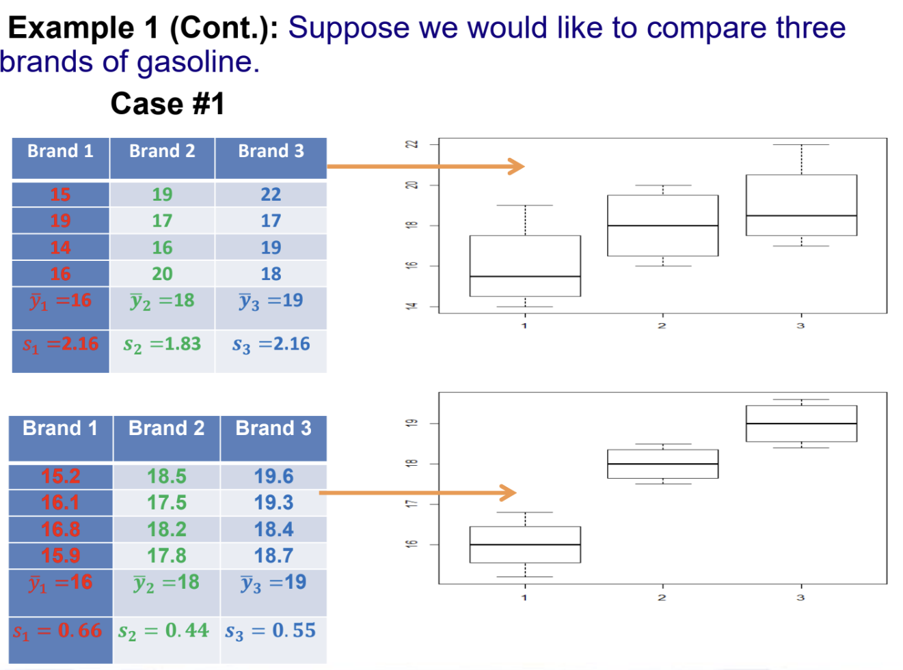

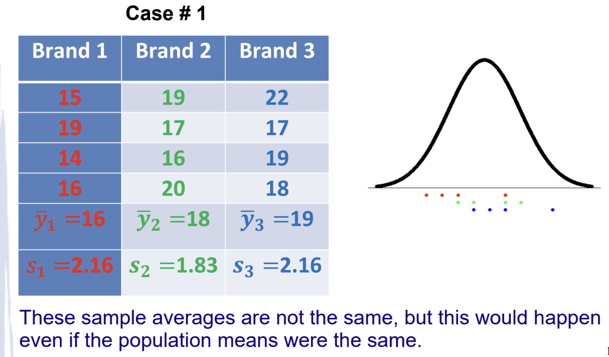

- The **boxplot** shows wide boxes → high variation within each group.
- These sample averages are not the same, but this would happen even if the population means were the same.
  - **Interpretation**: The observed differences in means (16 vs. 18 vs. 19) **could easily be due to random sampling variation**, especially since the data points are widely scattered (high SD).

- So, **we cannot conclude** the brands truly differ based on this data alone.

### 📊 Case #2: Low Within-Group Variation

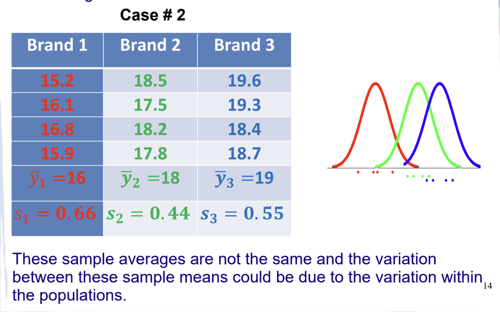


- These sample averages are not the same and the variation between these sample means could be due to the variation within the populations."
- But note: **within-group variation is very small** (SDs ≈ 0.5), so the differences **between** group means (16 vs. 18 vs. 19) are **much larger than the noise within groups**.
- So here, the difference in means is **unlikely to be due to chance** — it’s more likely that the brands truly perform differently.

### 🧠 What’s the Big Idea?

ANOVA doesn’t just look at whether sample means are different — it asks:

> **Is the difference between group means large compared to how spread out the data is within each group?**

That’s why we calculate:

$$
F = \frac{\text{Between-Group Variation}}{\text{Within-Group Variation}}
$$

- If **within-group variability is large** → denominator is large → **F is small** → **not significant** (Case #1).
- If **within-group variability is small** → denominator is small → **F is large** → **significant** (Case #2).

Later slides (e.g., Slide 29 and Slide 47) confirm this:

- **Case #1**: \( F = 2.21 \), p = 0.1656 → **not significant**
- **Case #2**: \( F = 30.216 \), p ≈ 0.0001 → **highly significant**

Therefore, Statistical significance depends not just on how far apart the group means are, but on how much variation exists within each group.

---


## How  One-Way ANOVA ANOVA Works

### 1. **Two Competing Models**
ANOVA compares two statistical models:

- **Reduced Model (Null Hypothesis $H_0$)**  
  Assumes all group means are equal:  
  $$
  H_0: \mu_1 = \mu_2 = \cdots = \mu_k
  $$
  → Only **one common mean** $\bar{y}_{..}$ for all observations.

- **Full Model (Alternative Hypothesis $H_a$)**  
  Allows each group to have its own mean:  
  $$
  H_a: \text{At least one } \mu_i \neq \mu_j
  $$
  → Uses **group-specific means** $\bar{y}_{i.}$.

These are also called:
- **Reduced model**: "One-mean model"
- **Full model**: "k-means model"

---

### 2. **Residuals and Sum of Squared Errors (SSE)**

For any model, the **residual** for observation $y_{ij}$ is:
$$
e_{ij} = y_{ij} - \hat{y}_{ij}
$$
where $\hat{y}_{ij}$ is the predicted value from the model.

- **Full model residual sum of squares (SS<sub>Residual, Full</sub>)**:
  
  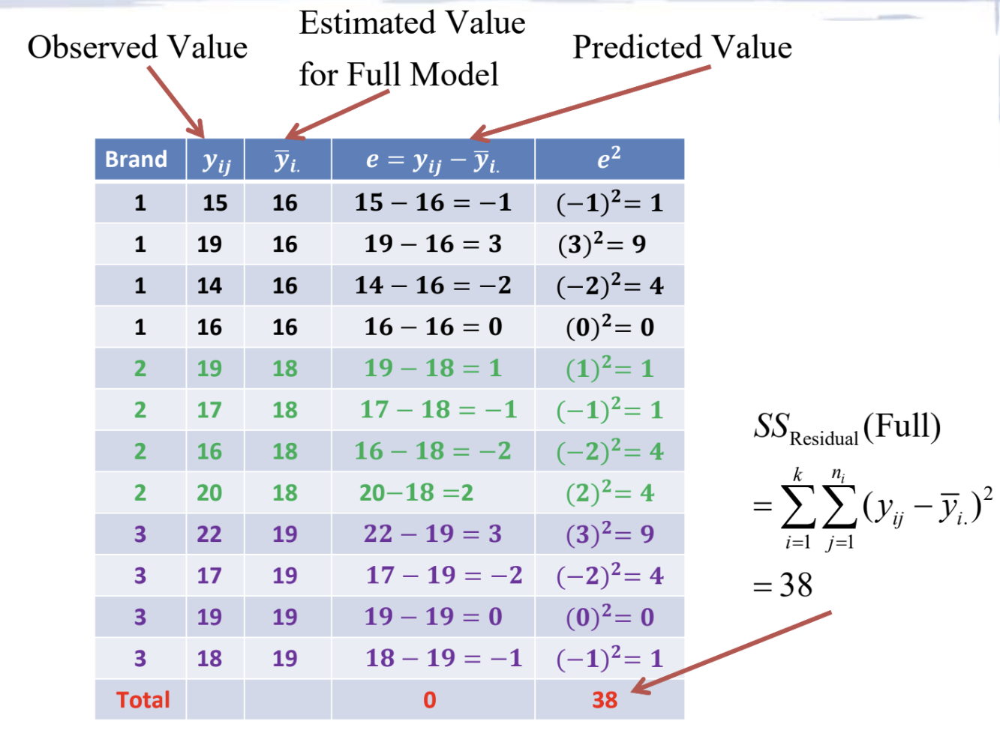
  $$
  SS_{\text{Full}} = \sum_{i=1}^k \sum_{j=1}^{n_i} (y_{ij} - \bar{y}_{i.})^2
  $$
  - This is also called **SSE(Error)** or **SS(Within Groups)**.
  - It’s the sum of squared deviations of **every observation from its own group mean**
  - The more complicated model (full model) will always have smaller
    sum of squared residuals.
  
  
  
- **Reduced model residual sum of squares (SS<sub>Residual, Reduced</sub>)**:

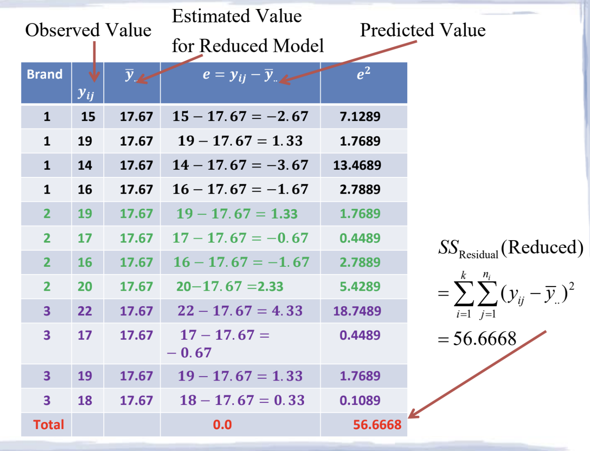
$$
SS_{\text{Reduced}} = \sum_{i=1}^k \sum_{j=1}^{n_i} (y_{ij} - \bar{y}_{..})^2
$$
- This equals **SST(Total)**.
- It’s the sum of squared deviations of **every observation from the grand mean**:

---

### 3. **Extra Sum of Squares (SS due to Treatments)**

The improvement in fit from using the full model is:
$$
\text{Extra SS} = SS_{\text{Reduced}} - SS_{\text{Full}} = 56.6668 - 38.0000 = 18.6668
$$

- This is the **Treatment Sum of Squares (SSTr)**!
- It’s the improvement in fit when going from Reduced to Full model
- So when you see “Extra SS”, think: **“How much did we reduce the error by adding group means?”**
- This represents **variability explained by group differences** (also called $$SS_{\text{Treatments}}$$ or $SS_{\text{between groups}}$).

$$
SS_{\text{Treatments}} = \sum_{i=1}^k n_i (\bar{y}_{i.} - \bar{y}_{..})^2
$$


 **Interpretation**

- **If $$H_0$$ is true** (all means really are equal), then the extra complexity of the full model isn’t needed—both models should have **similar SSR**.
- **If $$H_0$$ is false**, the full model fits much better → **SSR drops noticeably**, and Extra SS will be **large relative to random variation**.
- We test whether this reduction (18.6668) is **statistically significant** using an **F-test** (comparing Extra SS per added parameter to residual error).

---

### 4. **Degrees of Freedom (df)**

- **df_Residual (Reduced)** = n - 1 = 12 - 1 = 11 → This is **df_Total**
- **df_Residual (Full)** = n - k = 12 - 3 = 9 → This is **df_Error**
- **Extra df** = 11 - 9 = 2 → This is **df_Treatment = k - 1**

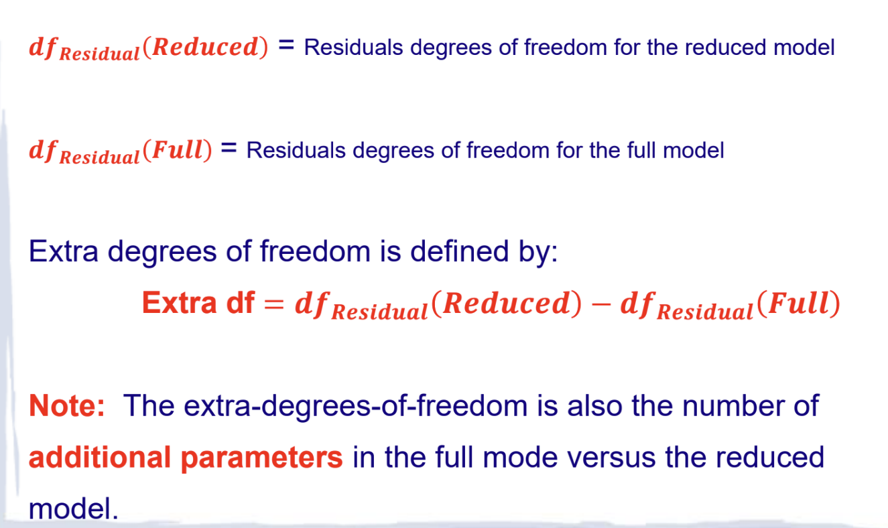

| Source             | Degrees of Freedom |
| ------------------ | ------------------ |
| Treatments (extra) | $k - 1$            |
| Error (full)       | $n - k$            |
| Total (reduced)    | $n - 1$            |

Where:
- $k$ = number of groups (treatments)
- $n = \sum_{i=1}^k n_i$ = total sample size

Note:  
$$
df_{\text{Treatments}} + df_{\text{Error}} = df_{\text{Total}}
$$

---

### 5. **Mean Squares (MS)**

- **Mean Square for Treatments**:
  $$
  MS_{\text{Treatments}} = \frac{SS_{\text{Treatments}}}{k - 1}
  $$

- **Mean Square for Error (MSE)**:
  $$
  MS_{\text{Error}} = \frac{SS_{\text{Error}}}{n - k}
  $$
  This is a **pooled estimate** of the common variance $\sigma^2$:
  $$
  \hat{\sigma}^2 = MS_{\text{Error}} = s_{\text{pooled}}^2
  $$

---


###  **ANOVA Components Summary Table!!! **

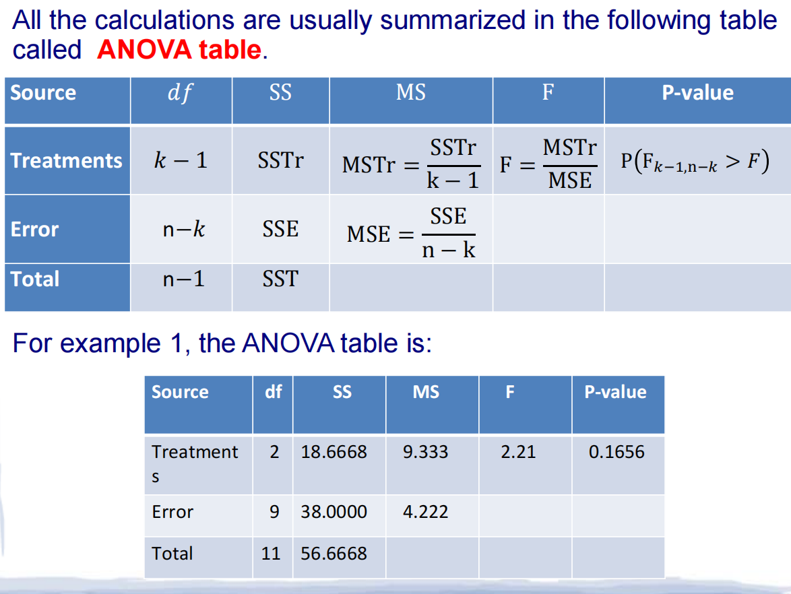

| Source                             | Sum of Squares (SS)                                          | Degrees of Freedom (df) | Mean Square (MS)                                           | Purpose                                                      |
| ---------------------------------- | ------------------------------------------------------------ | ----------------------- | ---------------------------------------------------------- | ------------------------------------------------------------ |
| **Treatments**<br>(Between Groups) | $$SS_{\text{Tr}} = \sum_{i=1}^k n_i (\bar{y}_{i.} - \bar{y}_{..})^2$$ | $$k - 1$$               | $$MS_{\text{Tr}} = \dfrac{SS_{\text{Treatments}}}{k - 1}$$ | Measures variability **due to differences among group means** |
| **Error**<br>(Within Groups)       | $$SS_{\text{Error}} = \sum_{i=1}^k \sum_{j=1}^{n_i} (y_{ij} - \bar{y}_{i.})^2$$ | $$n - k$$               | $$MS_{\text{Error}} = \dfrac{SS_{\text{Error}}}{n - k}$$   | Measures **random variability within groups**; estimates $\sigma^2$ |
| **Total**                          | $$SS_{\text{Total}} = \sum_{i=1}^k \sum_{j=1}^{n_i} (y_{ij} - \bar{y}_{..})^2$$ | $$n - 1$$               |                                                            | Total variability in all data                                |

- $$E[SS_{Error}] = (N - a)\sigma^2$$
- $$E[SS_{Treatment}] = (a - 1)\sigma^2 + n\sum_{i=1}^a \tau_i^2$$
- $$ E[SS_{Total}] = E[SS_{Error}] + E[SS_{Treatment}] $$
  $$ = (N-a)\sigma^2 + (a-1)\sigma^2 + n\sum \tau_i^2 $$
  $$ = (N - a + a - 1)\sigma^2 + n\sum \tau_i^2 $$
  $$ = (N-1)\sigma^2 + n\sum_{i=1}^a \tau_i^2 $$

#### ❗ Common Confusion Points Clarified

| Term                                      | Meaning                                                      |
| ----------------------------------------- | ------------------------------------------------------------ |
| $ \text{SS}_{\text{Residual (Reduced)}} $ | $ SST $ — total variation around grand mean **(Total)**      |
| $ \text{SS}_{\text{Residual (Full)}} $    | $ SSE $ — variation left after accounting for group means **(Error)** |
| $ \text{Extra SS} $                       | $ SSTr $ — variation explained by group differences  **(Treatment)** |
| $ \text{df}_{\text{Residual (Reduced)}} $ | $ df_{\text{Total}} = n - 1 $                                |
| $ \text{df}_{\text{Residual (Full)}} $    | $ df_{\text{Error}} = n - k $                                |
| $ \text{Extra df} $                       | $ df_{\text{Treatment}} = k - 1 $                            |


### 6. **F-Test Statistic**

#### Method 1

To test $H_0: \mu_1 = \cdots = \mu_k$, use:
$$
F = \frac{MS_{\text{Treatments}}}{MS_{\text{Error}}}
$$


Under $H_0$, this follows an **F-distribution** with:

- Numerator df = $k - 1$
- Denominator df = $n - k$

→ **Reject $H_0$** if $F$ is large (i.e., small p-value).

A **small p-value** (typically < 0.05) indicates that the differences between treatment means are **statistically significant**


#### Method 2

$$
TS = \frac{\text{Extra SS} / \text{Extra df}}{MS_{\text{Residual}}(\text{Full})}
= \frac{SS_{\text{Residual}}(\text{Reduced}) - SS_{\text{Residual}}(\text{Full})}{df_{\text{Residual}}(\text{Reduced}) - df_{\text{Residual}}(\text{Full})} \Bigg/ \frac{SS_{\text{Residual}}(\text{Full})}{df_{\text{Residual}}(\text{Full})}
$$


Under the null hypothesis ($H_0$: reduced model is adequate):

- The test statistic follows an **F-distribution**:
  $$
  TS \sim F_{\text{Extra df},\ df_{\text{Residual}}(\text{Full})}
  $$

- **Numerator df** = Extra degrees of freedom = $df_{\text{Residual}}(\text{Reduced}) - df_{\text{Residual}}(\text{Full})$

- **Denominator df** = Residual degrees of freedom for the full model = $df_{\text{Residual}}(\text{Full})$

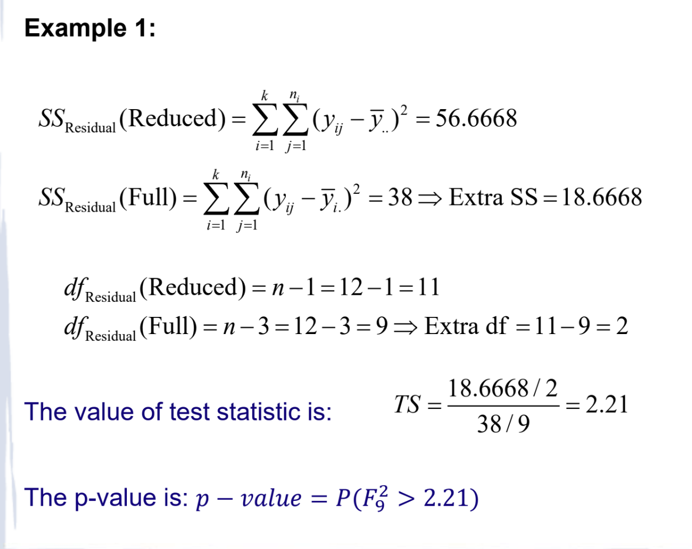

- This means: probability that an F-distributed random variable with numerator df = 2 and denominator df = 9 exceeds 2.21.
- From tables or software → this is **0.1656**, as shown in your ANOVA table.

---


# **2. How ANOVA Works: The Core Idea**

ANOVA compares **two sources of variation**:

### A. **Between-group variation**  
How far each group mean $\bar{y}_i$ is from the overall mean $\bar{y}_{..}$.

### B. **Within-group variation**  
How spread out the data are within each group (measured by sample variances $s_i^2$).

> If **between-group variation** is **much larger** than **within-group variation**, then group means likely differ.

---

## 📐 **3. The Math: Sums of Squares and F-Statistic**

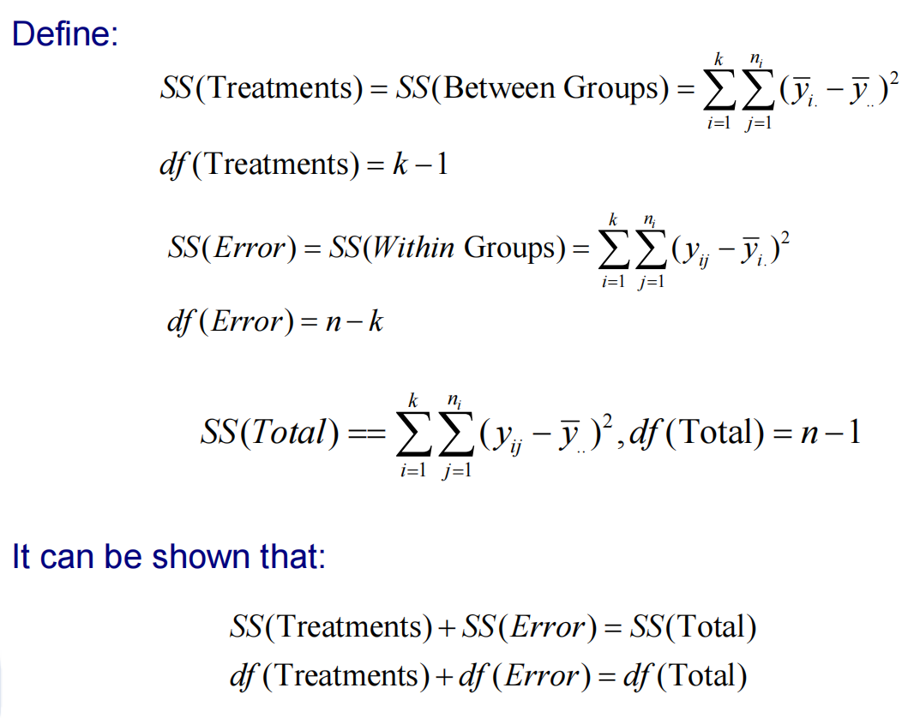

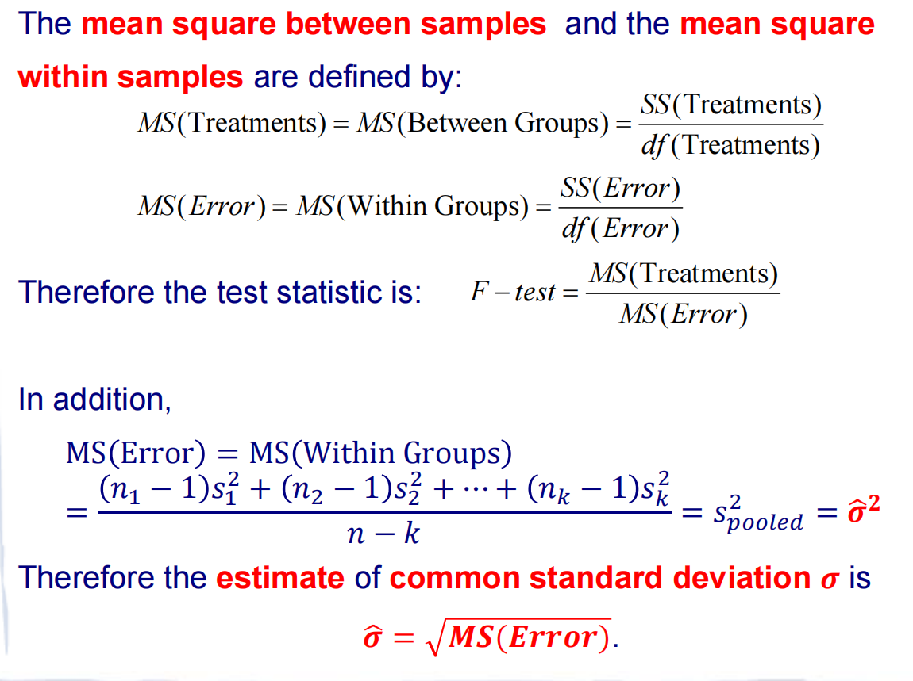


To test $H_0: \mu_1 = \cdots = \mu_k$, use:
$$
F = \frac{MS_{\text{Treatments}}}{MS_{\text{Error}}}
$$


Under $H_0$, this follows an **F-distribution** with:

- Numerator df = $k - 1$
- Denominator df = $n - k$

→ **Reject $H_0$** if $F$ is large (i.e., small p-value).

---

# R CODE FOR ANOVA & ASSUMPTION CHECKING

## ✅ PART 1: DATA ENTRY + SCATTERPLOT + GROUP MEANS

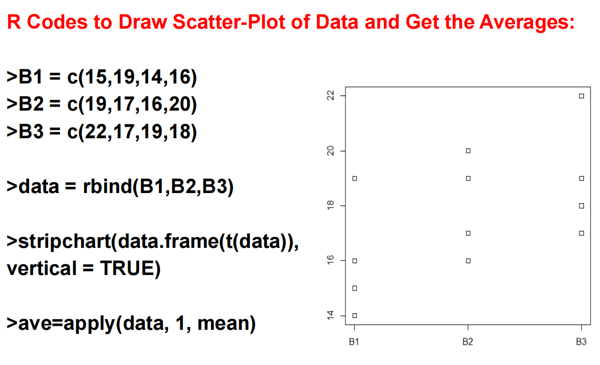

### Goal:

Enter data by group → visualize with stripchart → compute group means.

```r
> B1 = c(15,19,14,16)   # Brand 1 data
> B2 = c(19,17,16,20)   # Brand 2 data
> B3 = c(22,17,19,18)   # Brand 3 data
```

→ Each vector holds 4 observations per brand.

```r
> data = rbind(B1, B2, B3)
```

→ `rbind()` stacks vectors as **rows** → creates 3x4 matrix.

```r
> stripchart(data.frame(t(data)), vertical = TRUE)
```

→ `t(data)` transposes → columns become groups.  
→ `stripchart(..., vertical=TRUE)` = vertical dot plot (like boxplot without boxes).  
→ Shows spread of each brand’s data.

```r
> ave = apply(data, 1, mean)
```

→ `apply(data, 1, mean)` → computes **mean of each row** (i.e., each brand).  
→ Result: `ave = [16, 18, 19]` ← group means.

📌 **Study Tip**:  

- `rbind()` → rows = groups  
- `t()` → transpose to make columns = groups for plotting  
- `apply(data, 1, mean)` → row-wise mean = group mean

---

## ✅ PART 2: PERFORM ONE-WAY ANOVA

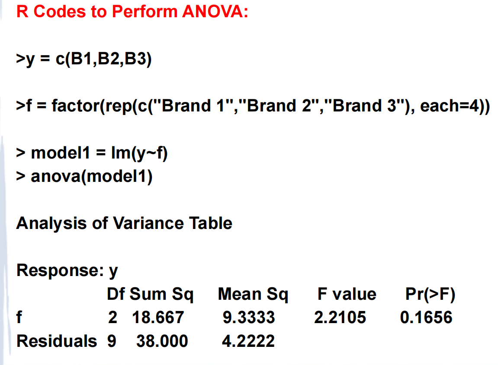

### Goal:

Run ANOVA to test if group means differ significantly.

```r
> y = c(B1, B2, B3)
```

→ Combine all data into one vector `y` (length 12).

```r
> f = factor(rep(c("Brand 1","Brand 2","Brand 3"), each=4))
```

→ `rep(..., each=4)` repeats each brand name 4 times → creates factor vector of length 12.  
→ `factor()` tells R this is a categorical variable (treatment group).

```r
> model1 = lm(y ~ f)
```

→ Fit linear model: response `y` predicted by factor `f`.

```r
> anova(model1)
```

→ Produces ANOVA table:

| Source    | Df   | Sum Sq | Mean Sq | F value | Pr(>F) |
| --------- | ---- | ------ | ------- | ------- | ------ |
| f         | 2    | 18.667 | 9.333   | 2.2105  | 0.1656 |
| Residuals | 9    | 38.000 | 4.222   |         |        |

✅ Matches your manual calculations!

📌 **Study Tip**:  

- `lm(y ~ f)` = ANOVA in R (since `f` is a factor)  
- `anova()` gives the F-test for group differences  
- `Pr(>F)` = p-value → here, **not significant** (p > 0.05)

---

## ✅ PART 3: CHECK ANOVA ASSUMPTIONS

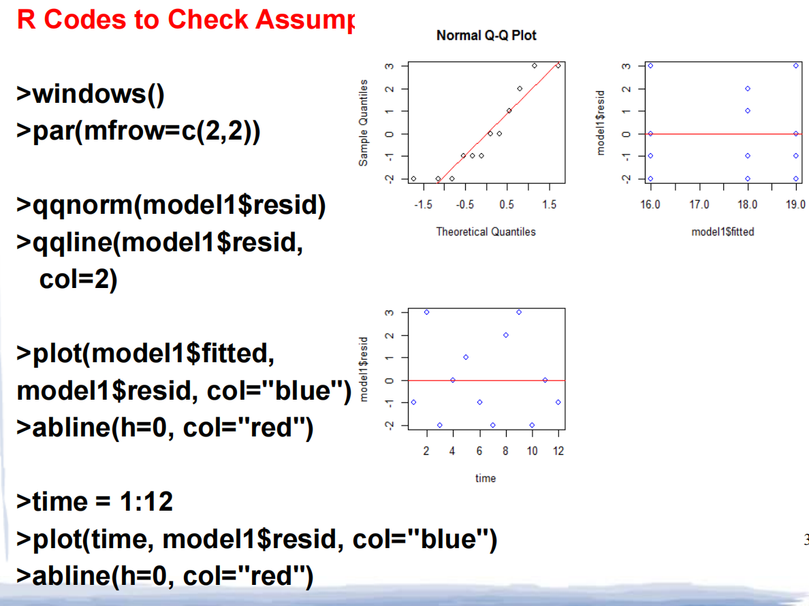

### Assumptions to Check:

1. Normality of residuals  
2. Homoscedasticity (constant variance)  
3. Independence (implied by design)

### Code Breakdown:

```r
> windows()           # Open new graphics window (Windows only)
> par(mfrow=c(2,2))   # Set up 2x2 plot layout
```

→ Prepares space for 4 diagnostic plots.

---

### 📈 Plot 1: Normal Q-Q Plot

```r
> qqnorm(model1$resid)
> qqline(model1$resid, col=2)
```

→ Checks **normality of residuals**.  
→ Points should follow the red line (theoretical quantiles).  
→ If they deviate → normality assumption may be violated.

---

### 📈 Plot 2: Residuals vs Fitted Values

```r
> plot(model1$fitted, model1$resid, col="blue")
> abline(h=0, col="red")
```

→ Checks **homoscedasticity** (constant variance).  

- $\sigma_1 = \sigma_2 = \dots = \sigma_k$
-  the **variance of the residuals is the same across all levels of the independent variable (i.e., all groups)**.

→ Look for random scatter around 0 (no funnel shape or curve).  
→ If points fan out → heteroscedasticity → problem.

---

### 📈 Plot 3: Residuals vs Time (Order)

```r
> time = 1:12
> plot(time, model1$resid, col="blue")
> abline(h=0, col="red")
```

→ Checks **independence** (if data collected over time/order).  

- **observations are independent of each other**

→ No pattern/trend → residuals are independent.  
→ Up/down trend or cycles → dependence → problem.

📌 **Study Tip**:  

- Always check these 3 plots after ANOVA!  
- **Q-Q plot** → normality  
- **Residuals vs Fitted** → equal variance  
- **Residuals vs Order** → independence

---


# **Check Assumptions Before Trusting Results**

## Assumptions for Valid ANOVA

1. **Independence**: Samples from each group are independent.
2. **Normality**: Each group is approximately normal.
3. **Equal variances**: All groups share the same $\sigma$ (homoscedasticity).

### How to Check:

- **Residual plots** (from linear model): look for randomness
- **Q-Q plot**: check normality of residuals
- **Bartlett’s test** or **Levene’s test**: check equal variances
  - **Bartlett’s Test**: Sensitive to normality → avoid if data is skewed.
  - **Levene’s Test**: Robust → uses absolute deviations from medians → better choice.


> ⚠️ Bartlett’s test is sensitive to non-normality → prefer **Levene’s test**.

If assumptions fail:

- Try **log or square-root transformation**
- Or use **nonparametric Kruskal-Wallis test** (uses ranks)

------

## 🔍 1. Checking the Equal Variance Assumption

### 📌 Why It Matters
ANOVA assumes **homoscedasticity**: all groups share a common population standard deviation $$\sigma$$. Violation can inflate Type I error or reduce power.

---

### 🧪 1.1 Bartlett’s Test

- **Null Hypothesis**:  
  $$
  H_0: \sigma_1 = \sigma_2 = \cdots = \sigma_k
  $$
- **Alternative**: At least two variances differ.
- **Test Statistic**:
  $$
  TS = \frac{(n - k) \ln(s_p^2) - \sum_{i=1}^k (n_i - 1) \ln(s_i^2)}{1 + \frac{1}{3(k - 1)} \left( \sum_{i=1}^k \frac{1}{n_i - 1} - \frac{1}{n - k} \right)}
  $$
  where pooled variance:
  $$
  s_p^2 = \frac{\sum_{i=1}^k (n_i - 1)s_i^2}{n - k} = MS_{\text{Error}}
  $$
- **Distribution under $$H_0$$**: Approximately $$\chi^2_{k-1}$$.
- **⚠️ Caveat**: Sensitive to non-normality → may reject $$H_0$$ due to skewness, not unequal variances.

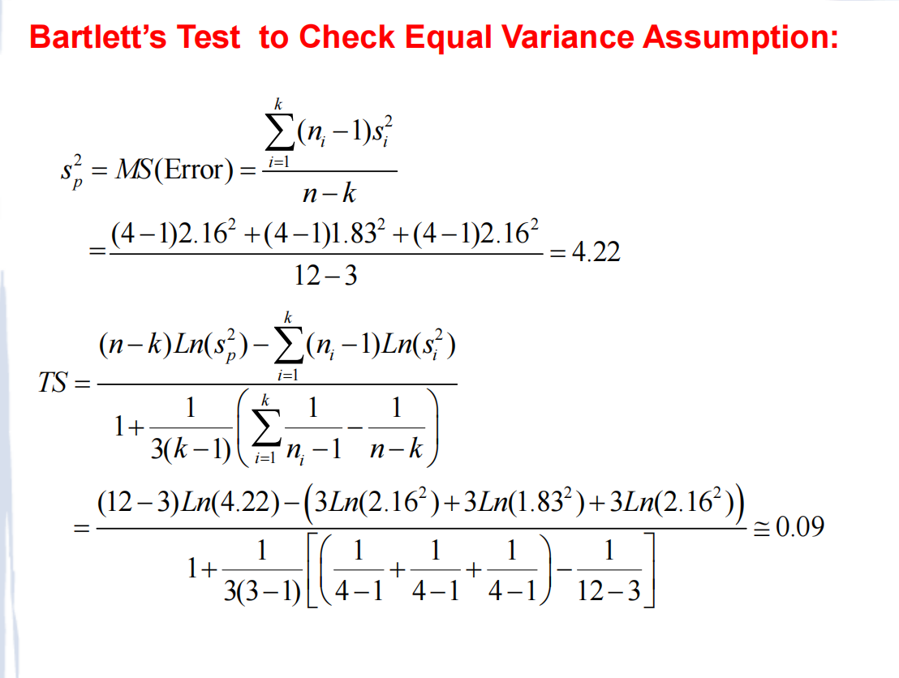

#### ✅ R Code:
```r
>model1 = lm(y~f)
>bartlett.test(model1$resid, f)

Bartlett test of homogeneity of variances
data: model1$resid and f
Bartlett's K-squared = 0.0946, df = 2, p-value = 0.9538
```
- Output: `Bartlett's K-squared = 0.0946, df = 2, p-value = 0.9538` → **no evidence against equal variances**.

---

### 🧪 1.2 Levene’s Test (More Robust against non-normality)

- **Idea**: Transform data to absolute deviations from group medians, then run ANOVA on those.
- **Steps**:
  1. Compute group medians: $$m_i = \text{median}(y_{i1}, \dots, y_{in_i})$$
  2. Compute absolute deviations: $$d_{ij} = |y_{ij} - m_i|$$
  3. Perform one-way ANOVA on $$d_{ij}$$

- **Null Hypothesis**: All group variances are equal ⇔ all group means of $$d_{ij}$$ are equal.

#### ✅ R Code (Manual):
```r
data = rbind(B1, B2, B3)
m = apply(data, 1, median)
y1 = c(data)
diff = abs(y1 - rep(m, times = 4))
f1 = factor(rep(c("Brand 1","Brand 2","Brand 3"), times = 4))
anova(lm(diff ~ f1))

Analysis of Variance Table
Response: diff
Df Sum Sq Mean Sq F value Pr(>F)
f1 2 0 0.0000 0 1
Residuals 9 13 1.4444
```

#### ✅ R Code (Using `car` package):
```r
> install.packages("car") #You need to install a package once
> library(car)
> y = c(B1,B2,B3)
> f = factor(rep(c("Brand 1","Brand 2","Brand 3"), each=4))
> leveneTest(y ~ f)  # default uses median

Levene's Test for Homogeneity of Variance (center = median)
Df F value Pr(>F)
group 2 0 1
9

```
- Output: `F = 0, p = 1` → **perfectly equal spread** in this example.

---

## 🔄 2. What If Assumptions Are Violated?

If normality or equal variance fails:

### Option A: **Transform the Data**
- Common transformations:
  - Log: $$\log(y_{ij})$$ → for right-skewed data
  - Square root: $$\sqrt{y_{ij}}$$ → for count data
  - Reciprocal: $$1/y_{ij}$$ → for time-to-event data

> Goal: Make residuals more normal and stabilize variance.

### Option B: **Use Nonparametric Methods**
- These use **ranks** instead of raw values → robust to outliers and non-normality.

---

## 📊 3. Nonparametric Alternative: Rank-Based ANOVA

### Step 1: Replace data with ranks
- Combine all $$n$$ observations → assign ranks 1 to $$n$$ (average ties).
- Example:
  ```r
  y = c(15,19,14,16,19,17,16,20,22,17,19,18)
  R = rank(y)
  
  >R
  [1] 2.0 9.0 1.0 3.5 9.0 5.5 3.5 11.0 12.0 5.5 9.0 7.0
  ```

### Step 2: Run ANOVA on ranks
- Fit model: $$R_{ij} = \mu + \tau_i + \varepsilon_{ij}$$
- Use usual F-test.

> This is an approximation to the **Kruskal-Wallis test**.

#### ✅ R Code:
```r
model1.rank = lm(R ~ f)
anova(model1.rank)

Analysis of Variance Table
Response: R
Df Sum Sq Mean Sq F value Pr(>F)
f 2 43.875 21.938 2.054 0.1842
Residuals 9 96.125 10.681

# F = 2.054, p = 0.1842
```

---

## 📈 4. Kruskal-Wallis Test (Exact Nonparametric Test)

- **Null Hypothesis**: All groups have identical distributions (⇒ same median).
- **Test Statistic**:
  $$
  H = \frac{12}{n(n+1)} \sum_{i=1}^k \frac{R_{i\cdot}^2}{n_i} - 3(n+1)
  $$
  where $$R_{i\cdot}$$ = sum of ranks in group $$i$$.

- **Asymptotic Distribution**: $$\chi^2_{k-1}$$ under $$H_0$$.

#### ✅ R Code:
```r
kruskal.test(y, f)
# Kruskal-Wallis chi-squared = 3.4473, df = 2, p = 0.1784
```

> Very close to rank-transformed F-test result.

---


# Example2: Breast-fed vs. Formula-fed Babies

### 🎯 Question:
> Is there evidence that the **average weight gain** (from birth to 6 months) is **different** between breast-fed and formula-fed babies?

---

## 📊 Data

| Group       | Weight Gains (lbs)   |
| ----------- | -------------------- |
| Breast-fed  | 10, 7, 8, 6, 8, 9, 9 |
| Formula-fed | 8, 9, 10, 8, 7, 6    |

- **Breast-fed**: n₁ = 7 babies
- **Formula-fed**: n₂ = 6 babies
- **Total**: n = 13 babies

---

## 🔍 Step 1: Two-Sample t-test (Direct Comparison)

This is the simplest way to compare two groups.

```r
> t.test(y1, y2, var.equal=T)
```

### ✅ Output Summary:

- **t-statistic** = 0.1865 → very small
- **p-value** = 0.8555 → **very large**
- **Conclusion**: No evidence to suggest the means are different.
- **Confidence Interval**: (-1.54, 1.83) → includes 0 → difference could be zero.
- **Sample Means**: Breast-fed = 8.14 lbs, Formula-fed = 8.00 lbs → almost identical.

> 💡 **Takeaway**: The two groups look virtually the same. A t-test says “no significant difference.”

---

## 🔬 Step 2: One-Way ANOVA (Same Problem, Different Tool)

ANOVA can also test if **two group means are equal** — it’s just a special case where k=2.

### R Code:

```r
> y1 = c(10,7,8,6,8,9,9)
> y2 = c(8,9,10,8,7,6)
> y12 = c(y1, y2)      # all data combined
> f12 = factor(c(rep("B",7), rep("F",6)))  # create factor for groups
> m = lm(y12 ~ f12)    # fit linear model
> anova(m)             # get ANOVA table
```

### ✅ ANOVA Table Output:

| Source    | Df   | Sum Sq  | Mean Sq | F value | Pr(>F) |
| --------- | ---- | ------- | ------- | ------- | ------ |
| f12       | 1    | 0.0659  | 0.06593 | 0.0348  | 0.8555 |
| Residuals | 11   | 20.8571 | 1.89610 |         |        |

### 🔑 Key Points:

- **F-statistic** = 0.0348 → tiny
- **p-value** = 0.8555 → same as t-test!
- **Why?** For k=2, **F = t²** → 0.1865² ≈ 0.0348 ✓
- **Degrees of Freedom**: df₁ = 1 (k-1), df₂ = 11 (n-k)

> 💡 **Takeaway**: ANOVA gives the *same conclusion* as the t-test here — no significant difference.

---

## 🔄 Why Use ANOVA for Two Groups?

You usually wouldn’t — a t-test is simpler and more direct.

But this example shows that **ANOVA generalizes the t-test** to k≥2 groups.

> ✅ If you have 2 groups → use t-test.  
> ✅ If you have 3+ groups → use ANOVA.

---

## 📌 Final Answer

> **No, there is no evidence to suggest that weight gains are different between breast-fed and formula-fed babies.**

Both the **t-test** and **ANOVA** yield a **p-value of 0.8555**, which is much larger than 0.05. The sample means are nearly identical (8.14 vs 8.00), and the confidence interval for the difference includes zero.

---

## 🧠 Quick Memory Trick

> **“Two groups? T-test. More groups? ANOVA.”**  
> And when k=2, they’re mathematically equivalent!

Let me know if you want to see the calculations by hand or visualize the data!

------


# Multiple Comparisons : comparing several means with each other.

## 🎯 5. Post-Hoc Analysis: Which Means Differ? (Multiple Comparisons)

### Why we need Multiple Comparisons

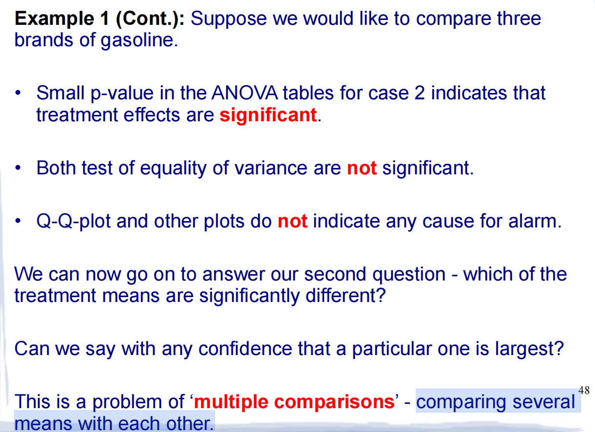

-  **"Small p-value in the ANOVA tables for case 2 indicates that treatment effects are significant."**
  - This means the overall ANOVA test (which compares all three gasoline brands at once) found strong evidence that **at least one brand performs differently** than the others.

- **Both test of equality of variance are not significant."**

  - Before trusting the ANOVA result, you must check its assumptions. One key assumption is that all groups have roughly the same amount of variation (variance).
  - The text mentions two tests for this: Bartlett’s test and Levene’s test.
  - “Not significant” here is **good news**. It means there’s no strong evidence that the variances are different between the groups.

- **"Q-Q-plot and other plots do not indicate any cause for alarm."**

  - Another assumption of ANOVA is that the data within each group should be approximately normally distributed.

  - A Q-Q plot is a visual tool to check this. If the points fall roughly along a straight line, the data is normal.

  - “No cause for alarm” means the plots look fine — the data seems to meet the normality assumption.

    

Once ANOVA rejects $$H_0$$, we ask: **Which pairs differ?**

If your ANOVA test rejects the null hypothesis, you know at least one mean is different, but you don't know which one. You then perform a detailed follow-up analysis using one of these methods:

> ⚠️ Naive pairwise t-tests inflate **family-wise error rate (FWER)**.

------


### 📋 Three Main Methods (Choose Based on Goal):

| Method         | When to Use                       | Pros & Cons                                                  |
| -------------- | --------------------------------- | ------------------------------------------------------------ |
| **Fisher LSD** | Only if ANOVA is significant      | Simple, but doesn’t control overall error rate → risky!      |
| **Tukey HSD**  | For comparing ALL pairs           | Controls family-wise error → best for pairwise comparisons   |
| **Scheffé**    | For ANY contrast (even unplanned) | Most conservative → wide intervals, safe for exploration     |
| **Bonferroni** | For pre-specified contrasts       | Flexible, adjusts for number of tests → good for planned comparisons |

---

### General Formula for Confidence Intervals

**(Slide 49)**

For any comparison between two means ($\mu_i - \mu_j$) or a complex contrast ($\gamma$), the confidence interval follows this structure:

$$ \text{Estimate} \pm (\text{Critical Value}) \times \text{Standard Error} $$

$$ \hat{\gamma} \pm k_{\alpha} \cdot SE(\hat{\gamma}) $$

*   **$\hat{\gamma}$**: The difference in sample means ($\bar{y}_i - \bar{y}_j$).
*   **$SE(\hat{\gamma})$**: The standard error, calculated using the pooled variance ($MS_E$) from the ANOVA table.
    $$ SE(\bar{y}_i - \bar{y}_j) = \sqrt{MS_E \left(\frac{1}{n_i} + \frac{1}{n_j}\right)} $$
*   **$k_{\alpha}$**: The **adjusted critical value**. This is the key difference between methods. Each method calculates this number differently to control the error rate.


### 5.1 Fisher’s Least Significant Difference (LSD)

*   **Concept:** Performs standard t-tests for every pair without adjusting the critical value significantly (only requires the overall ANOVA F-test to be significant first).
*   **Critical Value:** Uses the standard t-distribution value $t_{\alpha/2, n-k}$.

- **Confidence Interval for $$\mu_i - \mu_j$$**:
  $$
  \bar{y}_{i\cdot} - \bar{y}_{j\cdot} \pm t_{\alpha/2,\, n-k} \sqrt{MS_E \left( \frac{1}{n_i} + \frac{1}{n_j} \right)}
  $$
  
  - n - k is the df for residual
  
- **LSD (least significant difference) threshold**:Z
  $$
  \text{LSD} = t_{\alpha/2,\, n-k} \sqrt{MS_E \left( \frac{1}{n_i} + \frac{1}{n_j} \right)}
  $$

- **Decision**: Declare difference if $$|\bar{y}_{i\cdot} - \bar{y}_{j\cdot}| > \text{LSD}$$

> ❗ **Does NOT control FWER** — only controls per-comparison error rate.
>
> If you have many groups, the chance of a false positive skyrockets.

```
library(agricolae)
lsd_result <- LSD.test(model, "tip", group = FALSE, console = TRUE)
```

---

### 5.2 Simultaneous Confidence Intervals

We want:
$$
P\left( \text{All CIs cover true contrasts} \right) = 1 - \alpha
$$

#### General Form:
$$
\hat{\gamma} \pm k_\alpha \cdot SE(\hat{\gamma})
$$
where $$\gamma = \sum c_i \mu_i$$, with $$\sum c_i = 0$$ (a **contrast**).

---

### 5.3 Scheffé’s Method (For **All Possible Contrasts**)

- **Multiplier**:
  $$
  k_\alpha = \sqrt{(k - 1) F_{\alpha,\, k-1,\, n-k}}
  $$
- **CI**:
  $$
  \hat{\gamma} \pm \sqrt{(k - 1) F_{\alpha,\, k-1,\, n-k}} \cdot SE(\hat{\gamma})
  $$
- **SE for contrast**:
  $$
  SE(\hat{\gamma}) = \sqrt{MS_E \sum_{i=1}^k \frac{c_i^2}{n_i}}
  $$

✅ **Pros**: Works for any number of contrasts, even data-driven ones.  
❌ **Cons**: Very conservative → wide intervals.

#### Example (Slide 54):

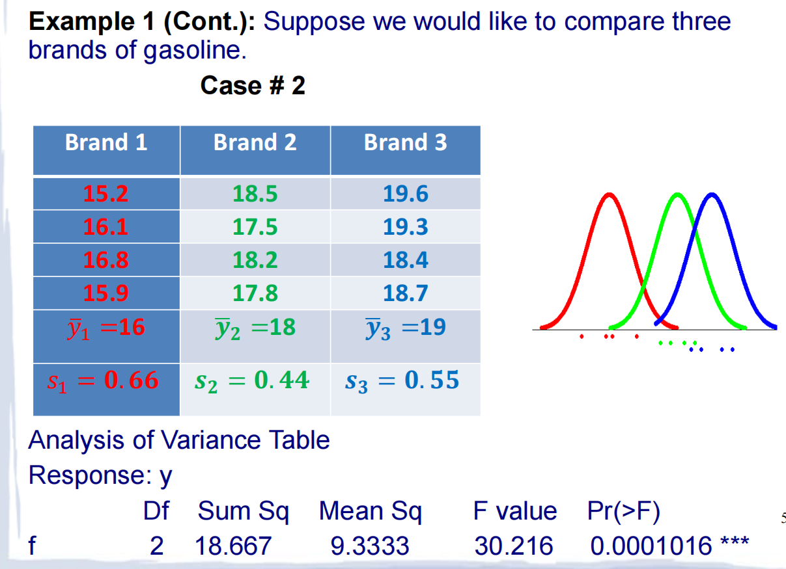

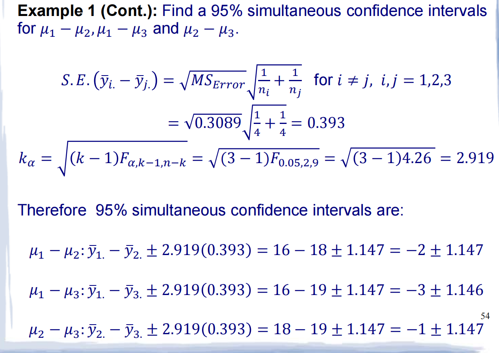

- $$k = 3,\ n = 12,\ MS_E = 0.3089,\ n_i = 4$$
- $$SE(\bar{y}_i - \bar{y}_j) = \sqrt{0.3089 \left( \frac{1}{4} + \frac{1}{4} \right)} = 0.393$$
- $$k_\alpha = \sqrt{2 \cdot F_{0.05,\,2,\,9}} = \sqrt{2 \cdot 4.26} = 2.919$$
- CI for $$\mu_1 - \mu_2$$: $$-2 \pm 2.919 \cdot 0.393 = (-3.147, -0.853)$$

---

### 5.4 Tukey’s HSD (Honestly Significant Difference)

- **Use when**: Only interested in **pairwise differences** $$\mu_i - \mu_j$$
- **Multiplier**:
  $$
  k_\alpha = \frac{q_{\alpha}(k, n - k)}{\sqrt{2}}
  $$
  where $$q_\alpha$$ = studentized range quantile.

- **CI**:
  $$
  \bar{y}_{i\cdot} - \bar{y}_{j\cdot} \pm \frac{q_{\alpha}(k, n - k)}{\sqrt{2}} \cdot \sqrt{MS_E \left( \frac{1}{n_i} + \frac{1}{n_j} \right)}
  $$

✅ **Less conservative than Scheffé** for pairwise comparisons.

#### Example (Slide 57):

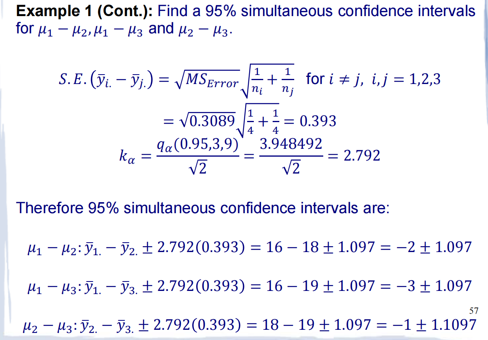

- $$q_{0.95}(3, 9) = 3.9485 \Rightarrow k_\alpha = 3.9485 / \sqrt{2} = 2.792$$
- Margin of error: $$2.792 \cdot 0.393 = 1.097$$
- CI for $$\mu_1 - \mu_2$$: $$-2 \pm 1.097 = (-3.097, -0.903)$$

#### ✅ R Code:
```r
TukeyHSD(aov(y ~ f))
# or
library(multcomp)
glht(lm(y ~ f), linfct = mcp(f = "Tukey"))
```

---

### 5.5 Bonferroni’s Method (For **Pre-Specified** Contrasts)

- Suppose you plan **$$m$$** contrasts in advance.
- Use **Bonferroni-adjusted** individual confidence level: $$1 - \alpha/m$$
- **Multiplier**:
  $$
  k_\alpha = t_{\alpha/(2m),\, n - k}
  $$

#### Example (Slide 59):

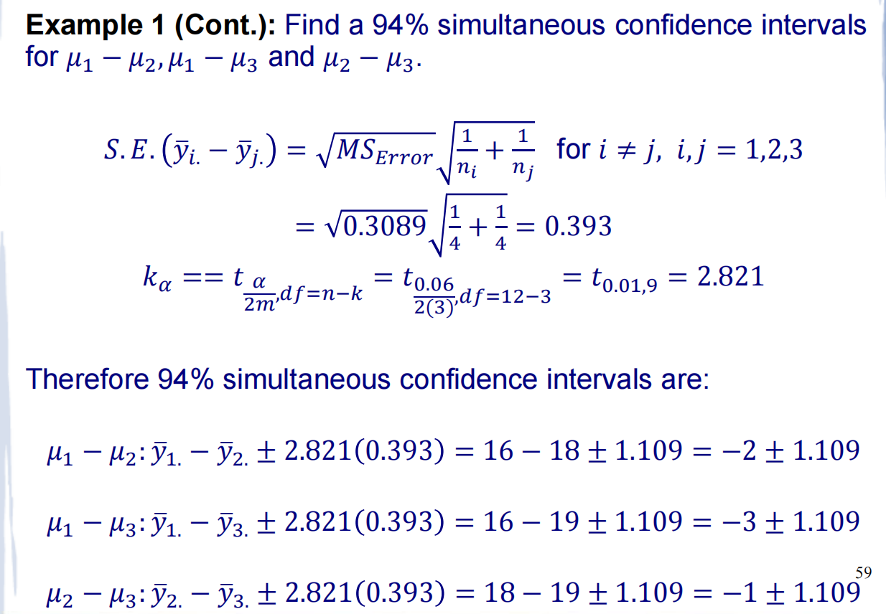

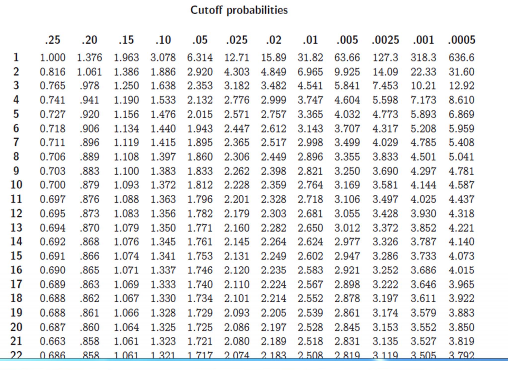

- 3 pairwise comparisons ⇒ $$m = 3$$
- For 94% family-wise CI: use $$\alpha = 0.06 \Rightarrow \alpha/(2m) = 0.01$$
- $$t_{0.01,\,9} = 2.821$$
- Margin of error: $$2.821 \cdot 0.393 = 1.109$$

✅ Simple, flexible.  
❌ Overly conservative if $$m$$ is large or contrasts are correlated.


Instead of just saying “Brand 1 ≠ Brand 2”, you want to estimate **how big** the difference is.

#### Formula (General):

$$
\text{CI for } \mu_i - \mu_j = (\bar{y}_i - \bar{y}_j) \pm \text{Multiplier} \times \sqrt{MS_E \left( \frac{1}{n_i} + \frac{1}{n_j} \right)}
$$

Where:

- Multiplier depends on method (Tukey, Scheffé, Bonferroni)
- $MS_E$ = Mean Square Error (from ANOVA table)

> ✅ In your Case 2 (where p was tiny):
>
> - μ₁ - μ₂ = -2 ± 1.097 → CI: (-3.097, -0.903) → **Significant!**
> - μ₁ - μ₃ = -3 ± 1.097 → CI: (-4.097, -1.903) → **Significant!**
> - μ₂ - μ₃ = -1 ± 1.097 → CI: (-2.097, 0.097) → **NOT significant!**

So: Brand 1 < Brand 2 and Brand 3, but Brand 2 and 3 are not significantly different.

------

## Comparison of Results (The Gasoline Example)

**(Slide 61)**

The lecture compares the **Margin of Error (ME)** (also called the Error Bound) for the 95% simultaneous confidence intervals using the three main methods.
*Recall: Smaller ME = Narrower Interval = Easier to prove significance.*

| Method         | Margin of Error (ME) | Ranking (Width)      | Best Use Case                            |
| :------------- | :------------------- | :------------------- | :--------------------------------------- |
| **Tukey**      | **1.097**            | **Narrowest (Best)** | Comparing **all pairs** of means.        |
| **Bonferroni** | 1.109                | Middle               | Comparing a **few specific** contrasts.  |
| **Scheffé**    | 1.147                | Widest (Worst)       | Comparing **complex/unknown** contrasts. |

**Conclusion from Data:**

*   **Brand 2 vs Brand 1:** Diff = 2.0. Since $2.0 > 1.097$, they are **significantly different**.
*   **Brand 3 vs Brand 1:** Diff = 3.0. Since $3.0 > 1.097$, they are **significantly different**.
*   **Brand 3 vs Brand 2:** Diff = 1.0. Since $1.0 < 1.097$, they are **NOT significantly different** (the interval includes 0).

## ✅ Key Takeaways (Slides 67–68)

1. **ANOVA assumptions must be checked**: normality, independence, equal variance.
2. **Bartlett’s test** is sensitive to non-normality; **Levene’s test** is preferred.
3. **Nonparametric alternatives** (Kruskal-Wallis) are robust when assumptions fail.
4. **Never do unprotected pairwise t-tests** after ANOVA.
5. Choose **multiple comparison method** based on goal:
   - All pairs → **Tukey**
   - Any contrast → **Scheffé**
   - Few planned → **Bonferroni**

---


# R code for multiple comparisons methods

## Comparing the Margin of Error (ME) for Different Methods

This slide simply summarizes the **width** of the confidence intervals you get from each method.

| Method     | Margin of Error (ME) |
| ---------- | -------------------- |
| Scheffé    | 1.147                |
| Bonferroni | 1.109                |
| Tukey      | 1.097                |

### 🔍 What does this mean?

- The **Margin of Error (ME)** is half the width of the confidence interval.
- A **smaller ME** means a **narrower, more precise** interval.
- So, **Tukey gives the most precise estimates**, followed by Bonferroni, then Scheffé.

> 💡 Why? Because Tukey is designed *only* for pairwise comparisons, so it doesn’t waste precision on other types of contrasts. Scheffé is the most conservative because it works for *any* contrast (even unplanned ones).

---

## 🧪 Slide 62: R Code to Set Up Multiple Comparisons

This shows how to use the `multcomp` package in R to perform these tests.

```r
install.packages("multcomp")
> library("multcomp") # Load the package
> model2 = lm(y ~ f)  # Fit the linear model


> mtest = glht(model2, linfct = mcp(f = "Tukey")) # Set up Tukey test
```

You can also define custom contrasts:

```r
> contrasts <- rbind(
    "B1-B2" = c(1, -1, 0),  # Brand 1 vs Brand 2
    "B1-B3" = c(1, 0, -1),  # Brand 1 vs Brand 3
    "B2-B3" = c(0, 1, -1)   # Brand 2 vs Brand 3
)
> mtest <- glht(model2, linfct = mcp(f = contrasts))
```

> ✅ This lets you control exactly which comparisons you want to make.

---

## 📈 Slide 63: R Output for Tukey’s Test (Summary)

```r
# View P-values
summary(mtest)


Simultaneous Tests for General Linear Hypotheses
Multiple Comparisons of Means: Tukey Contrasts

Linear Hypotheses:
                   Estimate Std. Error t value Pr(>|t|)
Brand 2 - Brand 1 == 0  2.000      0.393   5.089  0.00187 **
Brand 3 - Brand 1 == 0  3.000      0.393   7.634 < 0.001 ***
Brand 3 - Brand 2 == 0  1.000      0.393   2.545  0.07381 .
---
Signif. codes:  0 ‘***’ 0.001 ‘**’ 0.01 ‘*’ 0.05 ‘.’ 0.1 ‘ ’ 1
```


**Alternative Built-in Function:**

```r
TukeyHSD(aov(y ~ f))
```

### 🔍 Interpretation:

- **Estimate**: The difference in sample means (e.g., Brand 2 - Brand 1 = 2.0).
- **Std. Error**: How much uncertainty there is in that estimate (0.393).
- **t value**: The test statistic (Estimate / SE).
- **Pr(>|t|)**: The adjusted p-value for that comparison (controls for multiple testing).

#### ✅ Key Takeaways:

- **Brand 2 vs Brand 1**: p = 0.00187 → **Significant** → Brand 2 > Brand 1
- **Brand 3 vs Brand 1**: p < 0.001 → **Highly Significant**→ Brand 3 > Brand 1
- **Brand 3 vs Brand 2**: p = 0.07381 → **Not significant**→ No strong evidence Brand 3 > Brand 2

> 💡 So: Brand 1 is worst, Brand 2 is better, Brand 3 is best — but Brand 2 and Brand 3 are not significantly different from each other.

---

## 📈 Slide 64: R Output for Bonferroni’s Test

```r

> contrasts <- rbind(
    "B1-B2" = c(1, -1, 0),  # Brand 1 vs Brand 2
    "B1-B3" = c(1, 0, -1),  # Brand 1 vs Brand 3
    "B2-B3" = c(0, 1, -1)   # Brand 2 vs Brand 3
)

>mtest <-glht(model2,linfct=mcp(f=contrasts))
>summary(mtest,test=adjusted("bonferroni"))


Simultaneous Tests for General Linear Hypotheses
Multiple Comparisons of Means: User-defined Contrasts

Linear Hypotheses:
                   Estimate Std. Error t value Pr(>|t|)
B1-B2 == 0        -2.000      0.393  -5.089  0.00196 **
B1-B3 == 0        -3.000      0.393  -7.634 9.64e-05 ***
B2-B3 == 0        -1.000      0.393  -2.545  0.09442 .
```

### 🔍 Interpretation:

- Same estimates as Tukey, but **different p-values** because Bonferroni uses a different adjustment.
- **Brand 2 vs Brand 1**: p = 0.00196 → **Significant**
- **Brand 3 vs Brand 1**: p = 0.000096 → **Highly Significant**
- **Brand 3 vs Brand 2**: p = 0.094 → **Not significant**

> 💡 Same conclusion as Tukey: Only Brand 1 is significantly worse than the others.

---

## 📐 Slide 65: R Code to Get Confidence Intervals (Tukey)

```r
>model2 = lm(y~f)
>mtest <- glht(model2,linfct=mcp(f="Tukey"))
> confint(mtest)

Simultaneous Confidence Intervals
Multiple Comparisons of Means: Tukey Contrasts

Linear Hypotheses:
                   Estimate       lwr       upr
Brand 2 - Brand 1 == 0  2.00000  0.90325  3.09675
Brand 3 - Brand 1 == 0  3.00000  1.90325  4.09675
Brand 3 - Brand 2 == 0  1.00000 -0.09675  2.09675
```

### 🔍 Interpretation:

- These are **95% simultaneous confidence intervals**.
- If the interval **does not include 0**, the difference is significant.

#### ✅ Key Takeaways:

- **Brand 2 - Brand 1**: (0.90, 3.10) → **Does NOT include 0** → Significant
- **Brand 3 - Brand 1**: (1.90, 4.10) → **Does NOT include 0** → Significant
- **Brand 3 - Brand 2**: (-0.10, 2.10) → **Includes 0** → Not significant

> 💡 Again, confirms: Brand 1 is worse than both, but Brand 2 and Brand 3 are not significantly different.

---

## 📐 Slide 66: R Code Using Built-in `TukeyHSD()` Function

```r
> TukeyHSD(model2, conf.level=0.95)
Tukey multiple comparisons of means
95% family-wise confidence level

$f
           diff        lwr       upr     p adj
Brand 2-Brand 1  2  0.90275798 3.097242 0.0016961
Brand 3-Brand 1  3  1.90275798 4.097242 0.0000852
Brand 3-Brand 2  1 -0.09724202 2.097242 0.0734796
```

### 🔍 Interpretation:

- Identical to Slide 65 — just a different way to get the same result.
- `diff` = difference in means
- `lwr`, `upr` = lower and upper bounds of the CI
- `p adj` = adjusted p-value

> ✅ This is the easiest way to get Tukey’s test in R — no need to load extra packages.

---

## 🎯 Summary of Slides 61–66

| Goal                     | Method Used              | Result                                                       |
| ------------------------ | ------------------------ | ------------------------------------------------------------ |
| Compare precision        | All 3 methods            | Tukey has narrowest CIs → most precise                       |
| Run Tukey’s test         | `glht()` or `TukeyHSD()` | Brand 2 & 3 > Brand 1; Brand 2 & 3 not significantly different |
| Run Bonferroni’s test    | `glht()` with adjustment | Same conclusion as Tukey, slightly higher p-values           |
| Get confidence intervals | `confint()`              | Confirms which differences are significant (intervals not containing 0) |

---

## 💡 Final Tip

When you’re doing multiple comparisons:

- Use **Tukey** if you only care about pairwise differences → most powerful.
- Use **Bonferroni** if you have a small number of pre-planned comparisons → simple and flexible.
- Use **Scheffé** if you’re exploring many different contrasts or didn’t plan them in advance → safest but widest intervals.

------


