# The Big Problem in Experiments: Why Do We Need "Blocking"?

When you run an experiment (e.g., testing 4 fertilizers on plant growth), you want to know:  

> “Is the difference in plant height due to the fertilizer… or something else?”

That “something else” is called a **nuisance factor**—a variable that affects your results but isn’t the main thing you’re studying.

Examples:

- Sunlight differences across a field
- Different machines in a factory
- Different people (drivers, operators, patients)
- Time of day

If you ignore these, they add **noise**, making it harder to see the real effect of your treatment.

---

### 🔍 Two Types of Nuisance Factors

1. **Unknown & Uncontrollable**  
	→ You don’t even know it exists!  
	✅ **Solution: Randomization**  
	By randomly assigning treatments, you spread the unknown noise evenly across all groups, so it doesn’t bias your results.

2. **Known & Controllable**  
	→ You *know* it matters (e.g., different drivers affect fuel efficiency).  
	✅ **Solution: Blocking**

---

### 🧱 What Is Blocking?

**Blocking = Grouping similar experimental units together** into small, homogeneous groups called **blocks**.

Then, **within each block**, you randomly assign all (or some) treatments.

#### Why?

- Inside a block, conditions are nearly identical → less noise.
- Across blocks, conditions may differ → but you account for that statistically.

> 💡 Think of it like this:  
> Instead of comparing students from 10 different schools all mixed together,  
> you compare students **within the same classroom**, then average across classrooms.  
> That way, teacher quality or school resources don’t mess up your conclusion about, say, a new teaching method

---

### 🌰 Simple Example

Suppose you test 3 painkillers (A, B, C) on 6 people.

But people vary in age, weight, metabolism → big nuisance!

Instead of giving A, B, C to random people, you do this:

| Block (Person) | Treatment (Randomized) |
| -------------- | ---------------------- |
| Person 1       | A                      |
| Person 1       | B                      |
| Person 1       | C                      |
| Person 2       | B                      |
| Person 2       | C                      |
| Person 2       | A                      |

Wait—that’s not possible! One person can’t take all three drugs at once.

So instead, you might use **paired design**:  

- Measure pain before and after drug → each person is their own block.

Or in agriculture:  

- Each **field plot** is split into 3 subplots → all 3 fertilizers tested **on the same plot** → soil differences are blocked out.

That’s **Randomized Complete Block Design (RCBD)**: every block gets **all treatments**, in random order.


### ✅ Summary

| Concept             | What It Means                                                |
| ------------------- | ------------------------------------------------------------ |
| **Nuisance factor** | Something that affects results but isn’t your focus          |
| **Randomization**   | Handles *unknown* nuisance factors                           |
| **Blocking**        | Handles *known* nuisance factors by grouping similar units   |
| **Block**           | A group of similar experimental units (e.g., one patient, one machine, one day) |
| **Goal**            | Reduce noise → detect treatment effects more clearly, without losing real-world relevance |

Let me know if you’d like a visual diagram or a real-life analogy (like baking cookies with different

---

# **Randomized Complete Block Design (RCBD)**

## ✅ What is it?
- You have **b blocks** (e.g., 9 steel girders).
- Each block gets **all k treatments** (e.g., 4 prediction methods).
- Within each block, you **randomly assign** which treatment goes where.

> “Complete” = every treatment appears in every block.

## Example1:

### Description

You test 4 methods (A, B, C, D) on 9 girders. Each girder is a **block**—because each girder might behave differently. But within each girder, you apply all 4 methods.

This slide gives a **concrete example** of an RCBD with:

- **4 treatments**: A, B, C, D  
- **5 blocks**: B1, B2, B3, B4, B5  

> ✅ **“Complete”** means **every block contains all 4 treatments**.

The numbers in **parentheses** indicate the **random order** in which the treatments were applied *within each block*. 

| Block | A    | B    | C    | D    |
| ----- | ---- | ---- | ---- | ---- |
| B1    | (1)  | (3)  | (2)  | (4)  |
| B2    | (4)  | (2)  | (3)  | (1)  |
| B3    | (2)  | (1)  | (4)  | (3)  |
| B4    | (1)  | (3)  | (2)  | (4)  |
| B5    | (3)  | (4)  | (1)  | (2)  |

> For example, in **Block B1**, treatment A was run first, then C, then B, then D.

#### 💡 Why This Matters:

- By **randomizing within each block**, we eliminate bias from unknown factors *within* that block.
- By **blocking**, we control for known nuisance factors (e.g., different machines, days, people).


### R Code to Create an RCBD Manually

#### method1: 

```R
# Create block factor: 5 blocks, each repeated 4 times (for 4 treatments)
Block = factor(rep(c("B1","B2","B3","B4","B5"), each = 4))

# Define treatment labels
f = factor(c("A","B","C","D"))

# Randomly assign treatments within each block (5 times)
Treat = c(sample(f,4), sample(f,4), sample(f,4), sample(f,4), sample(f,4))

# Combine into a data frame
plan <- data.frame(Block = Block, treatment = Treat)

# Save to CSV file
write.table(plan, file = "RCBPlan.csv", sep = ",", row.names = FALSE)
```


#### Method2: Using the `agricolae` Package to Generate RCBD

1. **Install & load** the `agricolae` package:

	```r
	install.packages("agricolae")
	library(agricolae)
	```

2. **Define treatments** and **number of blocks**:

	```r
	Treat = c("A","B","C","D")
	Outdesign = design.rcbd(Treat, 5, seed = 11)  # 5 blocks, fixed seed for reproducibility
	rcb = Outdesign$book
	```

3. **(Optional)** Rename blocks:

	```r
	levels(rcb$block) = c("B1","B2","B3","B4","B5")
	```

4. **Bonus**: The same package offers **post-hoc tests**:

	- `LSD.test()` → Fisher’s Least Significant Difference
	- `HSD.test()` → Tukey’s Honest Significant Difference
	- `scheffe.test()`, `SNK.test()` → Other multiple comparison methods

## Example2

### Description

We want to **compare four different methods** for predicting the **shear strength** of steel plate girders.  
The methods are:

- **Aarau**
- **Karlsruhe**
- **Lehigh**
- **Cardiff**

But instead of testing on “ideal” girders, we use **real girders**—and real girders differ in material, geometry, manufacturing quality, etc. These differences are **nuisance factors**: they affect the outcome (prediction accuracy) but aren’t what we’re studying.

So, to **control for girder-to-girder variability**, we treat **each girder as a block**.

> ✅ **Block = one physical girder**  
> ✅ **Treatment = one prediction method**

Each girder is tested with **all four methods**, so it’s a **complete** block design.

#### The Data

| Block (Girder) | Aarau | Karlsruhe | Lehigh | Cardiff |
| -------------- | ----- | --------- | ------ | ------- |
| S1/1           | 0.772 | 1.186     | 1.061  | 1.025   |
| S2/1           | 0.744 | 1.151     | 0.992  | 0.905   |
| S3/1           | 0.767 | 1.322     | 1.063  | 0.930   |
| S4/1           | 0.745 | 1.339     | 1.062  | 0.899   |
| S5/1           | 0.725 | 1.200     | 1.065  | 0.871   |
| S1/2           | 0.844 | 1.402     | 1.178  | 1.004   |
| S2/2           | 0.831 | 1.365     | 1.037  | 0.853   |
| S3/2           | 0.867 | 1.537     | 1.086  | 0.858   |
| S4/2           | 0.859 | 1.599     | 1.052  | 0.800   |

The Table of Means

| Notation           | Name               | Definition                                                   | Calculation for this Data             | Value (Approx.)                                              |
| :----------------- | :----------------- | :----------------------------------------------------------- | :------------------------------------ | :----------------------------------------------------------- |
| **$\bar{y}_{..}$** | **Grand Mean**     | The average of **all** 36 numbers in the table.              | $\frac{\text{Sum of all values}}{36}$ | **0.9875**                                                   |
| **$\bar{y}_{i.}$** | **Treatment Mean** | The average of a specific **column** (Method).<br>*(Calculated across all 9 girders)* | $\frac{\text{Sum of Column } i}{9}$   | Aarau: **0.798**<br>Karlsruhe: **1.340**<br>Lehigh: **1.066**<br>Cardiff: **0.906** |
| **$\bar{y}_{.j}$** | **Block Mean**     | The average of a specific **row** (Girder).<br>*(Calculated across all 4 methods)* | $\frac{\text{Sum of Row } j}{4}$      | S1/1: **1.011**<br>S2/1: **0.948**<br>...<br>S4/2: **1.078** |


### 2. Detailed Breakdown with Examples

#### 🔍 What Is the Response Variable?

The response is the **ratio of predicted load to observed (actual) load**.

- If ratio = 1 → perfect prediction
- If ratio < 1 → under-prediction (unsafe!)
- If ratio > 1 → over-prediction (conservative, maybe wasteful)

We want methods that are **close to 1**, and **consistent** across girders.

#### Why Use RCBD Here?

Because **each girder is unique**, but we apply all 4 methods to the *same* girder. This means:

- Any difference between girders (e.g., S1/1 vs S3/2) is **blocked out**.
- We only compare methods **within the same girder**, which is fairer.


### R code: Read Data from a File and Generate Block Index and Treatment index

```
// Reads the 9×5 table: 1 column = girder (block), 4 columns = methods (treatments).
> data = read.csv("Data2_4.csv")

// Creating the Block Factor
> block = as.factor(rep(data[,1], each =4))

//  Creating the Treatment Factor
> treat = as.factor(rep(colnames(data)[-1], 9))

// Creating the Response Vector (`y`)
> y=c(t(data[,2:5]))
```

- **`data[,2:5]`**: Extracts only the numeric data columns (the 4 methods), creating a $9 \times 4$ matrix.
  *   Row 1: Values for Girder S1/1 across the 4 methods.
  *   Row 2: Values for Girder S2/1 across the 4 methods.
- **`t(...)`**: Transposes the matrix. It flips rows and columns, turning the $9 \times 4$ matrix into a $4 \times 9$ matrix.
  *   *Why?* In R, when you convert a matrix to a vector using `c()`, R reads the data **column by column** (column-major order).


After running these four lines, you have three vectors of length 36 that are perfectly aligned row-by-row:

| Index | `block` | `treat`   | `y` (Response) |
| :---- | :------ | :-------- | :------------- |
| 1     | S1/1    | Aarau     | 0.772          |
| 2     | S1/1    | Karlsruhe | 1.186          |
| 3     | S1/1    | Lehigh    | 1.061          |
| 4     | S1/1    | Cardiff   | 1.025          |
| 5     | S2/1    | Aarau     | 0.744          |
| ...   | ...     | ...       | ...            |

This structure allows you to run the ANOVA model:

```R
model <- lm(y ~ block + treat)
```


### R: Boxplots Interpretation

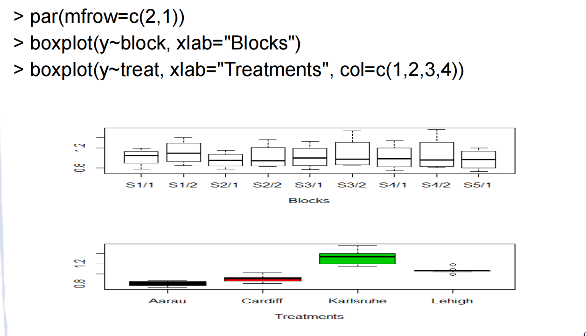

#### Top plot: `boxplot(y ~ block)`

- Shows **within-girder variation** (each box = one girder, 4 measurements).
- All boxes have similar medians & spreads → girders differ slightly, but no extreme outliers.
  - The boxes are located at roughly similar vertical levels (around 0.8 to 1.2), though there is some variation. For example, girder **S3/2** has a higher median than **S2/1**.

- Confirms blocking is reasonable (blocks are homogeneous *within* themselves).

#### Bottom plot: `boxplot(y ~ treat)`

This is the most critical plot for the experiment's conclusion. It compares the four methods: **Aarau**, **Cardiff**, **Karlsruhe**, and **Lehigh**.

- Compares the **four prediction methods**.
- Clear differences:
  - **Karlsruhe**: highest median (~1.34), tight spread → consistently over-predicts.
  - **Lehigh**: median ~1.07 → closest to 1 (ideal).
    -  There appear to be small circles below the bottom whisker. These represent **outliers**—specific data points where the Lehigh method performed unusually poorly compared to its typical performance.
  - **Aarau**: lowest (~0.80) → under-predicts (risky!).
  - **Cardiff**: ~0.91 → slightly conservative.

This visual evidence supports running an **ANOVA**  to statistically confirm that these differences are not due to random chance.

------

### **Statistical Model & ANOVA for RCBD**

#### RCBD Statistical Model

$$
\text{Observed value} = \text{Overall average} + \text{Treatment effect} + \text{Block effect} + \text{Random error}
$$

- **Model**:  
	$$ y_{ij} = \mu + \tau_i + \beta_j + \varepsilon_{ij} $$
	- $y_{ij}$: observed response for treatment $i$ in block $j$  
	- $\mu$: overall mean  
	- $\tau_i$: effect of treatment $i$  
	- $\beta_j$: effect of block $j$  
	- $\varepsilon_{ij} \sim N(0, \sigma^2)$: random error
	- $i$ = treatment (method)
	- $j$ = block (girder)

- **Estimates**:
	- $\hat{\mu} = \bar{y}_{..}$
	- $\hat{\tau}_i = \bar{y}_{i.} - \bar{y}_{..}$
	- $\hat{\beta}_j = \bar{y}_{.j} - \bar{y}_{..}$

- **Residuals**:  
	$$ e_{ij} = y_{ij} - \bar{y}_{i.} - \bar{y}_{.j} + \bar{y}_{..} $$

#### **Sums of Squares (SS) Decomposition**

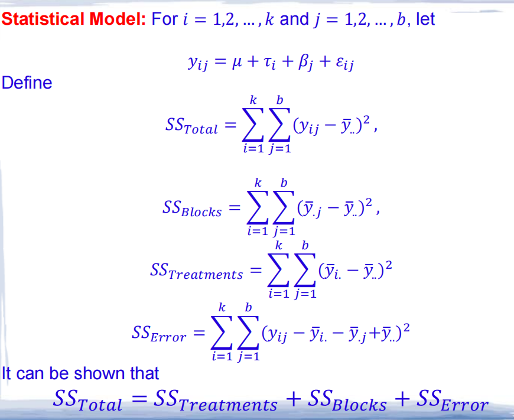

####  Expected Mean Squares (EMS)

- $E[\text{MSE}] = \sigma^2$
- $E[\text{MSTr}] = \sigma^2 + b \cdot \frac{\sum \tau_i^2}{k - 1}$
- $E[\text{MSB}] = \sigma^2 + k \cdot \frac{\sum \beta_j^2}{b - 1}$

→ Shows that **F-tests are valid** under the null hypotheses.


#### ANOVA Table for RCBD

| Source     | df           | SS      | MS                | F-test                               |
| ---------- | ------------ | ------- | ----------------- | ------------------------------------ |
| Treatments | $k - 1$      | SSTr    | MSTr = SSTr/(k−1) | $F = \frac{\text{MSTr}}{\text{MSE}}$ |
| Blocks     | $b - 1$      | SSB     | MSB = SSB/(b−1)   | $F = \frac{\text{MSB}}{\text{MSE}}$  |
| Error      | $(k-1)(b-1)$ | SSE     | MSE = SSE/df      | —                                    |
| Total      | $bk - 1$     | SSTotal | —                 | —                                    |

- If **F for treatments is large** → at least one treatment is different.

#### R: Output for ANOVA

```
model <- lm(y ~ block + treat)
anova(model)
```

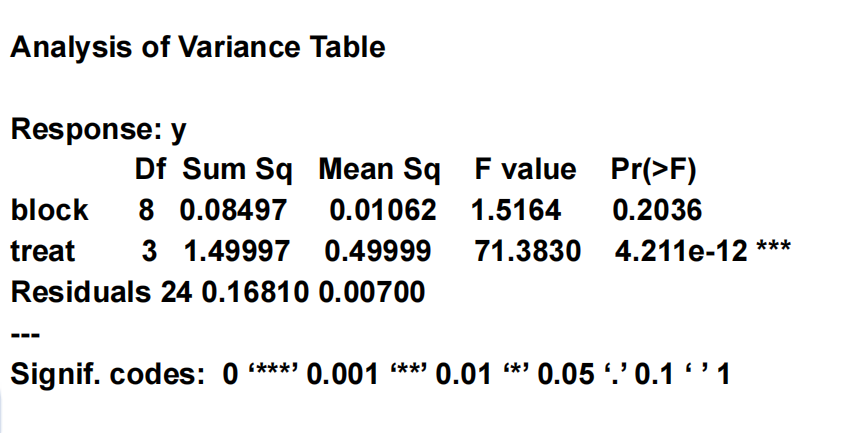

- **Treatment effect**: Highly significant (p < 0.001)
- **Block effect**: Not significant (p = 0.20), but still improves precision

> ✅ Even if blocks aren’t “significant,” **including them reduces error variance** and increases power to detect treatment differences.
>
> 

### R code: Draw Scatter-Plot of Data:

```R
data = read.csv("Data2_4.csv")          # Read 9×5 data: Girder + 4 methods
data_sub = data[,2:5]                   # Extract only the 4 treatment columns
rownames(data_sub) = data[,1]           # Set row names = girder IDs (S1/1, etc.)
par(mfrow = c(2,1))                     # Stack two plots vertically

#Plots all 4 methods side-by-side, with each column = one method.
#Each row (girder) appears as a horizontal group of 4 points → shows within-girder variation.
#X-axis labels: Aarau, Karlsruhe, Lehigh, Cardiff (methods).
#Y-axis: response (predicted/observed ratio).
stripchart(data_sub, vertical = TRUE)


#Transposes data: now each column = one girder (9 girders), each row = one method.
#Plots all 9 girders side-by-side, colored by girder (1–9).
#X-axis labels: S1.1, S2.1, ..., S4.2 (girders).
#Shows block-to-block variation and consistency of methods across girders.
stripchart(data.frame(t(data_sub)), vertical = TRUE, col = c(1:9))
```

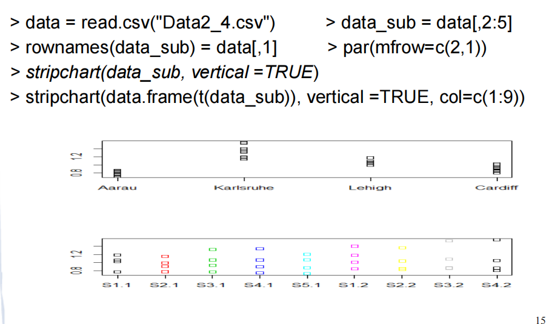

- **Top plot**: Clear separation among methods — Karlsruhe highest, Aarau lowest.
- **Bottom plot**: Within each girder, responses vary by method (e.g., in S1.1: Aarau < Cardiff < Lehigh < Karlsruhe), confirming blocking is appropriate.


### **R Codes to Check Assumptions:** 

**R code and four diagnostic plots** used to check the key assumptions of the linear model (e.g., for RCBD or LSD):

> ✅ **Assumptions to verify**:
>
> 1. **Normality** of residuals  
> 2. **Homoscedasticity** (constant variance)  
> 3. **No pattern** in residuals vs. fitted values, treatments, or blocks  

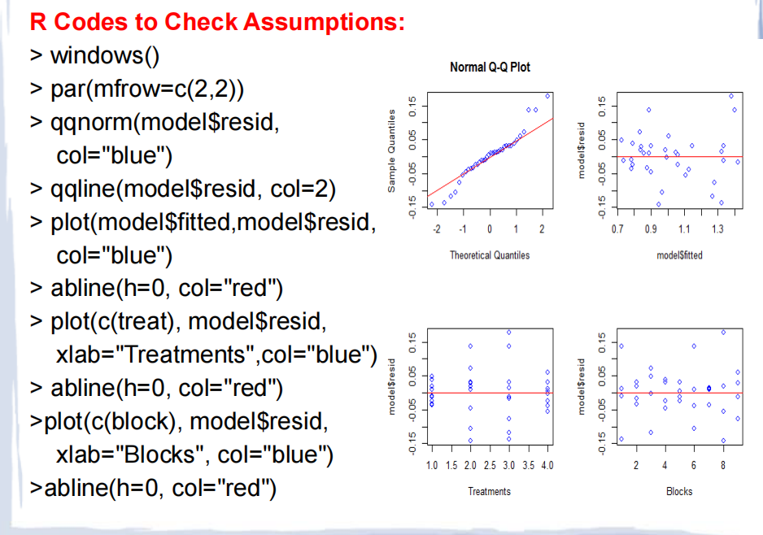

#### Code Breakdown:

```r
windows()                     # Open a new graphics window
par(mfrow = c(2,2))           # Arrange 4 plots in a 2×2 grid
```

#### 1. **Top-left: Normal Q-Q Plot**

```r
qqnorm(model$resid, col="blue")
qqline(model$resid, col=2)    # red line (col=2)
```

- **Purpose**: Check if residuals are normally distributed.
- Interpretation:
  - Points closely follow the red diagonal line → residuals are approximately normal.
  - Slight deviations at tails are common; no major curvature or outliers → assumption is reasonably satisfied.

#### 2. **Top-right: Residuals vs Fitted Values**

```r
plot(model$fitted, model$resid, col="blue")
abline(h=0, col="red")        # horizontal reference line at 0
```

- **Purpose**: Check for constant variance (homoscedasticity) of the random error term ($\epsilon_{ij}$) and linearity.
- Interpretation:
  - Residuals scatter randomly around the horizontal red line (y=0) with no funnel shape or pattern → constant variance assumed.
  - No clear curve → linear model is appropriate.

#### 3. **Bottom-left: Residuals vs Treatments**

```r
plot(c(treat), model$resid, xlab="Treatments", col="blue")
abline(h=0, col="red")
```

 What we’re checking:

- **Homogeneity of variance (homoscedasticity)** across treatments
- **No treatment-specific pattern or trend** in residuals

Interpretation:

- Residuals are scattered randomly above and below zero for all 4 treatments.
- The vertical spread (range of residuals) is roughly similar across all treatment groups — no funnel shape or increasing/decreasing dispersion.
- No obvious outliers or clusters tied to specific treatments.

#### 4. **Bottom-right: Residuals vs Blocks**

```r
plot(c(block), model$resid, xlab="Blocks", col="blue")
abline(h=0, col="red")
```

- **Purpose**: Check if variance differs across blocks (girders).

- Interpretation:
  - Residuals show consistent spread across all 9 blocks → block effects are additive and variance is stable.
  - No block stands out as having unusually large/small residuals → blocking was effective.


#### What if Normality Fails?

Use **Friedman’s test** (non-parametric version):
- Rank responses **within each block**
- Then do ANOVA on ranks

> In R: `friedman.test(y, treat, block)`

------


### **Checking Assumptions & Non-Parametric Alternatives in RCBD**

#### 1. **Testing Homogeneity of Variances**

ANOVA assumes that residuals are normally distributed, have a mean of zero, and have constant variance (homoscedasticity) across all groups (i.e., the **treatment levels**). 

Before trusting ANOVA results, check if variances are equal across groups, this is known as the **homogeneity of variances** assumption.

##### ✅ **Bartlett’s Test**  

- Assumes normality.
- Tests if variances are equal **across treatments or blocks**.
- **Low p-value (< 0.05)** → reject equal variances.

```r
bartlett.test(model$resid, treat)   # p = 0.0016 → unequal variances among treatments
bartlett.test(model$resid, block)   # p = 0.042 → borderline unequal among blocks
```

> ⚠️ **Caution**: Bartlett’s is sensitive to non-normality.

---

##### ✅ **Levene’s Test** (More robust)

- Uses **absolute deviations from group medians**.
- Does **not assume normality** → preferred when normality is doubtful.

**For treatments:**

```r
m.treat <- apply(data_sub, 2, median)
diff <- abs(y - rep(m.treat, times = 9))
anova(lm(diff ~ treat))  # p = 0.0168 → significant → unequal variances
```

**For blocks:**

Hypothesis:

*   $H_0$: Variances are equal across all blocks (homogeneity).
*   $H_1$: At least one block has a different variance.

```r
m.block <- apply(data_sub, 1, median)
diff <- abs(y - rep(m.block, each = 4))
anova(lm(diff ~ block))  

# p = 0.96 → There is no evidence that the variability of the error term differs between the girders (blocks). The assumption of constant variance (homoscedasticity) across blocks is satisfied.
```

> ✅ **Conclusion**: Treatment variances may differ; block variances seem fine.

---

#### 2. **Non-Parametric Alternative: Friedman’s Test**

Use when **normality assumption fails** (e.g., skewed residuals, outliers).

##### 🔍 **How it works**:

- **Ranks observations within each block** (1 = smallest, …).
- Then performs ANOVA-like test on ranks.
- Equivalent to Kruskal-Wallis for blocked data.

**Example output**:

- Karlsruhe always ranked **4** (highest) → consistently best treatment.
- Mean response: Karlsruhe (1.34) >> others (~0.8–1.07)

##### 📌 **Two ways to run it**:

**(a) Manual rank-based ANOVA**  

```r
data.ranks <- apply(data_sub, 1, rank)
model.ranks <- lm(c(data.ranks) ~ treat)
anova(model.ranks)  # F = 143.6, p < 2.2e-16 → strong treatment effect
```

**(b) Built-in Friedman test** (recommended):

```r
friedman.test(y, treat, block)
# χ² = 25.13, df = 3, p = 1.45e-05 → highly significant
```

> ✅ **Interpretation**: At least one treatment differs significantly — likely Karlsruhe is superior.

#### 🧠 **Key Takeaways**

| Test           | Purpose                  | When to Use        | R Function                       |
| -------------- | ------------------------ | ------------------ | -------------------------------- |
| **Bartlett’s** | Test equal variances     | Data is normal     | `bartlett.test()`                |
| **Levene’s**   | Test equal variances     | Normality doubtful | Custom `lm(abs(resid) ~ group)`  |
| **Friedman’s** | Non-parametric RCBD test | Normality violated | `friedman.test(y, treat, block)` |

> 💡 **Rule of thumb**: If assumptions fail → **use Friedman’s test** instead of regular ANOVA.

---

### 📊 Density Estimation

#### 🎯 Goal:

We want to **guess what the true probability distribution** of our data looks like—without assuming it’s normal, uniform, etc.

Think of it like this:  

> “If I collected more data from the same process, where would new points likely fall?”

A **histogram** tries to answer this—but it’s **jagged**, depends heavily on bin choice, and isn’t smooth.

**KDE gives a smooth, continuous estimate** of the underlying density.

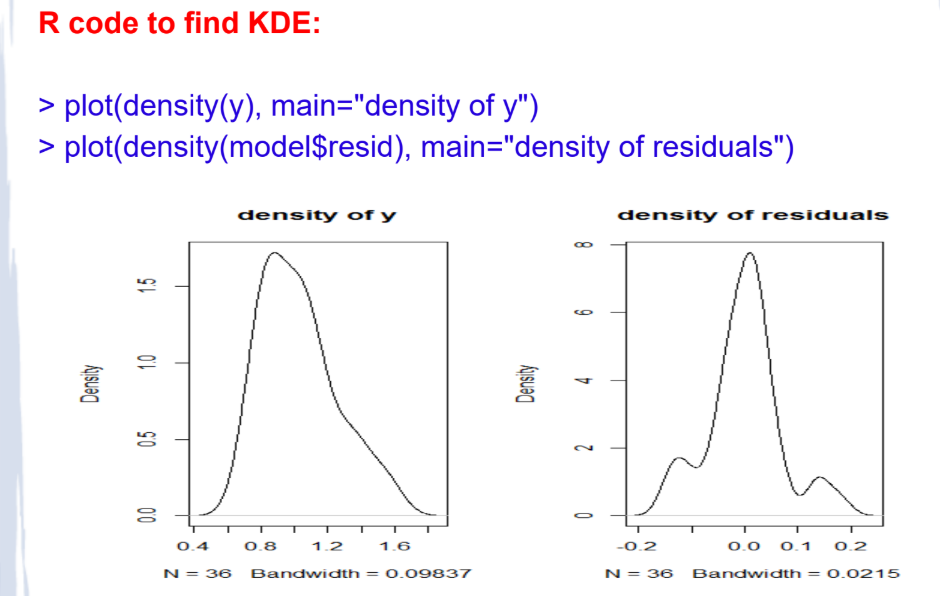


#### 🔍 How KDE Works (Intuition)

Imagine placing a **small smooth bump** (called a *kernel*) on top of **each data point**. Then you **add up all the bumps**.

- The most common bump = **standard normal curve** (bell-shaped).
- The width of each bump = **bandwidth (`b`)**.

✅ **Small bandwidth** → narrow bumps → wiggly, detailed estimate (high variance).  
✅ **Large bandwidth** → wide bumps → oversmoothed, blurry estimate (high bias).

> It’s like using a paintbrush: fine tip vs. broad brush.

#### 📐 Mathematical Formula (Don’t Panic!)

The KDE at a point $$y$$ is:

$$
\hat{f}(y) = \frac{1}{n b} \sum_{i=1}^{n} K\left( \frac{y_i - y}{b} \right)
$$

Where:

- $$n$$ = number of data points
- $$y_i$$ = your observed data
- $$K(\cdot)$$ = kernel function (e.g., standard normal PDF)
- $$b$$ = bandwidth (controls smoothness)

But **you don’t need to compute this by hand**—R does it!

#### 💻 In R: Super Easy!

```r
# Suppose your data is in a vector called 'y'
plot(density(y))
```

That’s it! R:

- Uses Gaussian (normal) kernel by default
- Automatically picks a good bandwidth (using rules like "Silverman’s rule")

You can also look at residuals from a model:

```r
model <- lm(y ~ block + treat)
plot(density(model$resid), main = "Density of Residuals")
```

> ✅ Use this to check if residuals look roughly bell-shaped (for ANOVA assumptions).

#### Why Should You Care? (In Your Context)

In **Chapter 4**, after fitting an RCBD or Latin Square model, you **check assumptions**:

1. Are residuals **normally distributed**?
2. Are variances **equal** across groups?

**KDE helps with #1**:  

- Instead of just a histogram (which is choppy), KDE gives a **smoother picture** of the residual distribution.
- If the KDE looks **roughly symmetric and bell-shaped** → normality assumption is reasonable.
- If it’s **skewed or has weird bumps** → consider transformation (like Box-Cox) or non-parametric test (like Friedman’s).

---

### **Box-Cox Transformation**

Used when data are skewed or heteroscedastic — to stabilize variance and improve normality.

To **stabilize variance** means to apply a mathematical transformation (like Log, Square Root, or Box-Cox) to the response variable *y* so that the **variance of the errors becomes constant** across all groups.

#### 🔹 Transformation Formula:
$$
y^{(\alpha)} = 
\begin{cases}
\displaystyle \frac{y^\alpha - 1}{\alpha}, & \alpha \ne 0 \\
\ln(y), & \alpha = 0
\end{cases}
$$

#### 🔹 Choosing $\alpha$:
- Use **Box-Cox plot**: maximize log-likelihood over $\alpha$
- In R (`MASS` package):
  ```r
  library(MASS)
  bc <- boxcox(model)          # produces plot + log-lik values
  alpha <- bc$x[which.max(bc$y)]  # optimal α
  ty <- (y^alpha - 1)/alpha    # transformed response
  ```

#### 🔹 Example workflow:

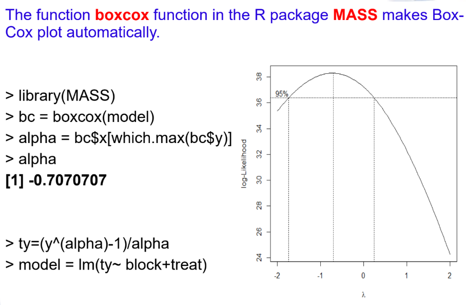

```r
library(MASS)
bc <- boxcox(lm(y ~ block + treat))
alpha <- bc$x[which.max(bc$y)]   # e.g., -0.707
ty <- (y^alpha - 1)/alpha
model_t <- lm(ty ~ block + treat)
```

> ⚠️ Requires $y > 0$. If not, add a constant first.


#### 3. **Why Transform?**

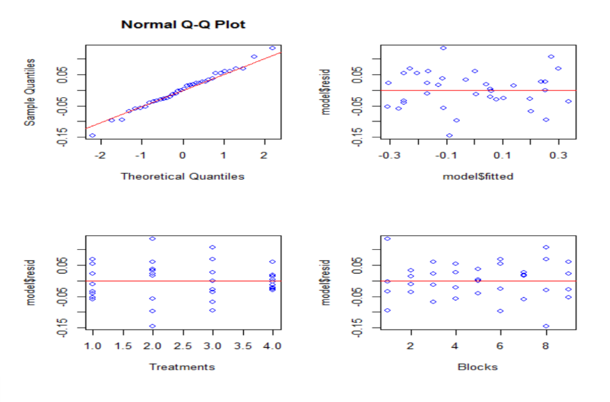

Common reasons:
- Improve normality of residuals  
- Stabilize variance (homoscedasticity)  
- Linearize relationships  
- Most common: **log** ($\alpha = 0$) or **square root** ($\alpha = 0.5$)

------


### **Which specific treatments differ from each other?**  

You run an experiment with **4 treatments** (e.g., Aarau, Karlsruhe, Lehigh, Cardiff).
You fit an ANOVA → it says: **“At least one treatment is different!”** (p-value tiny).

But now you ask:

> “Okay… but **which ones** are different? Is Karlsruhe better than Aarau? Is Cardiff the same as Lehigh?”
>
> “Is the difference between two treatment means big enough to be real — or just due to random noise?”

This is called **post-hoc multiple comparisons**.

There are two main methods shown here:

1. **Fisher’s LSD** (Least Significant Difference)  
2. **Tukey’s Method**

#### 🔹 1. Fisher’s LSD (Least Significant Difference)

##### ✅ What it does:

- Tests **each pair of treatment means** one-by-one.
- Uses the same error estimate (`MSE`) from the ANOVA.
- Very simple — but **does NOT control overall Type I error rate** when doing many comparisons (so it’s “liberal” — more false positives).

##### 📐 Formula:

For two treatments $i$ and $j$, with sample sizes $n_i$, $n_j$:

$$
\text{LSD} = t_{\alpha/2,\, df_{\text{error}}} \cdot \sqrt{MSE \left( \frac{1}{n_i} + \frac{1}{n_j} \right)}
$$

If  
$$
|\bar{y}_i - \bar{y}_j| > \text{LSD},
$$
→ declare them **significantly different**.

##### 📊 In Your Example:

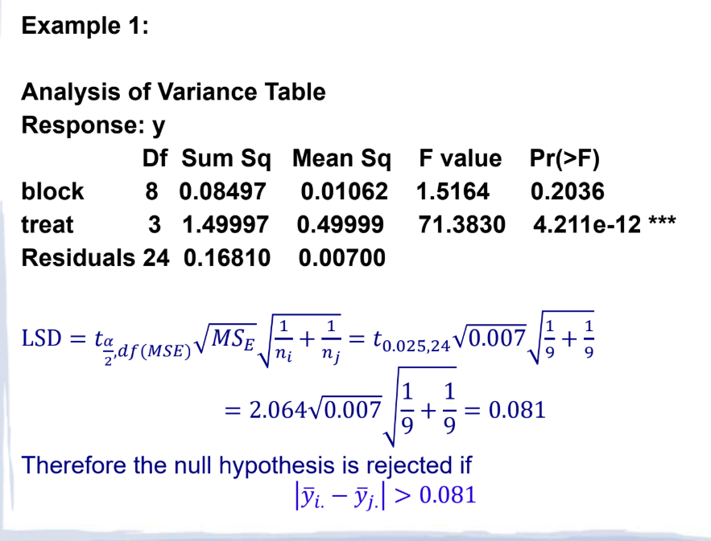

From ANOVA table:

- `df_error = 24`
- `MSE = 0.00700`
- Each treatment has $n_i = n_j = 9$ (9 girders × 1 per girder per treatment → 9 observations per method)

So:
$$
\text{LSD} = t_{0.025,\,24} \cdot \sqrt{0.007 \left( \frac{1}{9} + \frac{1}{9} \right)} 
= 2.064 \cdot \sqrt{0.007 \cdot \frac{2}{9}} 
= 2.064 \cdot \sqrt{0.001556} 
= 2.064 \cdot 0.03944 \approx 0.081
$$

✅ So: **Any pair with |difference| > 0.081 is significant**.

Now look at the treatment means and Differences:

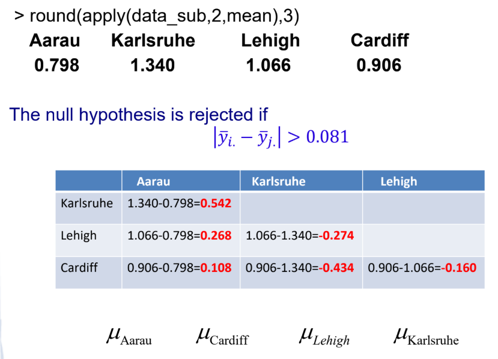

- Karlsruhe – Aarau = **0.542** > 0.081 → ✅ significant  
- Lehigh – Aarau = **0.268** > 0.081 → ✅ significant  
- Cardiff – Aarau = **0.108** > 0.081 → ✅ significant  
- Lehigh – Cardiff = **0.160** > 0.081 → ✅ significant  
- Karlsruhe – Cardiff = **0.434** > 0.081 → ✅ significant  
- Karlsruhe – Lehigh = **0.274** > 0.081 → ✅ significant  

➡️ **All pairs are significantly different!**  
*(That’s why the ANOVA F-test was so tiny: p = 4.2e−12)*

 

##### The Problem:

- You’re doing **6 comparisons** (A vs B, A vs C, A vs D, B vs C, B vs D, C vs D).
- Each test has 5% chance of false positive.
- But **overall**, chance of **at least one false alarm** is much higher (~26%).
- So **LSD doesn’t control the overall error rate**.

-  Think of it like this: If you roll a die 6 times, chance of getting a "1" at least once is way more than 1/6.

**Use LSD only if**:

- You planned **just 1 or 2 specific comparisons** ahead of time (called “planned contrasts”).
- Or you’re being exploratory and okay with more false positives.

---

#### 🔹 2. Tukey’s Method (Honestly Significant Difference)

##### ✅ What it does:

- Controls the **family-wise error rate** (i.e., keeps overall Type I error ≤ α, say 5%, even when comparing many pairs).
- More conservative than LSD — harder to declare significance.

##### 📐 Formula:

Instead of using the *t*-value, Tukey uses the **studentized range statistic** $q$:

$$
\text{HSD} = \frac{q_{\alpha}(k, \, df_{\text{error}})}{\sqrt{2}} \cdot \sqrt{MSE \left( \frac{1}{n_i} + \frac{1}{n_j} \right)}
$$

Or equivalently (as in your slide):
$$
\text{S.E.}(\bar{y}_i - \bar{y}_j) = \sqrt{MSE \left( \frac{1}{n_i} + \frac{1}{n_j} \right)} = 0.039 \\
k_\alpha = \frac{q_{0.95}(4, 24)}{\sqrt{2}} = \frac{3.90}{\sqrt{2}} \approx 2.759 \\
\Rightarrow \text{HSD} = 2.759 \times 0.039 \approx 0.108
$$

✅ So now: **Any pair with |difference| > 0.108 is significant**.

| **Pair**                | **Difference** | **> 0.108?**     |
| ----------------------- | -------------- | ---------------- |
| **Karlsruhe – Aarau**   | 0.542          | ✅ Yes            |
| **Lehigh – Aarau**      | 0.268          | ✅ Yes            |
| **Cardiff – Aarau**     | 0.108          | ❌ No (At cutoff) |
| **Karlsruhe – Cardiff** | 0.434          | ✅ Yes            |
| **Lehigh – Cardiff**    | 0.160          | ✅ Yes            |
| **Karlsruhe – Lehigh**  | 0.274          | ✅ Yes            |

So only **Cardiff vs. Aarau** is *not* significant under Tukey (borderline).

---

##### 💻 R Output Confirmation:

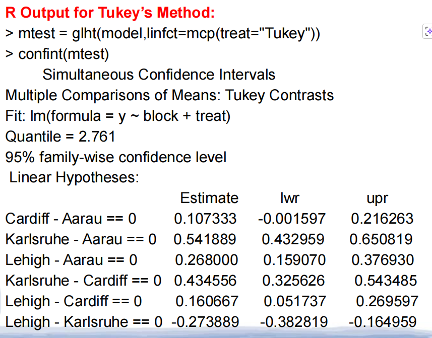

```r
mtest = glht(model,linfct=mcp(treat="Tukey"))
confint(mtest)   # Tukey contrasts
Cardiff - Aarau == 0    Estimate = 0.1073, 95% CI: [-0.0016, 0.2163]
```

→ Since CI includes 0, **not significant** — matches our calculation!

Other CIs (e.g., Karlsruhe − Aarau = 0.542, CI [0.433, 0.651]) do **not** include 0 → significant.

---

#### 🧠 Quick Summary Table

| Method         | Critical Value | Threshold | Controls Family Error? | When to Use                                    |
| -------------- | -------------- | --------- | ---------------------- | ---------------------------------------------- |
| **Fisher LSD** | $t_{\alpha/2}$ | 0.081     | ❌ No                   | Few comparisons; exploratory                   |
| **Tukey HSD**  | $q/\sqrt{2}$   | 0.108     | ✅ Yes                  | All pairwise comparisons (recommended default) |

------


# What If You Ignore Blocking? (Slides 35–36)

### 🎯 Key Idea:

If you **forget to account for blocks** and analyze an RCBD as if it were a **Completely Randomized Design (CRD)**, you make a serious mistake.

### 🔍 What Happens?

- In RCBD:  
	$$SS_{\text{total}} = SS_{\text{treatment}} + SS_{\text{block}} + SS_{\text{error}}$$
- In CRD (wrong analysis):  
	$$SS_{\text{total}} = SS_{\text{treatment}} + SS_{\text{error (inflated)}}$$
	- $$ SS_{Error(CRD)} = SS_{Error(RCBD)} + SS_{Block} $$
	

Also, the degrees of freedom change:

*   $df_{Error(RCBD)} = (a-1)(b-1)$
*   $df_{Error(CRD)} = ab - 1 - (a-1) = a(b-1)$

👉 The **block variation gets dumped into the error term**, making **error larger**.

### 📊 Consequence:

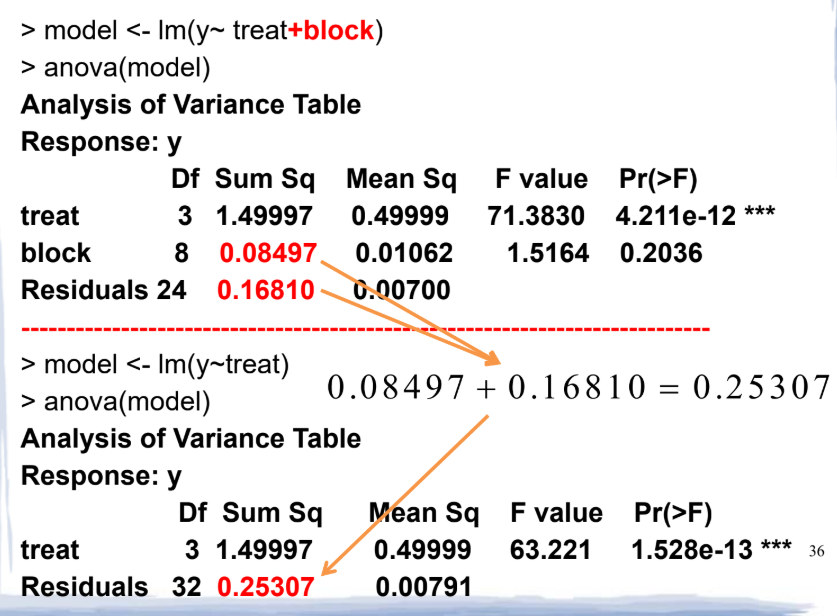

- **MSE increases** → **F-statistic decreases** → **less power** to detect real treatment effects.
- In your example:
	- Correct RCBD: MSE = 0.00700, F = 71.38
	- Wrong CRD: MSE = 0.00791, F = 63.22  
		→ Still significant here, but **in other cases, you might miss a real effect!**

✅ **Moral**: Always include known nuisance factors (like blocks) in your model!

------


# Paired Data = Special Case of RCBD (Slides 37–39)

### 🧪 Example: Blood pressure before/after a drug on 5 patients.

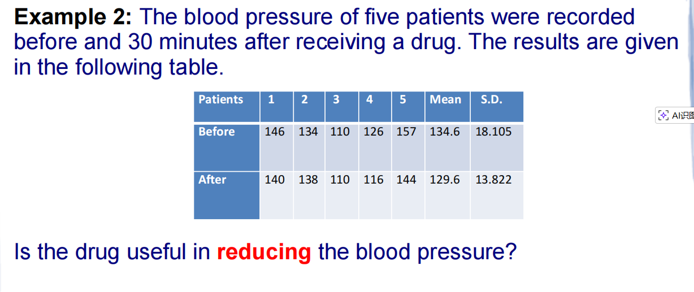

### 🔍 Connection to RCBD:

- **Each patient = a block** (to control for individual differences)
- **Two treatments**: “Before” and “After”
- This is an RCBD with **b = 5 blocks**, **k = 2 treatments**

### ✅ Two Equivalent Analyses:

1. **Paired t-test** (standard method):

  ```r
  > B = c(146, 134, 110, 126,157)
  > A = c(140, 138, 110, 116, 144)
  > t.test(B, A, alternative = "greater", paired =T)
  
  data: B and A
  t = 1.5972, df = 4, p-value = 0.09273
  alternative hypothesis: true difference in means is greater than 0
  95 percent confidence interval:
  -1.673736 Inf
  sample estimates:
  mean of the differences
  ```

2. **RCBD ANOVA** (**F-test for paired Samples**):

	```r
	> B = c(146, 134, 110, 126,157)
	> A = c(140, 138, 110, 116, 144)
	> y=c(B,A)
	> Treat = factor(rep(c("B","A"), each=5))
	> Block = factor(rep(c(1:5), 2))
	> model=lm(y~Treat+Block)
	> anova(model)
	
	Analysis of Variance Table
	Response: y
	          Df  Sum Sq  Mean Sq  F value  Pr(>F)    
	Treat      1    62.5     62.5    2.551  0.185462  
	Block      4  2168.4    542.1   22.127  0.005447 ** 
	Residuals  4    98.0     24.5                 
	```

Both test the same thing! The F-statistic in ANOVA = (t-statistic)².

> 💡 So: **Paired t-test is just a tiny RCBD!**

------


# Latin Square Design (LSD) (Slides 40–54)

## 🔷 Slide 40: Why Latin Square? The Problem with *Two* Nuisance Factors

**Core Idea**:  
Sometimes experiments have **TWO sources of unwanted variation** (nuisance factors), not just one.

- **RCBD** handles *one* nuisance(block) factor (e.g., patients in paired t-test)
- **Latin Square** handles *two* nuisance factors simultaneously

**Example Context**:  
Testing 4 gasoline additives/certain chemicals (A, B, C, D) to reduce air pollution:

- 🚗 **Nuisance Factor 1**: Different cars (wear differently)
- 👨‍✈️ **Nuisance Factor 2**: Different drivers (driving styles vary)

→ Without controlling both, differences in pollution might be due to car/driver—not the additive!

---

## 🔷 Slide 41: Latin Square Layout (The "Magic Grid")

Here's the experimental layout:

| Drivers ↓ \ Cars → | Car 1  | Car 2  | Car 3  | Car 4  |
| ------------------ | ------ | ------ | ------ | ------ |
| **Driver I**       | A (19) | B (24) | C (23) | D (26) |
| **Driver II**      | B (23) | A (24) | D (19) | C (30) |
| **Driver III**     | C (15) | D (14) | A (15) | B (16) |
| **Driver IV**      | D (19) | C (18) | B (19) | A (16) |

**Key Rules (What Makes It "Latin")**:
1. ✅ Each treatment (A/B/C/D) appears **exactly once per row** (driver)
2. ✅ Each treatment appears **exactly once per column** (car)
3. ✅ Total runs = $p^2$ where $p$ = #treatments = #rows = #columns

💡 **Why this works**:  
- Driver effect is "blocked out" by comparing treatments *within each row*  
- Car effect is "blocked out" by comparing treatments *within each column*  
→ Cleaner test of additive effects!

---

## 🔷 Slide 42: Creating Latin Squares in R

```r
The function design.lsd in the R package “agricolae” can be used 
to create a Latin square design.

install.packages("agricolae")
library(agricolae)
treat = c("A","B","C","D")
outdesign = design.lsd(treat, seed=23)
lsd = outdesign$book

> levels(lsd$row) = c("I", "II", "III", "IV")
> levels(lsd$col) = c(1,2,3,4)
```

→ This auto-generates a valid Latin Square layout. No manual shuffling needed!

---

## 🔷 Slide 43: The Statistical Model

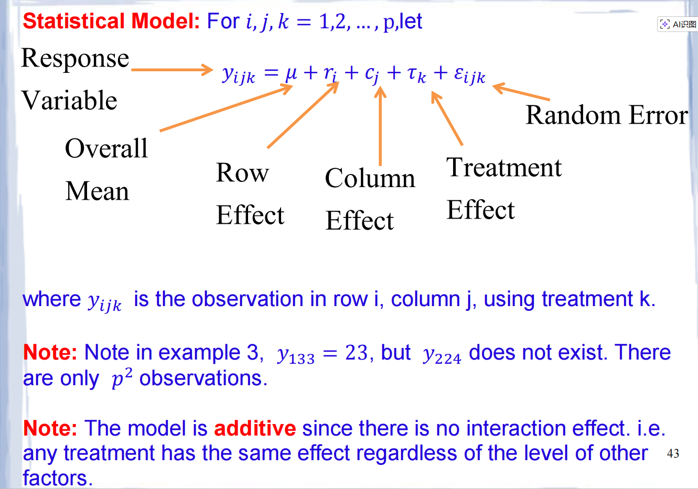
$$
y_{ijk} = \mu + r_i + c_j + \tau_k + \epsilon_{ijk}
$$

| Symbol           | Meaning                     | In Our Example                            |
| ---------------- | --------------------------- | ----------------------------------------- |
| $y_{ijk}$        | Observed pollution value    | e.g., 23 for Driver I, Car 3, Treatment C |
| $\mu$            | Overall average pollution   | Baseline level                            |
| $r_i$            | Row effect (driver)         | Driver I drives gently → lower pollution  |
| $c_j$            | Column effect (car)         | Car 3 is old → higher pollution           |
| $\tau_k$         | Treatment effect (additive) | What we *really* care about!              |
| $\epsilon_{ijk}$ | Random error                | Unexplained variation                     |

- In a Latin Square, you **only have one observation for each combination of row and column**.
- The notation $y_{ijk}$ usually means:
  - $i$ = row (e.g., driver)
  - $j$ = column (e.g., car)
  - $k$ = treatment (e.g., additive A, B, C, or D)

But here’s the key: **for any given row $i$ and column $j$, there is ONLY ONE treatment $k$**.


⚠️ **Critical Assumption**: **Additive model & No interactions** , This is about **how effects combine**.

- **Additive model** = Effects just **add up**; they don’t change each other.
- **No interaction** = The treatment works the **same way** no matter which row (driver) or column (car) it’s in. 
- Additive A works equally well in all cars/drivers. If false, Latin Square fails!

The design **assumes no interaction**. If interactions *do* exist, the Latin Square analysis can give **misleading results** because it can’t separate interaction effects from treatment effects.


**Example**:
Suppose Additive **A** reduces pollution by **5 units** on average.

- In an **additive model**:
  → It reduces by 5 units whether used by Driver I or Driver IV,
  → and whether used in Car 1 or Car 4.
  → The effect is **consistent**.
- If there **were an interaction**:
  → Maybe Additive A works great with gentle drivers (−8 units) but badly with aggressive drivers (+2 units).
  → Then the treatment effect **depends on the driver** → **not additive**.


## Statistical Data

### 📌 1. **Statistical Model**

$$
y_{ijk} = \mu + r_i + c_j + \tau_k + \varepsilon_{ijk}
$$

- $y_{ijk}$: observed response in **row $i$**, **column $j$**, with **treatment $k$**
- $\mu$: overall mean  
- $r_i$: effect of row $i$ (e.g., driver)  
- $c_j$: effect of column $j$ (e.g., car)  
- $\tau_k$: effect of treatment $k$ (e.g., additive A/B/C/D)  
- $\varepsilon_{ijk}$: random error  
  → **Additive only**: no interactions (treatment effect is same for all rows/columns).

### 📌 2. **Estimates & Residuals**

- $\hat\mu = \bar y_{...}$ → grand mean  

- $\hat r_i = \bar y_{i..} - \bar y_{...}$ → row effect = row mean − grand mean  

- $\hat c_j = \bar y_{.j.} - \bar y_{...}$ → column effect  = column mean - grand mean

- $\hat \tau_k = \bar y_{..k} - \bar y_{...}$ → treatment effect = treatment mean − grand mean  

- Residual:  
  $$
  e_{ijk} = y_{ijk} - \bar y_{i..} - \bar y_{.j.} - \bar y_{..k} + 2\bar y_{...}
  $$
  (subtract row, column, treatment means, but add back grand mean twice to avoid over-subtraction)


#### **marginal means** 

These are marginal means (averages over specific dimensions) in a Latin Square design with $p$ rows, $p$ columns, and $p$ treatments:

- $\bar y_{...}$: **Grand mean** — average of all $p^2$ observations.  
- $\bar y_{i..}$: **Row $i$ mean** — average of the $p$ observations in row $i$.  
- $\bar y_{.j.}$: **Column $j$ mean** — average of the $p$ observations in column $j$.  
- $\bar y_{..k}$: **Treatment $k$ mean** — average of the $p$ observations that received treatment $k$.

The dots indicate which indices are averaged over:
- First dot = row index,
- Second dot = column index,
- Third dot = treatment index.

### 📌 3. **Sums of Squares (SS)**

- Total variation:  
  $$
  SS_{\text{Total}} = \sum\sum\sum (y_{ijk} - \bar y_{...})^2
  $$

- Decomposed as:  
  $$
  SS_{\text{Total}} = SS_{\text{Treatments}} + SS_{\text{Rows}} + SS_{\text{Columns}} + SS_{\text{Error}}
  $$
  where:

  - $SS_{\text{Treatments}} = p \sum (\bar y_{..k} - \bar y_{...})^2$
  - $SS_{\text{Rows}} = p \sum (\bar y_{i..} - \bar y_{...})^2$
  - $SS_{\text{Columns}} = p \sum (\bar y_{.j.} - \bar y_{...})^2$

> ⚠️ Summations are **only over the $p^2$ observed cells** (not all $p^3$ combinations!).

### 📌 4. **Degrees of Freedom (df)**

- Total: $p^2 - 1$  

- Treatments: $p - 1$  

- Rows: $p - 1$  

- Columns: $p - 1$  

- **Error (MSE)**:   n - 𝑁𝑢𝑚𝑏𝑒𝑟 𝑜𝑓 𝑝𝑎𝑟𝑎𝑚𝑒𝑡𝑒𝑟𝑠 𝑖𝑛 𝑡ℎ𝑒 𝑓𝑢𝑙𝑙 𝑚𝑜𝑑𝑒
  $$
  df_{\text{Error}} = p^2 - [1 + (p-1) + (p-1) + (p-1)] = (p-1)(p-2)
  $$
  → This small df is why Latin Squares need $p \ge 4$ to have any error df.

  

 

## 🔷 Slides 44–46: How ANOVA Works (The Math Made Simple)

**Sum of Squares Decomposition**:
$$
SS_{Total} = SS_{Treatments} + SS_{Rows} + SS_{Columns} + SS_{Error}
$$

Think of it like budgeting variation:
- Total variation in data = 292 (from slide 50)
- Split into 4 buckets:
  - Treatment effect: 20 → Did additives differ?
  - Driver effect: 216 → Huge! Drivers matter a lot
  - Car effect: 24 → Moderate car differences
  - Error (unexplained): 52 → Random noise

**Degrees of Freedom (df)**:

- Treatments: $p-1 = 3$
- Rows (drivers): $p-1 = 3$
- Columns (cars): $p-1 = 3$
- Error: $(p-1)(p-2) = 3 \times 2 = 6$
- Total: $p^2 - 1 = 15$

🧠 **Why error df = $(p-1)(p-2)$?**  
We estimate $1 + 3 + 3 + 3 = 10$ parameters from 16 observations → $16 - 10 = 6$ leftover for error.

---

### 🔷 Slide 47: ANOVA Table Template

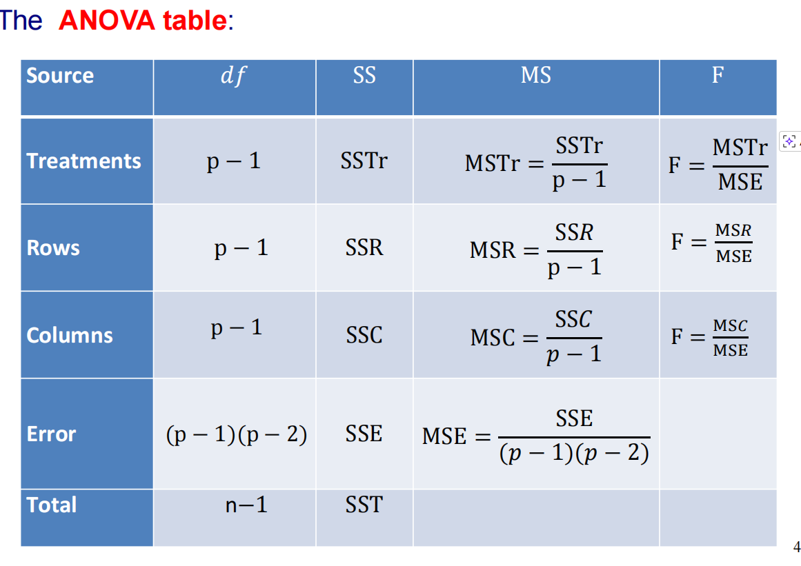

| Source     | df           | SS   | MS = SS/df | F = MS/MSE |
| ---------- | ------------ | ---- | ---------- | ---------- |
| Treatments | $p-1$        | SSTr | MSTr       | MSTr/MSE   |
| Rows       | $p-1$        | SSR  | MSR        | MSR/MSE    |
| Columns    | $p-1$        | SSC  | MSC        | MSC/MSE    |
| Error      | $(p-1)(p-2)$ | SSE  | MSE        | —          |
| Total      | $p^2-1$      | SST  | —          | —          |

---

### 🔷 Slide 50: Real ANOVA Output (Interpretation!)

Here's the experimental layout:

| Drivers ↓ \ Cars → | Car 1  | Car 2  | Car 3  | Car 4  |
| ------------------ | ------ | ------ | ------ | ------ |
| **Driver I**       | A (19) | B (24) | C (23) | D (26) |
| **Driver II**      | B (23) | A (24) | D (19) | C (30) |
| **Driver III**     | C (15) | D (14) | A (15) | B (16) |
| **Driver IV**      | D (19) | C (18) | B (19) | A (16) |

#### **R Codes to Define Factors in LSD:**

```r
> y = c(19, 24, 23, 26, 23, 24, 19, 30,15, 14, 15, 16, 19, 18, 19, 16)
> drivers <- as.factor(rep(as.character(as.roman(1:4)), each=4))
> cars<- as.factor(rep(1:4, times=4))
> treat <- as.factor(c("A", "B", “C", “D", “B", “A", “D", “C", 
“C", "D", “A", “B", “D", “C", "B", “A"))

Fuctions head() and tails can be used to return the first or last 
parts of a vector, matrix, table, data frame or function
> data <- data.frame(y, drivers, cars, treat)
> head(data,10)
1 19 I 1 A
2 24 I 2 B
3 23 I 3 C
4 26 I 4 D
5 23 II 1 B
6 24 II 2 A
7 19 II 3 D
8 30 II 4 C
9 15 III 1 C
10 14 III 2 D
```


#### **R Codes to Obtain ANOVA Table for LSD:**

```
> model <- lm(y~treat+drivers+cars)
> anova(model)

Analysis of Variance Table
Response: y
          Df Sum Sq Mean Sq F value  Pr(>F)  
treat      3     20    6.67   0.769  0.55181  
drivers    3    216   72.00   8.308  0.01477 *  
cars       3     24    8.00   0.923  0.48465  
Residuals  6     52    8.67                    
```

✅ **Driver effect is significant** (p = 0.015):  
→ Drivers differ *a lot* in pollution output (SS = 216 is huge!)

❌ **Treatment effect NOT significant** (p = 0.55):  
→ No evidence additives differ in reducing pollution

❌ **Car effect NOT significant** (p = 0.48):  
→ Cars don't differ much after controlling for drivers/treatments

💡 **Key Insight**:  
Even though treatments weren't significant *here*, Latin Square was still valuable—it removed driver variation (216 units) that would have drowned out treatment effects in a simpler design!

---

## 🔷 Slide 51: Checking Assumptions (Don't Skip This!)

**how to check assumptions** after fitting a Latin Square model:

#### **Normality of errors**:  

→ Use a **QQ-plot of residuals**. If points roughly follow a straight line, normality is reasonable.

#### **Constant variance (homoscedasticity)**:  

→ Plot residuals vs.:

- **Row labels** (e.g., drivers)  
- **Column labels** (e.g., cars)  
- **Treatment labels** (e.g., additives)  
→ Look for **no patterns or funnel shapes**—residuals should scatter evenly around zero.

#### **Formal tests for equal variances**:

- **Bartlett’s test**: Use only if residuals are **approximately normal** (sensitive to non-normality).
- **Levene’s test**: More robust; works even if normality is questionable (uses absolute deviations from group medians).

✅ **Goal**: Ensure the model’s assumptions hold so ANOVA results are valid.

---

## 🔷 Slides 52–53: Levene's Test for Equal Variances

Levene’s test checks **equal variances across groups** (e.g., treatments A–D), *without* assuming normality.

The function:

1. Computes absolute deviations from **group medians**:  
   `abs(y[group] − median(y[group]))`
2. Fits a one-way ANOVA on those deviations (`lm(y.d ~ factor)`)
3. Uses the F-test from that ANOVA as the Levene test statistic.


**R Codes to Perform Levene’s test :**

For Levene’s test, we should compute the absolute deviations from the medians in each label group and then do a one-way ANOVA on them

```
You may write a function to do Levene’s test. This following is an 
example.
> my.levene.test = function(y, v, factor) 
{ y.d <- vector()
for(j in v) y.d[factor==j] = abs(y[factor==j]-median(y[factor==j]))
model.d <- lm(y.d ~ factor)
anova(model.d)
}
```

**R Codes to Perform Levene’s Test for Treatment Group:** 

```
> v = c("A", "B", "C", "D")
> my.levene.test(y, v, treat)

Response: y.d
        Df Sum Sq Mean Sq F value Pr(>F)
factor   3     12    4.00    0.51   0.6825
Residuals 12   94    7.83
```

- **H₀**: All groups have equal variances  
- **p = 0.6825 > 0.05** → Fail to reject H₀ → **Variances are homogeneous** → ANOVA assumptions OK.


**Why test variances?**  
ANOVA assumes all groups have similar spread. Levene's test checks this:

✅ **p > 0.05** → Assumption satisfied → ANOVA results trustworthy  
❌ **p < 0.05** → Consider transformation or Welch's ANOVA

---

## 🔷 Slide 54: Multiple Comparisons (Tukey's HSD)

Used only if overall ANOVA is significant (here, it wasn’t — but shown for illustration).

When treatments *are* significant, ask: "Which pairs differ?"

```
install.packages("multcomp")

library(multcomp)
> mtest <- glht(model,linfct=mcp(treat="Tukey"))
> confint(mtest)

Simultaneous Confidence Intervals
Multiple Comparisons of Means: Tukey Contrasts
Fit: lm(formula = y ~ treat + drivers + cars)
Quantile = 3.4634 95% family-wise confidence level
Linear Hypotheses:
Estimate lwr upr
B - A == 0 2.0000 -5.2096 9.2096
C - A == 0 3.0000 -4.2096 10.2096
D - A == 0 1.0000 -6.2096 8.2096
C - B == 0 1.0000 -6.2096 8.2096
D - B == 0 -1.0000 -8.2096 6.2096
```

Output shows confidence intervals for all pairwise differences:
- If CI **doesn't include 0** → significant difference
- Example: `B-A: [-5.21, 9.21]` → includes 0 → NOT significantly different

⚠️ **In our example**: All CIs include 0 → no pairwise differences (matches p = 0.55 overall)

> 🔑 Key: If CI excludes 0 → significant difference; if includes 0 → not significant.

---

## 💡 Real-World Analogy

Imagine testing 4 coffee brands (A/B/C/D) with:
- ☕ **Rows** = 4 baristas (skill differences)
- 🥤 **Columns** = 4 mug types (material affects taste)

Latin Square ensures:
- Each barista brews all 4 brands (controls for skill)
- Each mug holds all 4 brands (controls for material)
→ You isolate *true coffee taste* from barista/mug effects!

---

## ❓ Self-Test Questions

1. Why can't we use RCBD when we have *two* nuisance factors?
2. What happens to error df if we increase $p$ from 4 to 5?
3. Why is the "no interaction" assumption critical for Latin Squares?
4. In slide 50, why was driver effect significant but treatment wasn't?

*(Answers: 1) RCBD only blocks one factor; 2) Error df = (5-1)(5-2)=12 (more power!); 3) Interactions would confound treatment effects with row/column effects; 4) Driver variation (216) was huge vs. treatment variation (20))*

---


# Graeco-Latin Square (Slide 55–57)

### 🔷 What is a **Graeco–Latin square**?

- It’s an extension of the **Latin square**.
- A Latin square controls for **two blocking factors** (e.g., *drivers* and *cars*).
- A **Graeco–Latin square** adds a **third blocking factor** (e.g., *days*), using **Greek letters** (α, β, γ, δ) alongside Latin letters (A, B, C, D).

✅ **Key rule**:  

> Every combination of **(Latin letter, Greek letter)** appears **exactly once** in the $p \times p$ grid.  
> So for $p=4$:  
>
> - 4 treatments (A, B, C, D)  
> - 4 drivers (I–IV)  
> - 4 cars (1–4)  
> - 4 days (α=Mon, β=Tue, γ=Wed, δ=Thu)  
>   → Total: $4^2 = 16$ runs, but now controlling for **3 nuisance factors**!

📌 In your table:

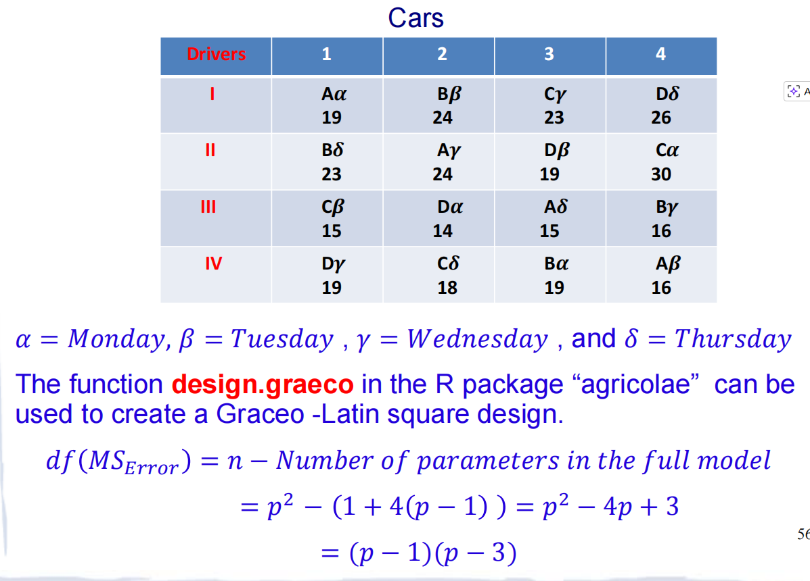

| Drivers \ Cars | 1       | 2       | 3       | 4       |
| -------------- | ------- | ------- | ------- | ------- |
| I              | Aα (19) | Bβ (24) | Cγ (23) | Dδ (26) |
| II             | Bδ (23) | Aγ (24) | Dβ (19) | Cα (30) |
| III            | Cβ (15) | Dα (14) | Aδ (15) | Bγ (16) |
| IV             | Dγ (19) | Cδ (18) | Bα (19) | Aβ (16) |

- Each cell shows: **Treatment + Day** (e.g., Aα = Treatment A on Monday).
- Notice:  
  - A appears with α, β, γ, δ → once each ✅  
  - α appears with A, B, C, D → once each ✅  
    → This is the *orthogonality* that makes Graeco–Latin squares powerful.

---

### 🔷 Why add a third block (e.g., days)?

Because real experiments often have **more than two sources of variation**:

- Driver skill  
- Car condition  
- Day-to-day changes (temperature, humidity, operator fatigue)

By adding “days” as a block, you **remove its effect** from treatment comparisons — just like blocking by drivers/cars did before.

---

### 🔷 Degrees of Freedom for Error

In a Graeco–Latin square with $p$ levels:

- Total observations: $n = p^2$
- Parameters estimated:  
  - 1 overall mean ($\mu$)  
  - $(p-1)$ for treatments  
  - $(p-1)$ for drivers  
  - $(p-1)$ for cars  
  - $(p-1)$ for days  
    → Total = $1 + 4(p-1)$

So:
$$
df_{\text{Error}} = p^2 - [1 + 4(p-1)] = p^2 - 4p + 3 = (p-1)(p-3)
$$

For $p = 4$:  
$$
df_{\text{Error}} = (4-1)(4-3) = 3 \times 1 = 3
$$
→ That’s why in Slide 57, **Residuals df = 3**.

⚠️ Important: If $p = 3$, then $df_{\text{Error}} = (2)(0) = 0$ → **no error term!** So Graeco–Latin squares require $p \ge 4$.

---

### 🔷 R Code & ANOVA Output (Slide 57)

R Codes to Obtain ANOVA Table for Graeco – Latin squares:

```r
> days <- as.factor(c("M","T","W", "TR", "TR","W","T","M",
"T","M","TR","W", "W","TR","M","T"))
> model <- lm(y~treat+drivers+cars+days)
> anova(model)
```

ANOVA table:

| Source    | df   | Sum Sq | Mean Sq | F    | Pr(>F)   |
| --------- | ---- | ------ | ------- | ---- | -------- |
| treat     | 3    | 20     | 6.667   | 0.50 | 0.708    |
| drivers   | 3    | 216    | 72.000  | 5.40 | 0.0998 . |
| cars      | 3    | 24     | 8.000   | 0.60 | 0.657    |
| days      | 3    | 12     | 4.000   | 0.30 | 0.825    |
| Residuals | 3    | 40     | 13.333  |      |          |

🔍 Interpretation:

- **Only drivers** are *marginally significant* (p = 0.0998 ≈ 0.10) — suggests driver differences matter.
- **Treatments (additives)**: p = 0.708 → **no evidence** they affect pollution.
- **Error df = 3** is very small → low power; we’d need larger $p$ (e.g., $p=5$ → df = 8) for more reliable tests.

---


#  Balanced Incomplete Block Design (BIBD) (Slides 58–71)

## 🎯 Why Do We Need BIBD?

### The Problem:

In a **Randomized Complete Block Design (RCBD)**, every block must contain **all treatments**.  
But what if that’s **physically impossible** or too costly?

> **Example (Slide 59):**  
> You’re testing **4 tire compounds (A, B, C, D)**.  
> But each tire can only be split into **3 sections** → you can only test **3 compounds per tire**.  
> So you **can’t fit all 4 treatments in one block (tire)**.

This is where **Incomplete Block Designs** come in—and **BIBD** is the *best kind* of incomplete design.

---

## 🔷 What Is a BIBD? (Slides 58–60)

A **Balanced Incomplete Block Design (BIBD)** has these properties:

| Symbol    | Meaning                                                      | In Example                    |
| --------- | ------------------------------------------------------------ | ----------------------------- |
| $t$       | Number of **treatments**                                     | 4 (A, B, C, D)                |
| $b$       | Number of **blocks**                                         | 4 tires                       |
| $k$       | **Block size** = #treatments per block                       | 3 (only 3 compounds per tire) |
| $r$       | **Replications** = times each treatment appears              | 3                             |
| $\lambda$ | Times **each pair** of treatments appears together in same block | 2                             |

✅ **Key idea**: Even though no block has all treatments, **every pair of treatments appears together equally often** → “balanced”.


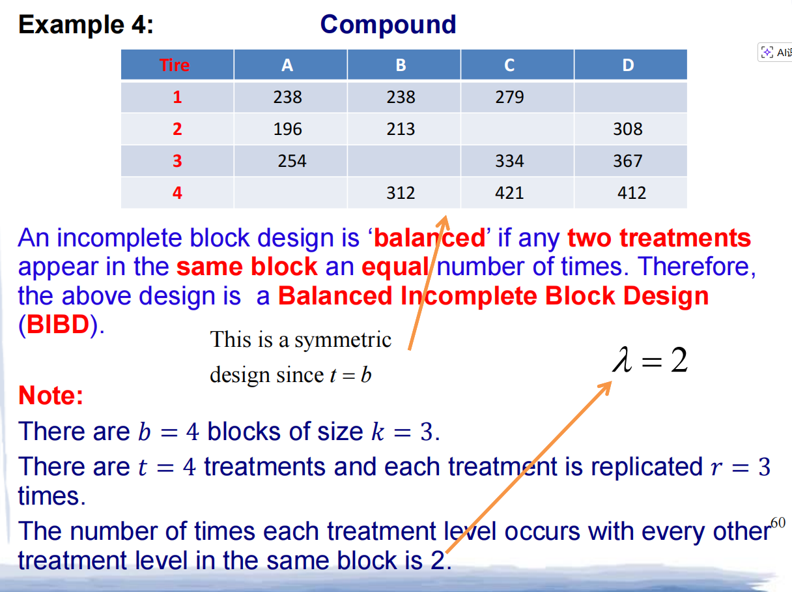

> In Slide 60:  
>
> - A & B appear together in Blocks 1 and 2 → 2 times  
> - A & C appear in Blocks 1 and 3 → 2 times  
> - ... and so on for all pairs → **$\lambda = 2$**

This balance ensures **fair comparisons** between any two treatments.

---

## 🔢 The Magic BIBD Equations (Slides 61–62)

For a valid BIBD, these **two equations must hold**:

1. $bk = rt$  
   → Total experimental units = blocks × size = treatments × reps  
   → $4 \times 3 = 3 \times 4 = 12$ ✅

2. $\lambda(t - 1) = r(k - 1)$  
   → Balances pairwise co-occurrence  
   → $2(4 - 1) = 3(3 - 1) \Rightarrow 6 = 6$ ✅

💡 These help you **design** a BIBD:  
If you know $t$ and $k$, you can solve for minimum $b, r, \lambda$.

> **Example**: $t = 6$ treatments, $k = 3$ per block  
> → From Eq 2: $\lambda(5) = r(2)$ → smallest integers: $r = 5, \lambda = 2$  
> → From Eq 1: $b = rt/k = (5×6)/3 = 10$ blocks  
> → Use `BIBsize(6,3)` in R to confirm 

```
> install.packages("daewr")
> library(daewr)
> BIBsize(6,3) # t = 6, k = 3
```

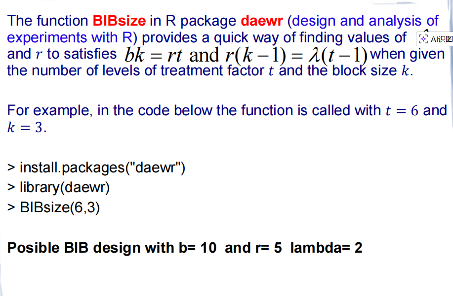

---

## ⚠️ Important Caveats (Slide 63)

#### 🔷 Key Equations & Facts:
- **BIBD must satisfy**:  
  $bk = rt$ and $r(k-1) = \lambda(t-1)$  
  (total units = blocks × size = treatments × reps; pairwise co-occurrence balanced)

- ✅ Even if equations hold, a BIBD **may not exist** (mathematically possible ≠ constructible).  
- ✅ If it *does* exist, it’s **D-optimal** (most efficient for estimating treatment effects).

#### 🔷 Using `optBlock()` in R (`AlgDesign` package):
To *search* for a BIBD when theory doesn’t guarantee one:

```r
# Finding Design Parameters (daewr package)
install.packages("daewr")
library(daewr)
BIBsize(6, 3) # t = 6 treatments, k = 3 per block  
# return 10 blocks (b=10)


# Generating the Design Layout (AlgDesign package)
library(AlgDesign)
BIB <- optBlock(~., 
                withinData = factor(1:6),   # t = 6 treatments
                blocksizes = rep(3, 10))   # b = 10 blocks, each k = 3 units
des <- BIB$rows
dim(des) <- NULL
des <- matrix(des, nrow = 10, # 10 rows (blocks).
              ncol = 3,  # 3 columns (units within the block).
              byrow = T, # Fills the matrix row-by-row.
              dimnames = list(paste(rep("Block", 10), 1:10),
                              c("Unit 1", "Unit 2", "Unit 3")))
print(des)
#----------output----------------
Posible BIB design with b= 10  and r= 5  lambda= 2 
         Unit 1 Unit 2 Unit 3
Block 1       2      3      4
Block 2       1      3      4
Block 3       3      5      6
Block 4       1      2      5
Block 5       2      3      5
Block 6       1      4      5
Block 7       4      5      6
Block 8       1      2      6
Block 9       2      4      6
Block 10      1      3      6
```

- This demonstrates how to *create* a design for **6 treatments**, which mathematically necessitates **10 blocks**.
- `BIB$rows` gives the assignment (e.g., Block 1: treatments 2,5,1).
- The design is **not unique** — rerunning may give a different but equivalent BIB.

> 💡 Think of `optBlock` as an algorithm that *tries* to find a balanced arrangement—like solving a puzzle with constraints.


---


## 📉 Statistical Analysis: Why Ordinary Means Don’t Work (Slides 65–66)

This slide (p. 65) explains **why ordinary treatment means are biased in a BIBD**.

#### 🔑 Key Idea:
In a **complete** block design (e.g., RCBD), the row mean $\bar y_{i.}$ is an unbiased estimator of treatment effect $\tau_i$ because every treatment appears in every block.

But in a **BIBD**, blocks are *incomplete* — treatment $i$ appears only in some blocks — so $\bar y_{i.} - \bar y_{..}$ is **biased**.

- **Unbiased estimator**: On average, it gives the **true value** of what you're trying to estimate.
  → If you repeated the experiment many times, the average of your estimates would equal the true parameter.
- **Biased estimator**: On average, it **misses the true value**—it’s systematically too high or too low.
  → Even with infinite repeats, the average estimate ≠ true value.

#### 📌 Example (Treatment B, $i=2$):

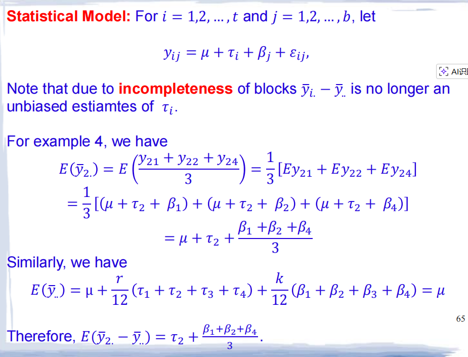

- Treatment B appears in blocks 1, 2, and 4 → $\bar y_{2.} = \frac{y_{21}+y_{22}+y_{24}}{3}$
- Taking expectation:
  $$
  E(\bar y_{2.}) = \mu + \tau_2 + \frac{\beta_1 + \beta_2 + \beta_4}{3}
  $$
  → includes **block effects** ($\beta_1,\beta_2,\beta_4$), not just $\tau_2$.

- Meanwhile, overall grand mean $E(\bar y_{..}) = \mu$ (unbiased).

So:
$$
E(\bar y_{2.} - \bar y_{..}) = \tau_2 + \frac{\beta_1 + \beta_2 + \beta_4}{3} \ne \tau_2
$$

❌ **Bias remains** due to unequal block representation.

#### ✅ Solution (next slide):  
Use **adjusted treatment totals** $Q_i = y_{i.} - \frac{1}{k}\sum n_{ij} y_{.j}$ to remove block effects and get unbiased estimates.

## ✅ Solution: Use **Adjusted Treatment Totals** ($Q_i$)

### 🎯 Why BIBD is “incomplete”

In a **Balanced Incomplete Block Design (BIBD)**:

- You have **t treatments** (e.g., 4 tire compounds: A, B, C, D)
- But each **block** (e.g., one tire) can only hold **k < t** treatments (e.g., only 3 sections per tire → only 3 compounds tested per tire).
- So **no treatment appears in every block** → you can’t just use the usual average (`y̅_i. − y̅..`) to estimate its effect — it’s **biased** (because it’s mixed with the blocks it happened to be in).

> ✅ That’s what “incompleteness” means: *treatments don’t appear everywhere*, so we need a smarter way.

### 🔧 The Fix: **Adjusted Treatment Total $Q_i$**

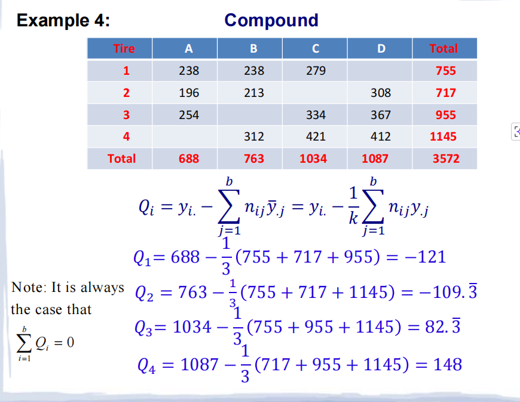

For treatment $i$, define:
$$
Q_i = y_{i.} - \frac{1}{k} \sum_{j=1}^b n_{ij} y_{.j}
$$

- $y_{i.}$ = total of all observations for treatment $i$ (e.g., A appears in tires 1,2,3 → sum = 238+196+254 = 688)
- $n_{ij} = 1$ if treatment $i$ is in block $j$, else 0  
- $y_{.j}$ = total of block $j$ (e.g., Tire 1 total = 755)
- $\frac{1}{k}\sum n_{ij} y_{.j}$ = average of the *blocks that contain treatment $i$*

➡️ So $Q_i$ = raw total **minus** the part due to block effects → it’s the *pure* treatment contribution.

**Example (A)**:
$$
Q_1 = 688 - \frac{1}{3}(755 + 717 + 955) = 688 - 809 = -121
$$

And crucially:  
✅ $\sum Q_i = 0$ — they’re deviations from overall mean (like contrasts).


### 📊 ANOVA for BIBD (the table)

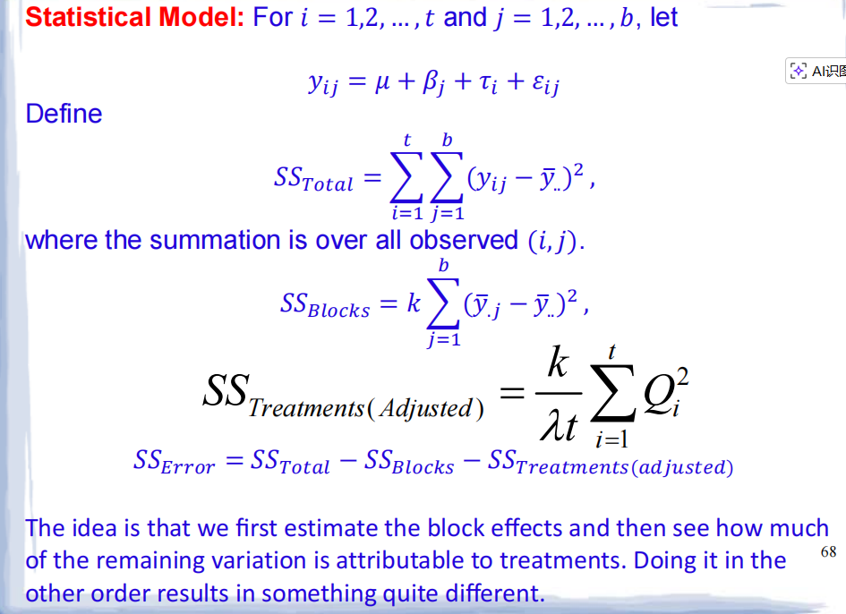

#### Sum of Squares:

- $SS_{\text{Treatments (adj)}} = \frac{k}{t} \sum_{i=1}^t Q_i^2$
- $SS_{\text{Blocks}} = k \sum (\bar y_{.j} - \bar y_{..})^2$
- $SS_{\text{Error}} = SS_{\text{Total}} - SS_{\text{Blocks}} - SS_{\text{Treatments (adj)}}$

**Why “adjusted”?** Because we used $Q_i$, not raw means.

**Key idea**: First remove block effects → then see how much *leftover* variation is due to treatments.


#### Degrees of Freedom:

| Source           | df                               |
| ---------------- | -------------------------------- |
| Blocks           | $b - 1$                          |
| Treatments (adj) | $t - 1$                          |
| Error            | $bk - b - t + 1 = N - b - t + 1$ |
| Total            | $N - 1 = bk - 1$                 |

> In example: $N = 12$, so Error df = $12 - 4 - 4 + 1 = 5$ ✅ (Slide 71)


#### Anova Table

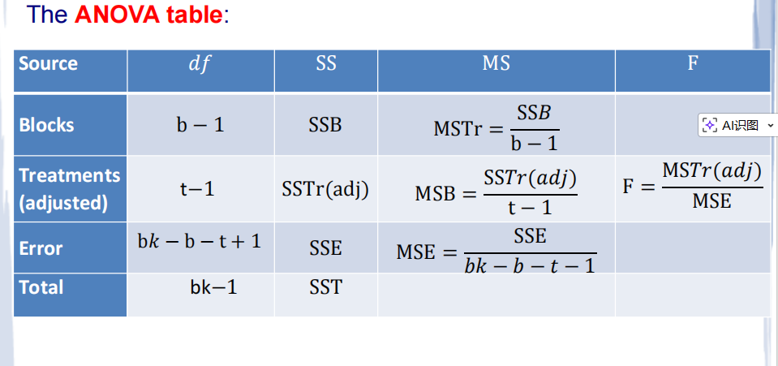


### **R Codes to Obtain ANOVA Table for BIBD:**

In R, **order matters** for BIBD:

```r
> y = c(238,238,279, 196,213,308, 254, 334, 367,312,421,412)
> treat = as.factor(c("A", "B", "C","A", "B", "D",
"A", "C", "D","B", "C", "D"))
> block = as.factor(rep(1:4, each=3))
> model <- lm(y ~ block + treat)
> anova(model)


# WRONG: treats not adjusted properly
model2 <- lm(y ~ treat + block)
anova(model2)

# CORRECT: adjust treatments FOR blocks
model <- lm(y ~ block + treat)
anova(model)

Analysis of Variance Table
```

Because BIBD is **not orthogonal**, Type I SS depends on order. Always put **block first**.


#### 🧪 Final Output & Interpretation (Slide 71)

ANOVA Table:

| Source    | Df   | Sum Sq | Mean Sq | F value | Pr(>F)      |
| --------- | ---- | ------ | ------- | ------- | ----------- |
| block     | 3    | 39123  | 13040.9 | 37.24   | 0.00076 *** |
| treat     | 3    | 20729  | 6909.7  | 19.73   | 0.00335 **  |
| Residuals | 5    | 1751   | 350.2   |         |             |

✅ **Conclusion**:  

- Block (tire) effect is huge → good we blocked!  
- **Treatment effect is significant** (p = 0.003) → tire compounds differ in wear resistance.

Now you can do **Tukey/Fisher tests** on adjusted means to see **which compounds differ**.

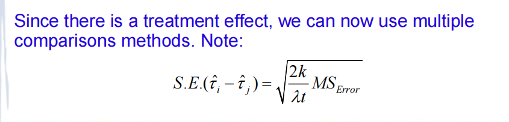

---

