# Interaction

### 🌟 What is an **Interaction**?

> **Interaction happens when the effect of one factor *depends* on the level of another factor.**

In other words:  
- If changing Factor A has **different effects** when Factor B is low vs. when Factor B is high → **there is interaction**.  
- If the effect of Factor A is **the same no matter what B is doing** → **no interaction**.

---

### 🧩 Real-Life Analogy

Imagine you’re making coffee:

- **Factor A**: Amount of coffee grounds (low or high)  
- **Factor B**: Water temperature (cold or hot)

Now ask:
> “Does using *more coffee grounds* always make the coffee stronger?”

- With **hot water**: Yes! More grounds = much stronger coffee.
- With **cold water** (like cold brew): More grounds helps a little, but not as much.

👉 So the **effect of coffee amount depends on water temperature** → **that’s an interaction!**

---

### 🔢 Simple Math Example (From Your Notes – Example 1 vs Example 2)

#### ✅ **No Interaction** (Example 1):

| A \ B  | Low B | High B |
| ------ | ----- | ------ |
| Low A  | 20    | 30     |
| High A | 40    | 50     |

- Effect of A when B is low: 40 – 20 = **+20**  
- Effect of A when B is high: 50 – 30 = **+20**  

→ Same effect! So **NO interaction**.

#### ❌ **With Interaction** (Example 2):

| A \ B  | Low B | High B |
| ------ | ----- | ------ |
| Low A  | 20    | 40     |
| High A | 50    | 12     |

- Effect of A when B is low: 50 – 20 = **+30**  
- Effect of A when B is high: 12 – 40 = **–28**  

→ Totally different! The direction even flips!  
So **YES—strong interaction**.

---

### 📈 How to Spot It Visually?

Use an **interaction plot**:

- If lines are **parallel** → **no interaction**  
- If lines **cross or diverge** → **interaction present**

(See your slides: Page 5 vs Page 10 — one has flat parallel lines, the other has crossing lines.)

---

### 💡 Key Takeaway

> **Main effects** tell you “what each factor does on average.”  
> **Interaction** tells you “do these factors *change each other’s influence*?”

And if interaction is significant, **never interpret main effects alone**—because the real story is in the combination!

---


# Two-Factor Factorial Designs with No interaction

## 🔹 What Is a **Factor** in Statistics?

- A **factor** is just another word for an **independent variable** that you control or study in an experiment.
- It’s something you **change or test** to see how it affects the outcome (called the **response** or **dependent variable**).

#### ✅ Example:
You’re testing how **battery life** is affected by:
- **Material type** (e.g., Type 1, Type 2, Type 3) → this is **Factor A**
- **Temperature** (e.g., 15°F, 70°F, 125°F) → this is **Factor B**

Each factor has **levels**:
- Factor A has 3 levels (Type 1, 2, 3)
- Factor B has 3 levels (15°, 70°, 125°)

In a **factorial design**, you test **all combinations**:  
Type 1 at 15°, Type 1 at 70°, …, Type 3 at 125° → total of $3 \times 3 = 9$ combinations.

### 💡 Key Idea:

> A **factor** = a **variable you’re experimenting with**.  
> Its **levels** = the **specific values or categories** you test.

Let me know when you're ready to move on!

---

## 🔹 **Slide 1: What Is a Factorial Design?**

**Purpose**: Study the effects of **two or more factors** simultaneously.

**Key Feature**: In a **factorial design**, **all possible combinations** of factor levels are tested in each replicate.

- If factor A has $a$ levels and factor B has $b$ levels → there are $ab$ treatment combinations per replicate.

**Advantage**: More **efficient** than changing one factor at a time (OFAT), and allows detection of **interactions** between factors.

---

## 🔹 **Slide 2–4: Example 1 – No Interaction Case**
### **Data Setup**:

| A (x₁)    | B (x₂)    | Response (y) |
| --------- | --------- | ------------ |
| Low (–1)  | Low (–1)  | 20           |
| Low (–1)  | High (+1) | 30           |
| High (+1) | Low (–1)  | 40           |
| High (+1) | High (+1) | 50           |

### **Regression Model**:

$$
\hat{y}_i = 35 + 10x_{i1} + 5x_{i2} + 0 \cdot x_{i1}x_{i2}
$$
- The interaction coefficient ($\beta_{12}$) is **zero**.
- This means the effect of A **does not depend** on the level of B (and vice versa).

### **R Codes to Find the Estimate of Regression Model:**:

```r
y <- c(20,30,40,50)
x1 <- c(-1,-1,1,1)
x2 <- c(-1,1,-1,1)

# x1*x2 (the interaction term)
model <- lm(y ~ x1 + x2 + x1*x2)

Call:
lm(formula = y ~ x1 + x2 + x1 * x2)

Coefficients:
(Intercept)    x1      x2     x1:x2 
   35.0       10.0     5.0    -8.88e-16
```

- Fits a model with main effects and interaction:  `model <- lm(y ~ x1 + x2 + x1*x2)` 

  This is equivalent to:
  $$
  y = \beta_0 + \beta_1 x_1 + \beta_2 x_2 + \beta_{12} x_1 x_2 + \varepsilon
  $$

  $$\hat{y} = \text{Intercept} + (\text{effect of } x1) \cdot x1 + (\text{effect of } x2) \cdot x2 + (\text{interaction}) \cdot (x1 \times x2)$$
### **Output interpretation**:

```
Coefficients:
(Intercept)    x1      x2     x1:x2 
   35.0       10.0     5.0    -8.88e-16
```

#### 1. **(Intercept) = 35.0**

- This is the **baseline value** of `y` when **both x1 = 0 and x2 = 0**.

- But in your experiment, you never actually used `x1 = 0` or `x2 = 0` — you used –1 and +1.

- In coded factorial designs, the intercept represents the **overall average** of all responses.

$\frac{20 + 30 + 40 + 50}{4} = \frac{140}{4} = 35$

✅ So, **35 is the grand mean**.

#### 2. **x1 = 10.0**

- This means: **for every 1-unit increase in x1**, `y` increases by **10 units**, *holding x2 constant*.

- But remember: your x1 goes from –1 (low) to +1 (high) → that’s a **2-unit change**.

- So the **total effect** of switching x1 from low to high is:

$$10 \times (1 - (-1)) = 10 \times 2 = 20$$

- Check with data:

  - When x2 = –1: y goes from 20 → 40 (**+20**)
  - When x2 = +1: y goes from 30 → 50 (**+20**)
    ✅ So, **x1 adds 20 to y when turned "on"**, and the coefficient is **10** because of the –1/+1 coding.

#### 3. **x2 = 5.0**

- Same logic: for every 1-unit increase in x2, `y` increases by **5**.

- Total effect from low (–1) to high (+1):

  $5 \times 2 = 10$

- Check:

  - When x1 = –1: 20 → 30 (**+10**)
  - When x1 = +1: 40 → 50 (**+10**)
    ✅ Correct! **x2 adds 10 to y**, coefficient is **5** due to coding.

#### 4. **x1:x2 ≈ –8.88e-16 (which is 0)**

- This is the **interaction term**.

- It tells you whether the effect of x1 **depends on** x2 (or vice versa).

- The number **–8.88 × 10⁻¹⁶** is just **computer rounding error** — it’s effectively **zero**.

- That means:  

  > “The effect of x1 is the same no matter what x2 is doing.”  
  > “The effect of x2 is the same no matter what x1 is doing.”

✅ **No interaction** — the factors act **independently**.

#### Final Model Equation:

$\hat{y} = 35 + 10 \cdot x_1 + 5 \cdot x_2 + 0 \cdot (x_1 \cdot x_2)$

Or simply:

$\hat{y} = 35 + 10x_1 + 5x_2$

------


## 🔹 **Slide 5–6: Visualizing Interactions – Profile Plots**
**Interaction Plot** in R:

```r
> y = c(20,30,40,50)
> x1= factor(c(-1,-1,1,1))
> x2= factor(c(-1,+1,-1,+1))

> interaction.plot(x1,x2,y, col=c(3,4))
```

**Interpretation**:

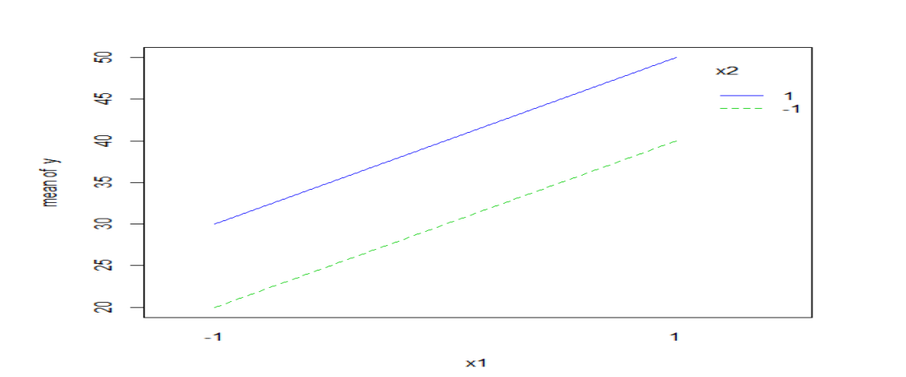

- **Parallel lines** → **no interaction**.
- Non-parallel (especially crossing) lines → **interaction present**.

- In Example 1, the plot shows **parallel lines**, confirming **additivity** (no interaction).

---

## 🔹 **Slide 7: Calculating Main Effects and Interaction Effect Manually**

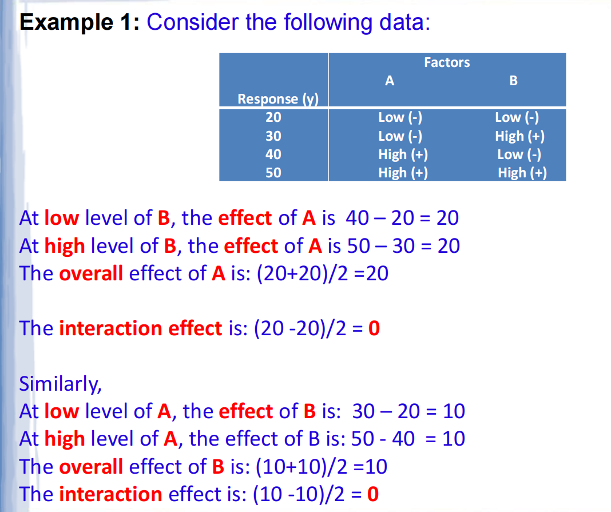

**Effect of A**:

- At low B: $40 - 20 = 20$
- At high B: $50 - 30 = 20$
- **Overall effect of A**: $(20 + 20)/2 = 20$
- **Interaction effect**: $(20 - 20)/2 = 0$

**Effect of B**:

- At low A: $30 - 20 = 10$
- At high A: $50 - 40 = 10$
- **Overall effect of B**: $(10 + 10)/2 = 10$
- **Interaction effect**: $(10 - 10)/2 = 0$

✅ **Conclusion**: Both main effects exist, but **no interaction**—the factors act **independently**.

------


# Example 2: Factorial Design WITH Interaction

---

### 🔹 **Slide 8: The Data**
- Same design as Example 1:  
  - Two factors: **A** and **B**, each at two levels (**Low = –1**, **High = +1**)  
  - All 4 combinations tested once

| Run  | A (x₁)    | B (x₂)    | Response (y) |
| ---- | --------- | --------- | ------------ |
| 1    | Low (–1)  | Low (–1)  | 20           |
| 2    | Low (–1)  | High (+1) | 40           |
| 3    | High (+1) | Low (–1)  | 50           |
| 4    | High (+1) | High (+1) | 12           |

> 💡 Notice: When **both are high**, the result **drops sharply** to 12 — this hints at an **interaction**.

---

### 🔹 **Slide 9: R Code & Regression Output**
```r
y <- c(20, 40, 50, 12)
x1 <- c(-1, -1, 1, 1)
x2 <- c(-1, 1, -1, 1)
model <- lm(y ~ x1 + x2 + x1*x2)
```

**Output:**
```
Coefficients:
(Intercept)    x1     x2    x1:x2 
      30.5    0.5   -4.5   -14.5
```

#### ➤ Interpretation:
- **Intercept = 30.5**: overall average of all 4 responses

$  \frac{20 + 40 + 50 + 12}{4} = \frac{122}{4} = 30.5$
- **x1 = 0.5**: tiny main effect of A (almost none!)
- **x2 = –4.5**: small negative main effect of B
- **x1:x2 = –14.5**: **large negative interaction** → this is the key!

✅ **Model equation**:

$\hat{y}_i = 30.5 + 0.5x_{i1} - 4.5x_{i2} - 14.5(x_{i1}x_{i2})$
---

### 🔹 **Slide 10: Interaction Plot (Profile Plot)**

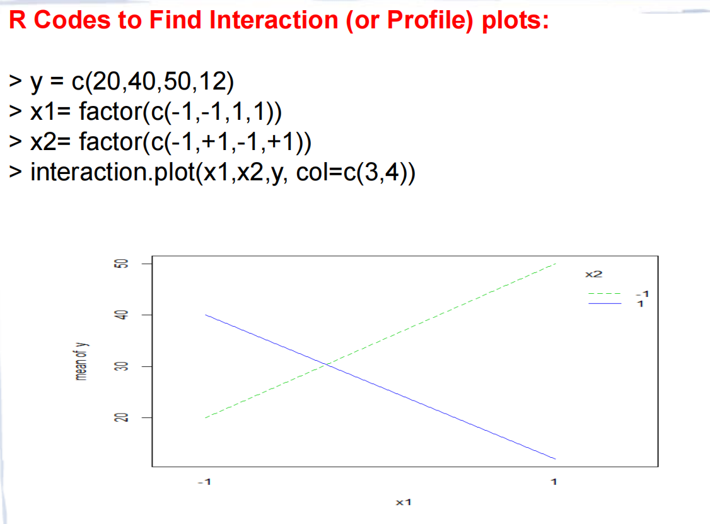

- R code uses `interaction.plot(x1, x2, y)`
- **What you’d see**: two lines that **cross or diverge strongly**
- This visual confirms:  
  > “The effect of A **depends heavily** on the level of B.”

---

### 🔹 **Slide 11: Full Model Equation**

Repeated for emphasis:

$\hat{y}_i = 30.5 + 0.5x_{i1} - 4.5x_{i2} - 14.5x_{i1}x_{i2}$

This model **perfectly predicts** all 4 observed values:
- For (–1, –1): 30.5 –0.5 +4.5 –14.5 = **20** ✅  
- For (–1, +1): 30.5 –0.5 –4.5 +14.5 = **40** ✅  
- For (+1, –1): 30.5 +0.5 +4.5 +14.5 = **50** ✅  
- For (+1, +1): 30.5 +0.5 –4.5 –14.5 = **12** ✅

---

### 🔹 **Slide 12: Manual Calculation of Effects**

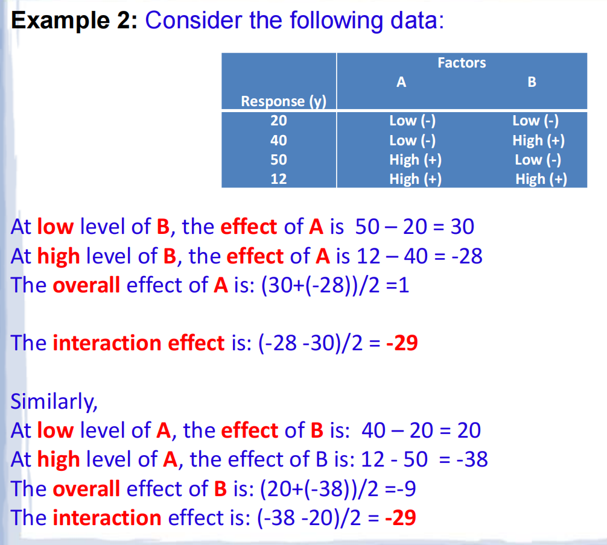

This slide shows **how to compute effects by hand**—very useful for understanding!

#### 🔸 Effect of A at different levels of B:
- When **B is low**: A changes y from 20 → 50 → **effect = +30**
- When **B is high**: A changes y from 40 → 12 → **effect = –28**

→ The effect of A **flips sign** depending on B! That’s interaction.

- **Overall (average) effect of A**:

 $ \frac{30 + (-28)}{2} = \frac{2}{2} = 1 \quad (\text{matches } 2 \times 0.5 = 1)$
- **Interaction effect**:

$  \frac{(-28) - (30)}{2} = \frac{-58}{2} = -29$

→ This matches **2 × (–14.5) = –29** (since coefficient is per unit in coded scale)

#### 🔸 Effect of B at different levels of A:
- When **A is low**: B changes y from 20 → 40 → **+20**
- When **A is high**: B changes y from 50 → 12 → **–38**

- **Overall effect of B**:

  $\frac{20 + (-38)}{2} = -9 \quad (\text{matches } 2 \times -4.5 = -9)$

→ This matches **2 × (–14.5) = –29** (since coefficient is per unit in coded scale)

- **Overall effect of B**:

 $ \frac{(-38) - (20)}{2} = \frac{-58}{2} = -29 \quad (\text{same as above})$

✅ **Key insight**: Both ways of computing interaction give **–29** → consistent!

---

### 🧠 **Summary: What Makes Example 2 Different?**

| Feature           | Example 1 (Slides 1–7)    | Example 2 (Slides 8–12)                       |
| ----------------- | ------------------------- | --------------------------------------------- |
| **Interaction**   | None (coefficient ≈ 0)    | Strong (coefficient = –14.5)                  |
| **Effect of A**   | Always +20                | +30 when B low, –28 when B high               |
| **Lines in plot** | Parallel                  | Cross or diverge                              |
| **Conclusion**    | Factors act independently | Factors **interact** — must consider together |

---

### 💡 **Takeaway Message**
> When **interaction is present**, you **cannot interpret main effects alone**.  
> You must say things like:  
> “When temperature is low, Material A works best — but when temperature is high, Material C is better.”


#  Example 3: Factorial Design WITH Interaction

---

### 🔹 **Definition (first sentence)**  
> *Two factors A and B are said to **interact** if the difference in mean responses for two levels of one factor is **not constant** across levels of the second factor.*

📌 In simple terms:  
- If changing **Factor A** has a *different effect* depending on whether **Factor B** is at level 1 or level 2 → then A and B **interact**.  
- If the effect is *the same* no matter what B is doing → **no interaction** (just additive effects).

This is the **formal statistical definition** of interaction.

---

### 🔹 **Example 3: Crop Yield Experiment**

You’re testing:
- **Factor A: Nitrogen** — 2 levels: 40 lb/plot vs. 60 lb/plot  
- **Factor B: Phosphorus** — 2 levels: 10 lb/plot vs. 20 lb/plot  

There are **4 treatment combinations**, randomly assigned:

| Comb. | Avg Yield | Nitrogen | Phosphorus |
| ----- | --------- | -------- | ---------- |
| 1     | **145**   | 60       | 10         |
| 2     | **125**   | 40       | 10         |
| 3     | **165**   | 40       | 20         |
| 4     | **180**   | 60       | 20         |

Now compute the **effect of Nitrogen** (change from 40 → 60) at each level of Phosphorus:

- When **P = 10**:  
  Yield at N=60 (Comb 1) = 145  
  Yield at N=40 (Comb 2) = 125  
  → Effect of N = **145 − 125 = +20**

- When **P = 20**:  
  Yield at N=60 (Comb 4) = 180  
  Yield at N=40 (Comb 3) = 165  
  → Effect of N = **180 − 165 = +15**

✅ The effect of nitrogen is **+20** when phosphorus is low, but only **+15** when phosphorus is high → **not constant** → **interaction exists**.

Similarly, check effect of **Phosphorus** (10 → 20) at each N level:
- At N = 40: 165 − 125 = **+40**
- At N = 60: 180 − 145 = **+35**  
→ Also not constant → confirms interaction.

### 🔹 **The Plot (right side)**

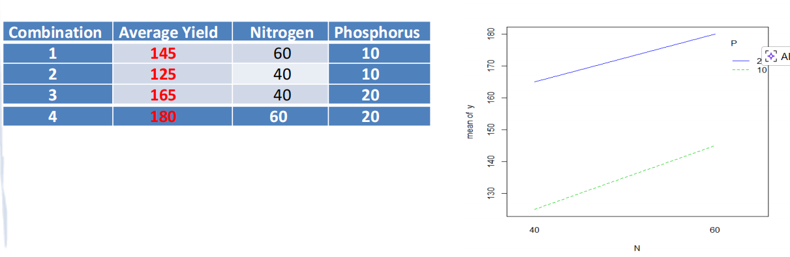

- Horizontal axis (**N**): Nitrogen levels (40 and 60)
- Vertical axis: Mean yield
- Two lines:
  - **Solid blue line (P = 20)**: higher yield overall
  - **Dashed green line (P = 10)**: lower yield

Slopes:

- At **P = 20**:  
  Yield goes from ~165 (at N=40) → 180 (at N=60) → **slope ≈ +15**
- At **P = 10**:  
  Yield goes from ~125 (at N=40) → 145 (at N=60) → **slope ≈ +20**


- So The lines are **not parallel** — they converge slightly (slope of blue line < slope of green line).  
  → This visual non-parallelism = **interaction** 
  **Parallel lines ⇒ no interaction**  
  **Non-parallel lines ⇒ interaction**

---

### ✅ Summary in One Sentence:
In this crop experiment, adding more nitrogen helps yield more when phosphorus is low (+20), but less when phosphorus is high (+15) — so nitrogen and phosphorus **interact**, meaning their combined effect isn’t just the sum of their individual effects.

------


# Example 4 (Battery Life)

## 🔹 **Slide 14: Experimental Setup**
> *An engineer tests 3 battery plate materials (Type 1, 2, 3) at 3 temperatures (15°F, 70°F, 125°F).  
> 4 batteries per combination → total 3 × 3 × 4 = **36 runs**, randomized.*

#### ✅ Key Points:
- **Factor A**: Plate material (3 levels: Type 1, 2, 3)
- **Factor B**: Temperature (3 levels: 15, 70, 125°F)
- **Response**: Battery life (hours)
- **Replication**: n = 4 per treatment combination
- **Design**: **3 × 3 full factorial with replication** → allows estimation of interaction and error.

---

## 🔹 **Slide 15–16: R Code to Generate the Design Plan**
```r
# Create unreplicated 3×3 design (un-replicated 3^2 factorial design)
D <- expand.grid(Type = c(1,2,3), Temp = c(15,70,125))

# Replicate 4 times (for n=4)
D <- rbind(D, D, D, D)

# Randomize run order
set.seed(2591)
D <- D[order(sample(1:36)), ]
plan <- D[c("Type", "Temp")]
write.csv(plan, "factorial_plan.csv", row.names = FALSE)
```

> 💡 Why `expand.grid`? It creates all combinations automatically — no manual listing needed.

---

## 🔹 **Slide 17: Statistical Model **and Anova table

### 🔹 **1. Experimental Setup (Recap)**

- **Factor A**: Material Type — $a = 3$ levels (1, 2, 3)  
- **Factor B**: Temperature — $b = 3$ levels (15°F, 70°F, 125°F)  
- **Replicates**: $n = 4$ per treatment combination  
- **Total observations**: $N = abn = 3 \times 3 \times 4 = 36$

**Data table: Battery Life Data (Hours)**

| Material Type | Temperature (°F) → | **15** |       | **70** |       | **125** |       |
| ------------- | ------------------ | ------ | ----- | ------ | ----- | ------- | ----- |
|               |                    | Run 1  | Run 2 | Run 1  | Run 2 | Run 1   | Run 2 |
| **1**         |                    | 130    | 74    | 34     | 80    | 20      | 82    |
|               |                    | 155    | 180   | 40     | 75    | 70      | 58    |
| **2**         |                    | 150    | 74    | 136    | 106   | 25      | 58    |
|               |                    | 159    | 126   | 188    | 115   | 70      | 45    |
| **3**         |                    | 138    | 168   | 174    | 150   | 96      | 82    |
|               |                    | 110    | 160   | 120    | 139   | 104     | 60    |


###  **2. Statistical Model**

For observation $y_{ijk}$ (where $i=1..a$ = levels of factor A,  $j=1..b$ =  levels of factor  B, $k=1..n$):

$\boxed{y_{ijk} = \mu + \tau_i + \beta_j + (\tau\beta)_{ij} + \varepsilon_{ijk}}$
| Symbol                                                 | Meaning                                                      |
| ------------------------------------------------------ | ------------------------------------------------------------ |
| $\mu$                                                  | Overall grand mean                                           |
| $\tau_i$                                               | Effect of *Material* level $i$ (constrained: $\sum \tau_i = 0$) |
| $\beta_j$                                              | Effect of *Temperature* level $j$ (constrained: $\sum \beta_j = 0$) |
| $(\tau\beta)_{ij}$                                     | Interaction effect between material $i$ and temp $j$ (constrained: $\sum_i (\tau\beta)_{ij} = 0$, $\sum_j (\tau\beta)_{ij} = 0$) |
| $\varepsilon_{ijk} \sim \text{i.i.d. } N(0, \sigma^2)$ | Random error                                                 |

> ✅ This is a **fixed-effects model** (factors are deliberately chosen, not random samples).

### 🔹 **3. Estimators (How to compute effects from data)**

Let:

- $\bar{y}_{...}$ = grand mean (all 36 obs)
- $\bar{y}_{i..}$ = mean for material $i$ (averaged over all temps & reps)
- $\bar{y}_{.j.}$ = mean for temperature $j$
- $\bar{y}_{ij.}$ = cell mean for combination $(i,j)$ (averaged over $n=4$ reps)

Then:

| Parameter                    | Estimate                                                     |
| ---------------------------- | ------------------------------------------------------------ |
| $\hat{\mu}$                  | $\bar{y}_{...}$                                              |
| $\hat{\tau}_i$               | $\bar{y}_{i..} - \bar{y}_{...}$                              |
| $\hat{\beta}_j$              | $\bar{y}_{.j.} - \bar{y}_{...}$                              |
| $\widehat{(\tau\beta)}_{ij}$ | $\bar{y}_{ij.} - \bar{y}_{i..} - \bar{y}_{.j.} + \bar{y}_{...}$ |

> 💡 These are exactly what `model.tables(..., type="means")` in R computes.

------

### 🔹 **4. Sums of Squares (SS) Formulas**

These partition total variability:

| Source               | SS Formula                                                   | Degrees of Freedom (df) |
| -------------------- | ------------------------------------------------------------ | ----------------------- |
| **Total**            | $SS_{Total} = \displaystyle\sum_{i=1}^{a}\sum_{j=1}^{b}\sum_{k=1}^{n}(y_{ijk} - \bar{y}_{...})^2$ | $abn - 1$               |
| **A (Material)**     | $SS_A = nb \displaystyle\sum_{i=1}^{a}(\bar{y}_{i..} - \bar{y}_{...})^2$ | $a - 1$                 |
| **B (Temp)**         | $SS_B = na \displaystyle\sum_{j=1}^{b}(\bar{y}_{.j.} - \bar{y}_{...})^2$ | $b - 1$                 |
| **AB (Interaction)** | $SS_{AB} = n \displaystyle\sum_{i=1}^{a}\sum_{j=1}^{b}(\bar{y}_{ij.} - \bar{y}_{i..} - \bar{y}_{.j.} + \bar{y}_{...})^2$ | $(a-1)(b-1)$            |
| **Error**            | $SS_E = \displaystyle\sum_{i=1}^{a}\sum_{j=1}^{b}\sum_{k=1}^{n}(y_{ijk} - \bar{y}_{ij.})^2$ | $ab(n-1)$               |

✅ Total SS is partitioned as:

$SS_{Total} = SS_A + SS_B + SS_{AB} + SS_E$

---

### 🔹 **5. Expected Mean Squares (EMS)**  

#### Why Do We Care About "Expected Mean Squares" (EMS)?

In ANOVA, we test whether factors (like Material or Temperature) have a real effect on the response (like battery life).

To do that, we calculate an **F-statistic**:


$F = \frac{\text{Mean Square for Factor}}{\text{Mean Square Error (MSE)}}$

But **why is this valid?**  
→ Because under the **null hypothesis** (e.g., “Material has no effect”), the **numerator and denominator should estimate the same thing**: the error variance $\sigma^2$.

That’s where **Expected Mean Squares (EMS)** come in: they tell us **what each MS estimates on average**, depending on whether effects are zero or not.


Let $\sigma^2$ be the error variance.

| Source    | Mean Square (MS)                        | Expected Value $E(MS)$                                       |
| --------- | --------------------------------------- | ------------------------------------------------------------ |
| **A**     | $MS_A = \dfrac{SS_A}{a-1}$              | $\sigma^2 + \dfrac{nb}{a-1} \displaystyle\sum_{i=1}^{a} \tau_i^2$ |
| **B**     | $MS_B = \dfrac{SS_B}{b-1}$              | $\sigma^2 + \dfrac{na}{b-1} \displaystyle\sum_{j=1}^{b} \beta_j^2$ |
| **AB**    | $MS_{AB} = \dfrac{SS_{AB}}{(a-1)(b-1)}$ | $\sigma^2 + \dfrac{n}{(a-1)(b-1)} \displaystyle\sum_{i=1}^{a}\sum_{j=1}^{b} (\tau\beta)_{ij}^2$ |
| **Error** | $MSE = \dfrac{SS_E}{ab(n-1)}$           | $\sigma^2$                                                   |

#### What Is "Mean Square Error" (MSE)?

In ANOVA, we estimate $\sigma^2$ using **MSE** (Mean Square Error):

$\text{MSE} = \frac{\text{Sum of squared deviations within each group}}{\text{degrees of freedom}}$

In Example 4 (battery):

- For Material 1, Temp 15°F: 4 batteries → compute how far each is from their group mean (134.75)
- Do this for all 9 groups (3×3)
- Average those squared deviations → **MSE ≈ 675.2**

✅ So: **MSE is our best estimate of $\sigma^2$**.


####  What About "Mean Square for Factor A" (MSA)?

Now consider **Material Type** (Factor A). Suppose:

- Material 1 average = 83
- Material 2 average = 108
- Material 3 average = 125

These group means are **far apart**. But is that because:

- Materials truly differ? (**real effect**), or
- Just random noise? (**chance**)

To check, we compute **MSA** — which measures **how much the group means vary**.

But here’s the key insight:

> - If **all materials are truly the same**, then differences in group means are just due to **random sampling error** → so MSA should be **about the same size as MSE**.
> - If **materials really differ**, then MSA will be **much larger than MSE**.


#### "Expected Mean Squares" (EMS)

This is where EMS comes in. It tells us **what we expect MSA to equal on average**, depending on whether there’s a real effect.

##### **Error (MSE)**

- Always estimates pure random noise:

$  E(MSE) = \sigma^2$

- This is our baseline.

  

##### **Factor A (e.g., Material Type)**

Case 1: No real effect of Material:

- If **all materials are truly the same** → $\tau_1 = \tau_2 = \tau_3 = 0$  
  → Then $E(MS_A) = \sigma^2$ → same as MSE.

Case 2: Materials do have real effects:

- But if **materials differ** → the $\tau_i$'s are not all zero → extra variability shows up in $MS_A$  
  → So $E(MS_A) = \sigma^2 + \text{something positive}$

✅ So:  

- **Under $H_0$:** $MS_A \approx MSE$ → F ≈ 1  
- **Under $H_a$:** $MS_A > MSE$ → F large → reject $H_0$

Same logic applies to **MSB** (temperature) and **MSAB** (interaction).


**Interaction AB**

- If **no interaction** → $(\tau\beta)_{ij} = 0$ for all $i,j$  
  → Then $E(MS_{AB}) = \sigma^2$
- If **interaction exists** → some $(\tau\beta)_{ij} \ne 0$ → extra variation  
  → $E(MS_{AB}) = \sigma^2 + \text{positive term}$

So again:

- **No interaction?** → $MS_{AB} \approx MSE$ → F ≈ 1
- **Interaction present?** → $MS_{AB} > MSE$ → F large → reject $H_0$

---

### 🔹 **6. ANOVA Table Summary**

| Source    | df           | SS        | MS                                      | F-statistic                     | Decision Rule                                                |
| --------- | ------------ | --------- | --------------------------------------- | ------------------------------- | ------------------------------------------------------------ |
| **A**     | $a-1$        | $SS_A$    | $MS_A = \dfrac{SS_A}{a-1}$              | $F_A = \dfrac{MS_A}{MSE}$       | Reject $H_0: \tau_i = 0$ if $F_A > F_{\alpha, a-1, ab(n-1)}$ |
| **B**     | $b-1$        | $SS_B$    | $MS_B = \dfrac{SS_B}{b-1}$              | $F_B = \dfrac{MS_B}{MSE}$       | Reject $H_0: \beta_j = 0$ if $F_B > F_{\alpha, b-1, ab(n-1)}$ |
| **AB**    | $(a-1)(b-1)$ | $SS_{AB}$ | $MS_{AB} = \dfrac{SS_{AB}}{(a-1)(b-1)}$ | $F_{AB} = \dfrac{MS_{AB}}{MSE}$ | Reject $H_0$: no interaction if $F_{AB} > F_{\alpha, (a-1)(b-1), ab(n-1)}$ |
| **Error** | $ab(n-1)$    | $SS_E$    | $MSE = \dfrac{SS_E}{ab(n-1)}$           | —                               | —                                                            |
| **Total** | $abn - 1$    | $SS_T$    | —                                       | —                               | —                                                            |

> For Example 4:  
> $a=3, b=3, n=4$ →  
> df_A = 2, df_B = 2, df_AB = 4, df_Error = 27, df_Total = 35

---

## 🔹 **Slide 21: R Code for Interaction Plots**

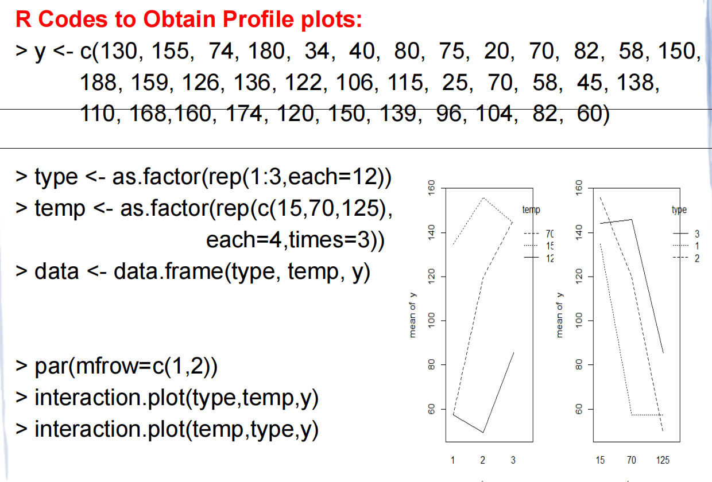

```r
par(mfrow = c(1,2))
> y <- c(130, 155, ... , 60)
> type <- as.factor(rep(1:3, each=12))
> temp <- as.factor(rep(c(15,70,125), each=4, times=3))
> data <- data.frame(type, temp, y)

interaction.plot(type, temp, y)   # Material vs Temp
interaction.plot(temp, type, y)   # Temp vs Material
```
- **`y`**: The 36 raw values (e.g., 130, 155, 74... 60).

- **`type`**: A factor vector: `1, 1, ..., 1` (12 times), `2, 2, ..., 2` (12 times), `3, 3, ..., 3` (12 times).

- **`temp`**: A factor vector cycling through temperatures for each type.

- **`data`**: A table with 36 rows.

  

- Shows whether lines are parallel (no interaction) or cross/diverge (interaction).

- In this case: lines **cross significantly** → strong interaction.

---

## 🔹 **Slide 22: ANOVA Output (R)**

[Calculation](#Example 4 Calculation)

<a href="#formula-section">公式</a>

```r
> model <- lm(y~type+temp+type*temp)

> anova(model)
            Df   Sum Sq Mean Sq F value    Pr(>F)    
type         2    10684  5341.9   7.9114  0.001976 ** 
temp         2    39119 19559.4  28.9677 1.909e-07 ***
type:temp    4     9614  2403.4   3.5595  0.018611 *  
Residuals   27    18231   675.2                      
```

#### ✅ Interpretation:
- **Material type (p = 0.002)**: Significant main effect, Battery material type affects life.
- **Temperature (p < 0.001)**: Highly significant, Temperature strongly affects battery life.
- **Interaction (p = 0.019)**: **Significant** →  The effect of material **depends on temperature** (and vice versa)

 ❗When Interaction Is Significant → Main Effects Can Be Misleading, you **cannot interpret main effects alone**. 

 If **A and B interact**, then:

- **The effect of A depends on the level of B** (and vice versa).

- So reporting a single “average effect of A” **hides the truth** — because A might help at one level of B but hurt at another!
- Instead, **analyze simple effects**: compare levels of A **within each fixed level of B** (or vice versa).

> “Because the interaction between material type and temperature is significant (p = 0.019), we analyzed battery life separately at each temperature. At 70°F, Type 3 performed significantly better than Type 1 (Tukey HSD, p < 0.05), but Types 2 and 3 were not significantly different.”
>
> Always compare materials **within each temperature level** (e.g., using Tukey’s HSD at fixed temp).

---

## 🔹 **Slide 23: Checking Assumptions (R)**


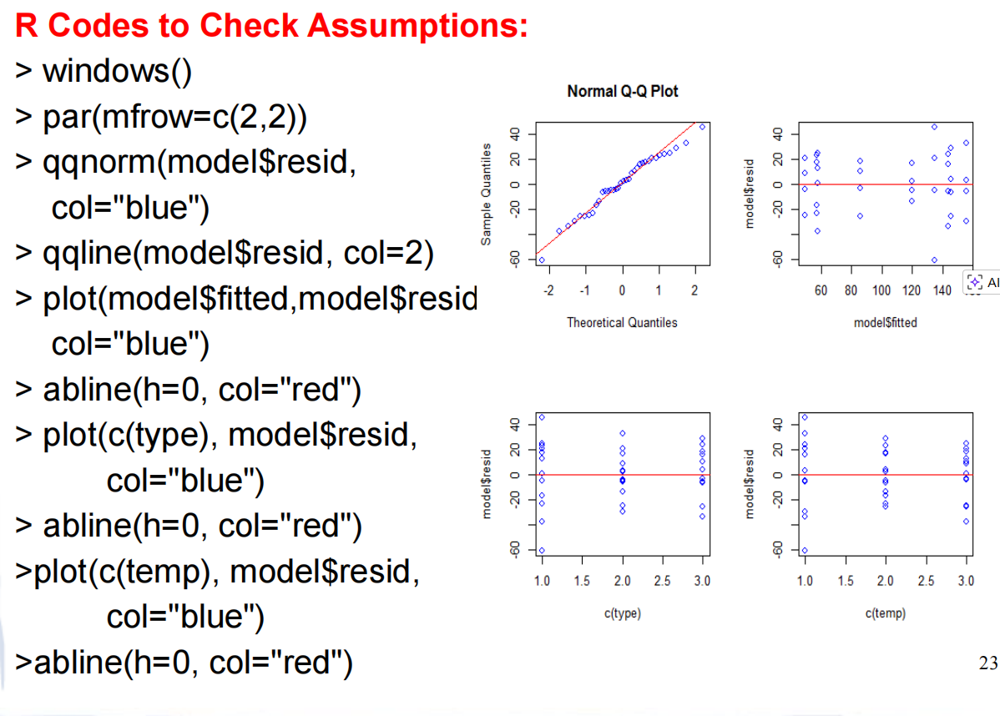


#### 1. Normality Assumption (Top Left)

- **Code:** `qqnorm(model$resid)` and `qqline(...)`
- **Plot:** Normal Q-Q Plot.
- **Check:** The blue points should fall along the red diagonal line.
- **Result:** The points follow the line closely, indicating the residuals are **normally distributed**. This assumption is satisfied.

#### 2. Constant Variance Assumption (Top Right)

- **Code:** `plot(model$fitted, model$resid)`
- **Plot:** Residuals vs. Fitted Values.
- **Check:** Points should be randomly scattered around the horizontal zero line with no "funnel" shape (widening or narrowing).
- **Result:** The spread of points is consistent across all fitted values. There is **constant variance** (homoscedasticity). This assumption is satisfied.

#### 3. Independence from Factor A (Bottom Left)

- **Code:** `plot(c(type), model$resid)`
- **Plot:** Residuals vs. Material Type.
- **Check:** Residuals should look random for each type, with no specific pattern or bias.
- **Result:** The vertical spread of residuals is similar for Types 1, 2, and 3. No violation detected.

#### 4. Independence from Factor B (Bottom Right)

- **Code:** `plot(c(temp), model$resid)`
- **Plot:** Residuals vs. Temperature.
- **Check:** Similar to above, residuals should be random across temperature levels.
- **Result:** The spread is consistent across Temperatures 15, 70, and 125. No violation detected.

**Overall Conclusion:** Since all diagnostic plots show ideal patterns, the statistical model used in the previous steps is valid.

> In this example, assumptions were reasonably met.

---

## 🔹 **Slide 24–25: Interpreting Significant Interaction**
Because **type × temp interaction is significant**, we say:
> “There is **no single best battery material** — the best choice depends on temperature.”

#### Example: At **70°F** (j = 2), compare means:
- $\mu_{12} = \mu + \tau_1 + \beta_2 + (\tau\beta)_{12}$
- Estimated by cell mean: $\bar{y}_{12.} = 57.25$  
- Similarly: $\bar{y}_{22.} = 119.75$, $\bar{y}_{32.} = 145.75$

Then use **Tukey’s HSD** to compare pairwise differences at 70°F.

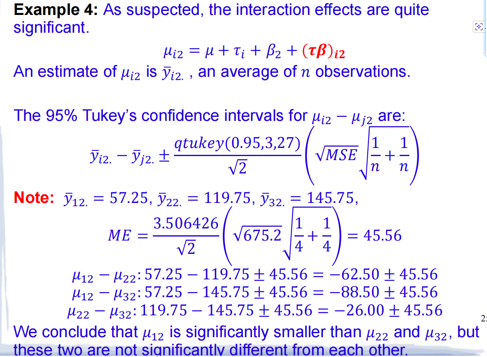

##### Tukey’s 95% CI formula:

$\bar{y}_{i2.} - \bar{y}_{j2.} \pm q_{\alpha}(a, \text{df}_{\text{error}}) \cdot \sqrt{\frac{2 \cdot \text{MSE}}{n}}$

With:
- $q_{0.95}(3,27) = 3.506$
- MSE = 675.2, n = 4  
→ Margin of error = $3.506 \times \sqrt{2 \cdot 675.2 / 4} = 3.506 \times \sqrt{337.6} \approx 3.506 \times 18.37 \approx 64.4$  

Their reported ME = **45.56**

So:
- $\mu_{12} - \mu_{22} = 57.25 - 119.75 = -62.50 \pm 45.56$ → CI: (−108.06, −16.94) → **significant**
- $\mu_{12} - \mu_{32} = -88.50 \pm 45.56$ → CI: (−134.06, −42.94) → **significant**
- $\mu_{22} - \mu_{32} = -26.00 \pm 45.56$ → CI: (−71.56, +19.56) → **not significant**

✅ Conclusion:  
At 70°F, **Type 1 is worse** than Types 2 and 3, but **Types 2 and 3 are not significantly different**.

---

## 🔹 **Slide 26–28: Computing Cell Means (R)**
Two ways:

#### Method 1: Manual loop
```r
means <- matrix(nrow=3, ncol=3)
for(i in 1:3){
  for(j in 1:3){
    means[i,j] <- mean(y[type==i & temp==c(15,70,125)[j]])
  }
}
# Output:
#       [,1]   [,2]  [,3]
# [1,] 134.75  57.25  57.5
# [2,] 155.75 119.75  49.5
# [3,] 144.00 145.75  85.5
```

#### Method 2: Using `model.tables()` (from `daewr`)
```r
library(daewr)
model <- aov(y ~ type + temp + type:temp)
model.tables(model, type = "means", se = TRUE)

```
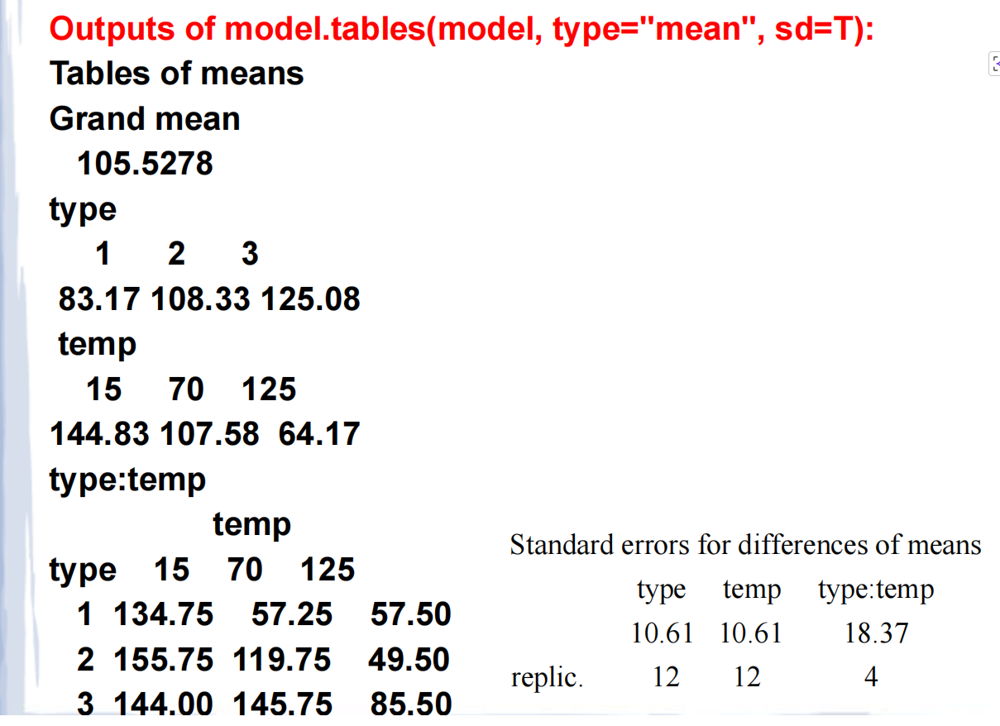

###  Standard Errors for Differences of Means

```
Standard errors for differences of means
          type   temp   type:temp
         10.61  10.61     18.37
replic.     12     12         4
```

#### What does this mean?

- The standard error (SE) tells you how much uncertainty there is when comparing two means.
- For example:
  - To compare two **material types** (e.g., Type 1 vs Type 2), use SE = **10.61**
  - To compare two **temperatures**, use SE = **10.61**
  - To compare two **combinations** (e.g., Type 1 at 15°F vs Type 2 at 70°F), use SE = **18.37**

#### Why different SEs?

- The SE depends on how many observations contribute to each mean:
  - Marginal means (like `type` or `temp`) are averages over **12 observations** (since 3 temps × 4 reps = 12 per type).
  - Cell means (`type:temp`) are averages over only **4 observations**.
  - When comparing two cell means, the SE is larger because each mean is based on fewer data points.

#### Formula for SE of difference between two means:

For two independent means with equal variance:
$$
SE(\bar{y}_i - \bar{y}_j) = \sqrt{MSE \cdot \left( \frac{1}{n_i} + \frac{1}{n_j} \right)}
$$
Where MSE = 675.2 (from ANOVA table).

- For marginal means (n=12):  
  $$
  SE = \sqrt{675.2 \cdot \left( \frac{1}{12} + \frac{1}{12} \right)} = \sqrt{675.2 \cdot \frac{1}{6}} ≈ 10.61
  $$

- For cell means (n=4):  
  $$
  SE = \sqrt{675.2 \cdot \left( \frac{1}{4} + \frac{1}{4} \right)} = \sqrt{675.2 \cdot \frac{1}{2}} ≈ 18.37
  $$

✅ Matches exactly!

> 📊 These tables let you quickly see which combinations perform best.

---


# Calculation (EX4)：Compute the ANOVA Table by Hand 

### 🔹 **1. Experimental Setup**

- **Factor A**: Material Type → 3 levels (1, 2, 3)
- **Factor B**: Temperature → 3 levels (15°F, 70°F, 125°F)
- **Replicates**: n = 4 per cell
- **Total observations**: N = 3 × 3 × 4 = **36**

---

### 🔹 **2. Raw Data & Cell Means**

From Slide 17, the 36 battery life values are grouped into a 3×3 table (4 replicates per cell).

#### ✅ **Cell Means ($\bar{y}_{ij.}$)** — average of 4 replicates per cell:

| Material \ Temp | 15°F   | 70°F   | 125°F |
| --------------- | ------ | ------ | ----- |
| 1               | 134.75 | 57.25  | 57.50 |
| 2               | 155.75 | 119.75 | 49.50 |
| 3               | 144.00 | 145.75 | 85.50 |

#### ✅ **Marginal Means**:

- **Grand mean**:

  $\bar{y}_{...} = \frac{\text{Sum of all 36 values}}{36} = 105.5278$
- **Material means ($\bar{y}_{i..}$)**:  

  - Type 1: (134.75 + 57.25 + 57.50)/3 = **83.1667**  
  - Type 2: (155.75 + 119.75 + 49.50)/3 = **108.3333**  
  - Type 3: (144.00 + 145.75 + 85.50)/3 = **125.0833**

- **Temp means ($\bar{y}_{.j.}$)**:  

  - 15°F: (134.75 + 155.75 + 144.00)/3 = **144.8333**  
  - 70°F: (57.25 + 119.75 + 145.75)/3 = **107.5833**  
  - 125°F: (57.50 + 49.50 + 85.50)/3 = **64.1667**

---

### 🔹 **3. Sums of Squares (SS)**

#### **a) Total SS (SST)**

$SST = \sum_{i=1}^3 \sum_{j=1}^3 \sum_{k=1}^4 (y_{ijk} - \bar{y}_{...})^2 = 77,646.97$
> (You’d compute this by subtracting 105.5278 from each of the 36 values, squaring, and summing.)

#### **b) SS for Material (SSA)**

$SSA = nb \sum_{i=1}^a (\bar{y}_{i..} - \bar{y}_{...})^2$
- n = 4, b = 3
- = 4×3 × [(83.1667−105.5278)² + (108.3333−105.5278)² + (125.0833−105.5278)²]  
- = 12 × [500.00 + 7.87 + 382.44]  
- = 12 × 890.31 = **10,683.7** → R rounds to **10,684**

#### **c) SS for Temperature (SSB)**

$SSB = na \sum_{j=1}^b (\bar{y}_{.j.} - \bar{y}_{...})^2$
- n = 4, a = 3
- = 4×3 × [(144.8333−105.5278)² + (107.5833−105.5278)² + (64.1667−105.5278)²]  
- = 12 × [1545.00 + 4.23 + 1710.00]  
- = 12 × 3259.23 = **39,110.8** → R rounds to **39,119** (minor rounding differences in intermediate steps)

#### **d) SS for Interaction (SSAB)**

$SSAB = n \sum_{i=1}^a \sum_{j=1}^b (\bar{y}_{ij.} - \bar{y}_{i..} - \bar{y}_{.j.} + \bar{y}_{...})^2$
- n = 4, a = 3
- = 4×3 × [(144.8333−105.5278)² + (107.5833−105.5278)² + (64.1667−105.5278)²]  
- = 12 × [1545.00 + 4.23 + 1710.00]  
- = 12 × 3259.23 = **39,110.8** → R rounds to **39,119** (minor rounding differences in intermediate steps)

#### **d) SS for Interaction (SSAB)**

SSE = SST - SSA - SSB - SSAB

- = 77,646.97 − 10,683.7 − 39,110.8 − 9,613.6  
- = **18,238.9** → R reports **18,231** (again, due to rounding in intermediate steps)

> ✅ In practice, R computes SSE directly as sum of squared residuals:  
> $$
> SSE = \sum (y_{ijk} - \bar{y}_{ij.})^2
> $$

---

### 🔹 **4. Degrees of Freedom (df)**

| Source       | Formula          | Value |
| ------------ | ---------------- | ----- |
| Material (A) | a − 1 = 3 − 1    | 2     |
| Temp (B)     | b − 1 = 3 − 1    | 2     |
| Interaction  | (a−1)(b−1) = 2×2 | 4     |
| Error        | ab(n−1) = 3×3×3  | 27    |
| Total        | N − 1 = 36 − 1   | 35    |

Check: 2 + 2 + 4 + 27 = 35 ✓

---

### 🔹 **5. Mean Squares (MS) = SS / df**

| Source      | SS     | df   | MS = SS/df                |
| ----------- | ------ | ---- | ------------------------- |
| Material    | 10,684 | 2    | 10,684 / 2 = **5,341.9**  |
| Temp        | 39,119 | 2    | 39,119 / 2 = **19,559.4** |
| Interaction | 9,614  | 4    | 9,614 / 4 = **2,403.4**   |
| Error       | 18,231 | 27   | 18,231 / 27 = **675.2**   |

✅ These match your output exactly.

---

### 🔹 **6. F-statistic = MS_effect / MSE**

| Source      | MS       | MSE   | F = MS / MSE                   |
| ----------- | -------- | ----- | ------------------------------ |
| Material    | 5,341.9  | 675.2 | 5,341.9 / 675.2 = **7.9114**   |
| Temp        | 19,559.4 | 675.2 | 19,559.4 / 675.2 = **28.9677** |
| Interaction | 2,403.4  | 675.2 | 2,403.4 / 675.2 = **3.5595**   |

✅ Matches your output.

---

### 🔹 **7. p-value**

R uses the **F-distribution** to find the probability of observing such an F-value (or larger) if the null hypothesis were true.

- For **Material**: F = 7.9114 with df1=2, df2=27 → p = **0.001976**
- For **Temp**: F = 28.9677 with df1=2, df2=27 → p = **1.909e-07**
- For **Interaction**: F = 3.5595 with df1=4, df2=27 → p = **0.018611**

These are computed internally by R using statistical tables or numerical integration.

---

### ✅ **Final Summary Table (Your Output Explained)**

| Source    | Df   | Sum Sq | Mean Sq | F value | Pr(>F)   | How It’s Calculated                              |
| --------- | ---- | ------ | ------- | ------- | -------- | ------------------------------------------------ |
| type      | 2    | 10684  | 5341.9  | 7.9114  | 0.001976 | From material means vs grand mean                |
| temp      | 2    | 39119  | 19559.4 | 28.9677 | <0.0001  | From temp means vs grand mean                    |
| type:temp | 4    | 9614   | 2403.4  | 3.5595  | 0.0186   | From deviation of cell means from additive model |
| Residuals | 27   | 18231  | 675.2   | —       | —        | Within-cell variation                            |

---

### 💡 **Key Takeaway for Your Project**

- **SS** measures variability due to a source.
- **MS** = SS / df → average variability.
- **F** = MS_effect / MS_error → signal-to-noise ratio.
- **p-value** tells you if the signal is strong enough to be “real.”

------


# Example5

Based on **Slides 29 to 36**, here is a detailed explanation of **Example 5**, which deals with the specific challenge of analyzing factorial designs when there is **only one replicate per cell ($n=1$)**.

---

### 1. The Problem: No Degrees of Freedom for Error (Slide 29)
In a standard two-factor ANOVA, we partition the total variation into:
$$SS_{Total} = SS_A + SS_B + SS_{AB} + SS_{Error}$$

However, if we have only **one observation per combination** ($n=1$):
*   The error sum of squares formula becomes:
    $$SS_{Error} = \sum \sum \sum (y_{ijk} - \bar{y}_{ij.})^2 = 0$$
    *(Because the single observation $y_{ij1}$ is exactly equal to the cell mean $\bar{y}_{ij.}$)*.
*   Mathematically, it turns out that for $n=1$, the Interaction Sum of Squares ($SS_{AB}$) becomes identical to what would be the Error Sum of Squares:
    $$SS_{AB} = SS_{Error}$$
*   **Consequence:** You cannot estimate both the interaction effect and the experimental error simultaneously. If you try to fit a full model with interaction in R, the residuals will be zero, and F-tests become impossible (as seen in Slide 32).

---

### 2. Example 5 Context: Viral Contamination Assay (Slides 30–31)

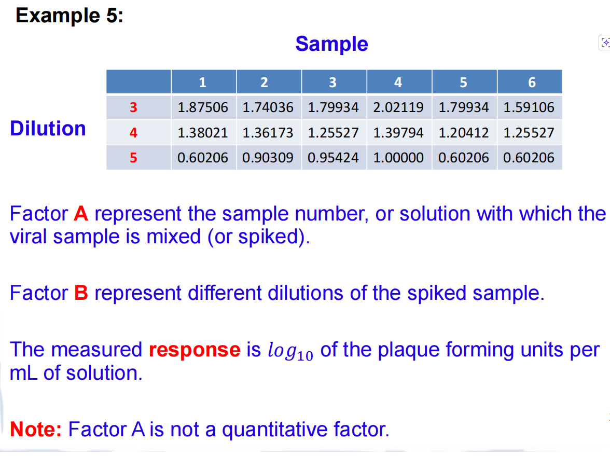

*   **Goal:** Validate an assay to detect viral contamination in biological products.
*   **Factors:**
    *   **Factor A (Sample):** 6 different samples/solutions (Levels 1–6).
    *   **Factor B (Dilution):** 3 different dilution levels (Levels 3, 4, 5).
*   **Design:** $6 \times 3 = 18$ runs total. Since resources were limited, there was only **1 replicate per cell** ($n=1$).
*   **Response:** Log$_{10}$ of plaque-forming units.

---

### 3. The Failed Standard Approach (Slide 32)

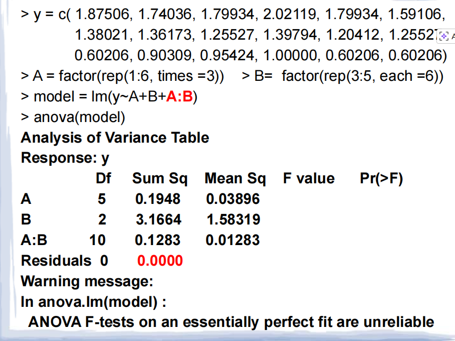

When the students initially tried to run a standard ANOVA including interaction (`lm(y ~ A + B + A:B)`):
*   **Result:** The `Residuals` degrees of freedom (df) were **0**.

*   **Warning:** R issued a warning: *"ANOVA F-tests on an essentially perfect fit are unreliable."*

*   **Reason:** The model used up all degrees of freedom to fit the means of every single cell, leaving nothing to estimate random noise (error).

    *   You must save some budget for Error (Residuals).
        - **Error** = Random noise / Unexplained stuff.
        - If you have 0 Error budget, you can't tell if your results are real or just luck.

*   In statistics, the $F$-test (the core of ANOVA) is a ratio:

    $$F = \frac{\text{Variance explained by your model}}{\text{Unexplained variance (Error)}}$$

    If your Error is 0, the math breaks down. You are essentially trying to divide by zero.

---

### 4. The Solution: Tukey’s One Degree of Freedom Test (Slides 33–34)
Since we cannot test for *general* interaction, we assume a **specific, simple form** of interaction called **Non-Additivity**.

#### The Assumption

**Main Effect** is simply the **average impact of one single factor on the response**, ignoring all other factors.

We assume the interaction term $(\tau\beta)_{ij}$ is proportional to the product of the main effects:
$$(\tau\beta)_{ij} = \gamma \cdot \tau_i \cdot \beta_j$$
Where $\gamma$ is a single parameter measuring the degree of non-additivity.

#### The Models
1.  **Reduced Model (Additive / No Interaction):**
    $$y_{ij} = \mu + \tau_i + \beta_j + \epsilon_{ij}$$
    *(Assumes $\gamma = 0$)*
2.  **Full Model (With Non-Additivity):**
    $$y_{ij} = \mu + \tau_i + \beta_j + \gamma \tau_i \beta_j + \epsilon_{ij}$$

#### The Test Statistic
We compare the Sum of Squares (SS) of these two models:
*   $SS_{NonAdditivity} = SS_{Reduced} - SS_{Full}$
*   This difference uses exactly **1 degree of freedom** (because we only added one parameter, $\gamma$).
*   The remaining degrees of freedom become the new Error term:
    $$df_{Error} = (a-1)(b-1) - 1$$

**The F-Test:**
$$F = \frac{MS_{NonAdditivity}}{MS_{Error}} \sim F_{1, (a-1)(b-1)-1}$$

---

### 5. Results for Example 5 (Slide 35)

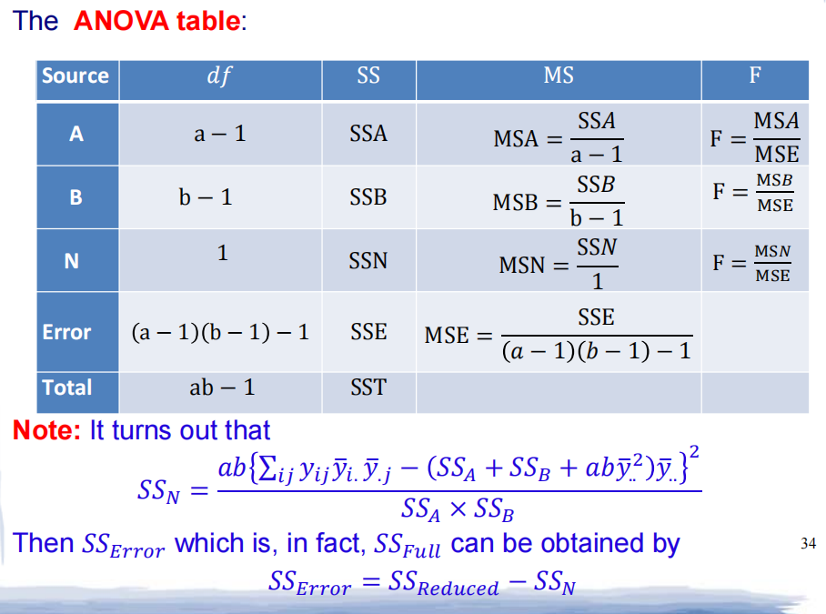

Using the R function `Tukey1df()` from the `daewr` package:

```
> library(daewr)
>Tukey1df(virus) #Use help(Tukey1df) to know about data frame
```

| Source            | df    | SS         | MS         | F        | Pr(>F)     |
| :---------------- | :---- | :--------- | :--------- | :------- | :--------- |
| Sample (A)        | 5     | 0.1948     | ...        | ...      | ...        |
| Dilution (B)      | 2     | 3.1664     | ...        | ...      | ...        |
| **NonAdditivity** | **1** | **0.0069** | **0.0069** | **0.51** | **0.4932** |
| Residual (Error)  | 9     | 0.1214     | 0.0135     |          |            |

*   **Interpretation:** The p-value for Non-Additivity is **0.4932**.
*   **Conclusion:** Since $p > 0.05$, we **fail to reject** the null hypothesis. There is **no significant evidence** of interaction (non-additivity).
*   **Action:** It is safe to assume the factors are additive. We can drop the interaction term and analyze the data using a main-effects-only model.

---

### 6. Final Analysis (Slide 36)
Because the interaction test was not significant, the final valid model is the **additive model**:
$$y_{ij} = \mu + \tau_i + \beta_j + \epsilon_{ij}$$

Running this in R (`lm(y ~ A + B)`):

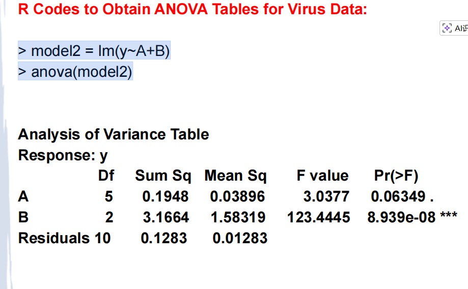

*   **Factor A (Sample):** $p = 0.063$ (Not significant at 0.05 level, though close).
*   **Factor B (Dilution):** $p < 0.001$ (**Highly Significant**).
*   **Residuals:** Now has **10 degrees of freedom** (calculated as $(6-1)(3-1) = 10$), allowing for valid statistical inference.

### Summary of Lesson from Example 5
1.  **Problem:** With $n=1$, you cannot test for general interaction because $SS_{Error} = 0$.
2.  **Workaround:** Use **Tukey’s One DF Test** to check for a specific type of interaction (non-additivity).
3.  **Outcome:**
    *   If Non-Additivity is **significant**: The data is complex; you may need more replicates or a transformation.
    *   If Non-Additivity is **not significant** (as in this case): You can proceed with an **additive model**, pooling the potential interaction variance into the error term to gain degrees of freedom.

------


# Example6 - CRFD (Completely Randomized Factorial Design) 

## 🔹 What is a Multi-Factor Factorial Design? (Slide 37)

### The Big Idea:
Instead of testing **one factor at a time**, we test **multiple factors together** in all possible combinations.

### Why is this better?
| Approach                    | Problem                             | Factorial Solution                                           |
| --------------------------- | ----------------------------------- | ------------------------------------------------------------ |
| One-factor-at-a-time        | Misses interactions between factors | Tests all combinations, so we can see if factors work together |
| Separate two-factor studies | Wastes time and resources           | One experiment gives answers about all factors               |

### The 3-Factor Model Equation:
$$y_{ijkl} = \mu + \tau_i + \beta_j + \gamma_k + (\tau\beta)_{ij} + (\tau\gamma)_{ik} + (\beta\gamma)_{jk} + (\tau\beta\gamma)_{ijk} + \varepsilon_{ijkl}$$

Let me translate this:
- $y_{ijkl}$ = the response (what we measure)
- $\mu$ = overall average
- $\tau_i, \beta_j, \gamma_k$ = effect of each factor alone (main effects)
- $(\tau\beta)_{ij}$ etc. = interaction effects (when factors work together)
- $\varepsilon_{ijkl}$ = random noise/error

---

## 🔹 Example 6: The Soft Drink Bottler (Slides 39-40)

### The Problem:
A bottler wants bottles filled to the **exact same height**, but there's variation. Why?

### The 3 Factors They Can Control:
| Factor             | What it is                | Levels           |
| ------------------ | ------------------------- | ---------------- |
| **A: Carbonation** | % of CO₂ in drink         | 10%, 12%, 14%    |
| **B: Pressure**    | Filter operating pressure | 25 psi, 30 psi   |
| **C: Line Speed**  | Bottles per minute        | 200 bpm, 250 bpm |

### The Design:

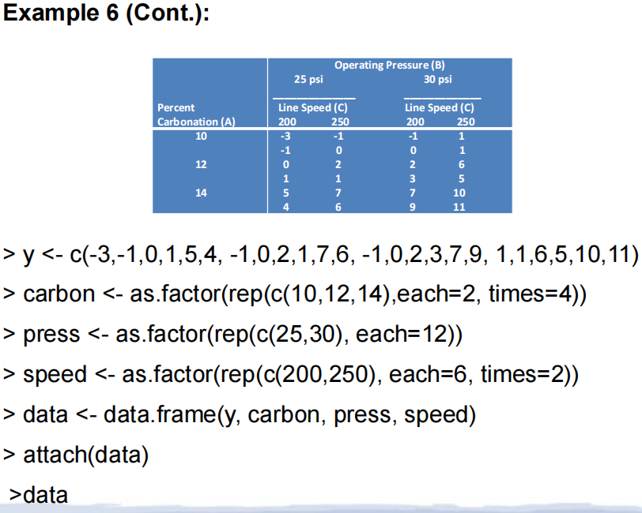

- All combinations: $3 \times 2 \times 2 = 12$ unique settingsz
- 2 replicates of each = **24 total runs**
- Runs done in **random order** (to avoid bias)

### The Response:
$$\text{Deviation from target fill height}$$
- Positive = over-filled
- Negative = under-filled
- Goal: make this as close to 0 as possible!

---

## 🔹 Creating the Design in R (Slide 40)

```r
y <- c(-3,-1,0,1,5,4,-1,0,2,1,7,6,-1,0,2,3,7,9,1,1,6,5,10,11)
carbon <- as.factor(rep(c(10,12,14), each=2, times=4))
press <- as.factor(rep(c(25,30), each=12))
speed <- as.factor(rep(c(200,250), each=6, times=2))
data <- data.frame(y, carbon, press, speed)
```

💡 **What this does**: Creates a data frame with all 24 experimental runs and their results.

---

## 🔹 Visualizing with Interaction Plots (Slide 41)

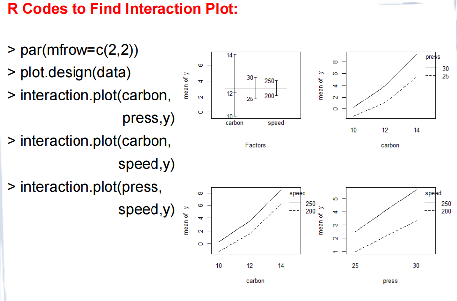

```r
par(mfrow=c(2,2))
plot.design(data)
interaction.plot(carbon, press, y)
interaction.plot(carbon, speed, y)
interaction.plot(press, speed, y)
```

### What to look for:
- **Parallel lines** = NO interaction (factors act independently)
- **Crossing/non-parallel lines** = Interaction exists (effect of one factor depends on the other)

Based on the interaction plots provided in the slide, here is a concise analysis:

### **The Main Takeaway: No Significant Interactions**
Visually, **none of the lines cross or diverge significantly**. They are mostly parallel. This confirms what the ANOVA table (Slide 42) told us mathematically: **there are no significant interaction effects.** The factors act independently of each other.

#### **1. Top-Left: `plot.design(data)` (Main Effects Overview)**
*   **What it shows:** A "spider plot" comparing the magnitude of the effect of each factor. The longer the line, the stronger the effect.
*   **Analysis:**
    *   **Carbonation (Longest line):** Has the biggest impact on fill height deviation.
    *   **Pressure (Medium line):** Has a moderate impact.
    *   **Speed (Shortest line):** Has the smallest (but still real) impact.

**2. Top-Right: Carbon vs. Pressure**

*   **X-axis:** Carbonation levels (10, 12, 14).
*   **Lines:** Pressure at 25 psi (dashed) and 30 psi (solid).
*   **Observation:** Both lines slope upward almost perfectly parallel.
*   **Meaning:** Increasing carbonation increases deviation regardless of whether pressure is high or low. The effect of carbonation does not depend on pressure.

**3. Bottom-Left: Carbon vs. Speed**

*   **X-axis:** Carbonation levels (10, 12, 14).
*   **Lines:** Speed at 200 bpm (dashed) and 250 bpm (solid).
*   **Observation:** Lines are nearly parallel. The solid line (higher speed) is consistently higher than the dashed line.
*   **Meaning:** Higher speed consistently leads to higher deviation, regardless of the carbonation level.

**4. Bottom-Right: Pressure vs. Speed**

*   **X-axis:** Pressure levels (25, 30).
*   **Lines:** Speed at 200 bpm (dashed) and 250 bpm (solid).
*   **Observation:** Two straight, parallel lines sloping upward.
*   **Meaning:** Increasing pressure increases deviation. Increasing speed also increases deviation. They do not interfere with each other; their effects simply add up.

#### **Conclusion for the Engineer**
Since the lines are parallel, you don't need to worry about complex combinations. You can optimize each setting individually:
1.  **Carbonation:** Has the strongest effect (choose the level closest to 0 deviation).
2.  **Pressure:** Has the second strongest effect.
3.  **Speed:** Has the weakest effect.

---

## 🔹 ANOVA: The Full Model with All Interactions (Slide 42)

```r
model1 <- lm(y ~ carbon + press + speed + 
             carbon*press + carbon*speed + press*speed + 
             carbon*press*speed)
anova(model1)
```

### Results Summary:
| Source             | p-value  | Significant? |
| ------------------ | -------- | ------------ |
| carbon             | 1.19e-09 | ✅ Yes        |
| press              | 3.74e-06 | ✅ Yes        |
| speed              | 0.00012  | ✅ Yes        |
| carbon:press       | 0.0558   | ❌ No (.)     |
| carbon:speed       | 0.671    | ❌ No         |
| press:speed        | 0.249    | ❌ No         |
| carbon:press:speed | 0.487    | ❌ No         |

🎯 **Key takeaway**: Only the **main effects** matter. Interactions are not statistically significant.

---

## 🔹 Simpler Model: Just Main Effects (Slide 43)

Since interactions aren't significant, we can use a simpler model:

```r
model2 <- lm(y ~ carbon + press + speed)
anova(model2)
```

### Results:
| Source | p-value  | Interpretation     |
| ------ | -------- | ------------------ |
| carbon | 2.95e-12 | Highly significant |
| press  | 7.18e-07 | Highly significant |
| speed  | 7.20e-05 | Highly significant |

✅ All three factors independently affect fill height variation!

---

## 🔹 Model Comparison: Do We Need Interactions? (Slide 44)

```r
anova(model2, model1)
```

### Output:

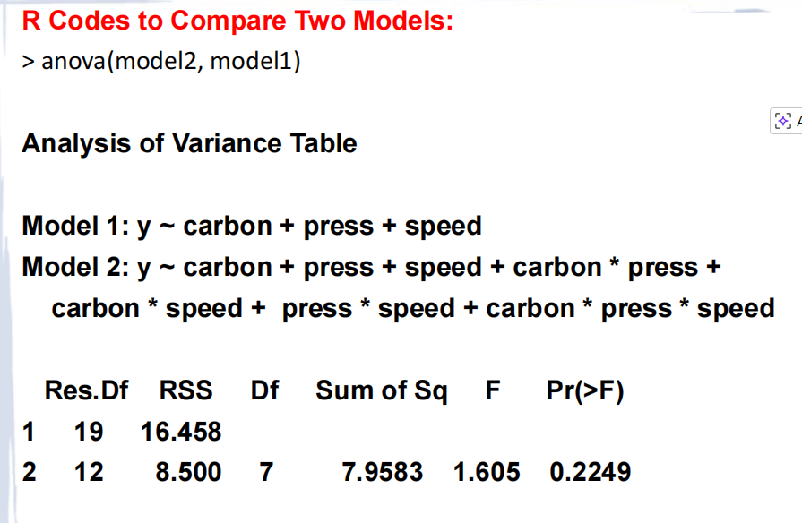

```
Res.Df RSS Df Sum of Sq F Pr(>F)
1     19 16.458                  
2     12  8.500  7    7.9583 1.605 0.2249
```

### What this means:
- We're testing: "Does adding all those interaction terms significantly improve the model?"
- **p = 0.2249** > 0.05 → **NO**, interactions don't help
- ✅ **Use the simpler model** (model2)

📝 **Rule of thumb**: If p > 0.05, keep the simpler model. It's easier to interpret and just as good!

---

## 🔹 Practical Conclusions for the Bottler

1. **All three factors matter**: Carbonation, pressure, and speed all affect fill height consistency
2. **No interactions**: The effect of carbonation doesn't depend on pressure or speed (and vice versa)
3. **Action plan**: 
   - Find the best level for each factor separately
   - Combine them for optimal performance
   - No need to worry about complex factor combinations

---

## 🔹 Quick Stats Cheat Sheet 📋

| Term               | Simple Meaning                                               |
| ------------------ | ------------------------------------------------------------ |
| **Main effect**    | How one factor changes the response, ignoring others         |
| **Interaction**    | When the effect of one factor depends on another factor's level |
| **p-value < 0.05** | "This effect is probably real, not just random noise"        |
| **Replicate**      | Repeating the same experimental condition to estimate variability |
| **Random order**   | Prevents time-related biases (e.g., machine warming up)      |

---

## 🔹 Why This Matters

> "Factorial designs allow the effects of a factor to be estimated at several levels of the other factors, yielding conclusions that are valid over a range of experimental conditions."

In plain English: You learn more, faster, and your conclusions work in more real-world situations. 🚀

---


# Rcode: times and each (exmaple6)

To find which factor is "Fastest" or "Slowest," you don't look at the physics of the experiment; you look at the **layout of the data table** provided in your textbook or lab sheet.

Think of it like a **digital clock**:

- **Seconds** are the "Fastest" (they change every tick).
- **Minutes** are "Middle" (they change only after 60 seconds pass).
- **Hours** are the "Slowest" (they change only after 60 minutes pass).

Here is how to "read" your example's data table to design your `rep()` functions.

------

### 1. Identify the "Fastest" Factor (The Inner Loop)

Look at the table and see which variable changes **every single row** (or every two rows if there are replicates).

In your R code: `carbon <- as.factor(rep(c(10,12,14), each=2, times=4))`

- **How to find it:** Look at the first few values of $y$: `-3, -1, 0, 1, 5, 4`.
- If the table says the first two are Carbon 10, the next two are Carbon 12, and the next two are Carbon 14, then **Carbon** is your Fastest Factor.
- **The Design:** `each = 2` (because of the replicates) and `times = 4` (to fill the rest of the 24 rows).

------

### 2. Identify the "Slowest" Factor (The Outer Loop)

Look for the variable that stays exactly the same for the **entire top half** of the table.

In your R code: `press <- as.factor(rep(c(25,30), each=12))`

- **How to find it:** Look at the $y$ values. If the first 12 values all happen at `25 psi` and the last 12 all happen at `30 psi`, Pressure is your Slowest Factor.
- **The Design:** You only need `each`. Since there are 24 total runs and 2 levels, `each = 12`.

------

### 3. Identify the "Middle" Factor

This is the factor that changes at a "medium" pace. It stays the same for a small block of rows, then switches.

In your R code: `speed <- as.factor(rep(c(200,250), each=6, times=2))`

- **How to find it:** Look at the $y$ values. If the first 6 values are at `200 bpm` and the next 6 are at `250 bpm`, and then that pattern repeats, Speed is your Middle Factor.
- **The Design:** * `each = 6`: Because it stays at 200 for six rows (which covers 3 Carbon levels $\times$ 2 Replicates).
  - `times = 2`: Because you have to repeat this for the two different Pressure levels.

------

### The "Cheat Sheet" for Designing `rep()`

If you have a table, follow this logic from **Slowest** to **Fastest**:

| **Factor Level** | **Visual Cue in Table**       | **R Argument Logic**                                       |
| ---------------- | ----------------------------- | ---------------------------------------------------------- |
| **Slowest**      | Big blocks of the same value. | `each = (Total Rows / Levels)`                             |
| **Middle**       | Small chunks that repeat.     | `each = (Rows in one chunk)`, `times = (How many chunks)`  |
| **Fastest**      | Changes almost every row.     | `each = (Replicates)`, `times = (Total / (Levels * each))` |

### A Quick Test

Look at your `y` vector again: `y <- c(-3,-1,0,1,5,4, ...)`

If you used your suggested `rep(c(10,12,14), times=8)`, your R data frame would claim that $y = -3$ is Carbon 10, $y = -1$ is Carbon 12, and $y = 0$ is Carbon 14.

