# 📚 Comprehensive Notes: Chapter 6 - The $2^k$ Factorial Design
*Written for beginners - All concepts explained step-by-step*

---

## 🎯 Part 1: What is a Factorial Design? (The Big Picture)

### 1.1 Why Do We Need This?
Imagine you're baking a cake and want to know what affects how good it tastes:
- **Factor A**: Oven temperature (low: 300°F, high: 350°F)
- **Factor B**: Sugar amount (low: 1 cup, high: 2 cups)
- **Factor C**: Baking time (low: 20 min, high: 30 min)

A **factorial design** lets you test ALL combinations of these factors at once, so you can see:
- ✅ How each factor affects the result **individually** (main effects)
- ✅ How factors work **together** (interaction effects)

### 1.2 What Does "$2^k$" Mean?
| Symbol | Meaning                           | Example                                           |
| ------ | --------------------------------- | ------------------------------------------------- |
| $k$    | Number of factors                 | $k=2$ means 2 factors (e.g., temperature & sugar) |
| $2$    | Each factor has 2 levels          | "Low" and "High"                                  |
| $2^k$  | Total number of experimental runs | $2^2 = 4$ runs; $2^3 = 8$ runs                    |

> 💡 **Key Advantage**: $2^k$ designs use the **minimum number of runs** to study $k$ factors completely. Perfect for early-stage experiments when you have many factors to screen!

---

## 🔢 Part 2: The $2^2$ Factorial Design (2 Factors, 2 Levels Each)

### 2.1 Example 1: Chemical Process Yield 🧪
**Research Question**: How do reactant concentration (Factor A) and catalyst amount (Factor B) affect chemical yield?

| Factor                        | Low Level | High Level |
| ----------------------------- | --------- | ---------- |
| **A: Reactant Concentration** | 15%       | 25%        |
| **B: Catalyst Amount**        | 1 pound   | 2 pounds   |

**Experimental Data** (3 replicates per treatment):

| Treatment Combination | A Level  | B Level  | Replicate I | Replicate II | Replicate III | **Total** | **Label**     |
| --------------------- | -------- | -------- | ----------- | ------------ | ------------- | --------- | ------------- |
| (1)                   | Low (-)  | Low (-)  | 28          | 25           | 27            | **80**    | Both low      |
| a                     | High (+) | Low (-)  | 36          | 32           | 32            | **100**   | A high, B low |
| b                     | Low (-)  | High (+) | 18          | 19           | 23            | **60**    | A low, B high |
| ab                    | High (+) | High (+) | 31          | 30           | 29            | **90**    | Both high     |

> 📝 **Notation Tip**: Labels like `(1)`, `a`, `b`, `ab` are called **standard order**. They help us organize calculations systematically.

---

### 2.2 Calculating Main Effects (Step-by-Step)

#### 🔹 What is a "Main Effect"?
The **main effect of A** = Average yield when A is HIGH − Average yield when A is LOW

#### 🔹 Calculation for Factor A:
$$
\text{Effect of A} = \frac{1}{2n}[(ab + a) - (b + (1))]
$$
Where $n = 3$ (number of replicates)

**Plug in the numbers**:
$$
A = \frac{1}{2(3)}[(90 + 100) - (60 + 80)] = \frac{1}{6}[190 - 140] = \frac{50}{6} = \boxed{8.33}
$$

✅ **Interpretation**: Increasing reactant concentration from 15% to 25% **increases yield by 8.33 units on average**.

#### 🔹 Calculation for Factor B:
$$
\text{Effect of B} = \frac{1}{2n}[(ab + b) - (a + (1))]
$$

**Plug in the numbers**:
$$
B = \frac{1}{2(3)}[(90 + 60) - (100 + 80)] = \frac{1}{6}[150 - 180] = \frac{-30}{6} = \boxed{-5.00}
$$

✅ **Interpretation**: Increasing catalyst from 1 to 2 pounds **decreases yield by 5.00 units on average**.

---

### 2.3 Calculating Interaction Effect (AB)

#### 🔹 What is an "Interaction"?
An interaction occurs when the effect of one factor **depends on the level** of another factor.

**Formula for AB interaction**:
$$
AB = \frac{1}{2n}[(ab + (1)) - (a + b)]
$$

**Calculation**:
$$
AB = \frac{1}{2(3)}[(90 + 80) - (100 + 60)] = \frac{1}{6}[170 - 160] = \frac{10}{6} = \boxed{1.67}
$$

✅ **Interpretation**: The interaction is small (1.67) compared to main effects (8.33 and -5.00), suggesting A and B mostly act independently.

---

### 2.4 The Contrast Method & Sum of Squares

#### 🔹 What is a "Contrast"?
A contrast is a weighted sum of treatment totals used to estimate effects. For $2^2$ design:

| Effect | Contrast Formula            | Contrast Value ($C$)       |
| ------ | --------------------------- | -------------------------- |
| A      | $C_A = ab + a - b - (1)$    | $90 + 100 - 60 - 80 = 50$  |
| B      | $C_B = ab + b - a - (1)$    | $90 + 60 - 100 - 80 = -30$ |
| AB     | $C_{AB} = ab + (1) - a - b$ | $90 + 80 - 100 - 60 = 10$  |

- **Contrast A ($C_A$):** Compares the "High A" results against the "Low A" results.
- **Contrast AB ($C_{AB}$):** Measures the interaction by comparing the consistency of the effects.


#### Why are they important?

Contrasts are the building blocks for the rest of your statistical analysis:

- **Calculating Effects:** The average effect of a factor is simply the contrast divided by $2n$ (where $n$ is the number of replicates).

- **Calculating Sum of Squares (SS):** As shown on **Page 8**, the Sum of Squares used in your ANOVA table is derived directly from these contrasts:

  $$SS = \frac{Contrast^2}{4n}$$

- **Orthogonality:** These contrasts are **orthogonal**, meaning they are mathematically independent of one another. This allows you to evaluate the effect of Factor A without it being "tangled up" with the effect of Factor B.

####  Sum of Squares (SS) Formula:

$$
SS_{\text{Effect}} = \frac{C_{\text{Effect}}^2}{2^k \cdot n} = \frac{C^2}{4n} \quad \text{(for $2^2$ design)}
$$

**Calculations**:
$$
SS_A = \frac{50^2}{4(3)} = \frac{2500}{12} = 208.33
$$
- This measures how much of the change in your results is due to switching Factor A from its low level to its high level.

$$
SS_B = \frac{(-30)^2}{4(3)} = \frac{900}{12} = 75.00
$$
$$
SS_{AB} = \frac{10^2}{4(3)} = \frac{100}{12} = 8.33
$$

- This measures the variability caused by the **interaction** between Factor A and Factor B. It answers: "Does the effect of Concentration change depending on how much Catalyst is used?"

**Total Sum of Squares** (given): $SS_{Total} = 323.00$

**Error Sum of Squares**:
$$
SS_{Error} = SS_{Total} - SS_A - SS_B - SS_{AB} = 323 - 208.33 - 75 - 8.33 = \boxed{31.34}
$$

---

### 2.5 ANOVA Table (Analysis of Variance)

| Source    | Degrees of Freedom (df) | Sum of Squares (SS) | Mean Square (MS = SS/df) | F-value (MS/MSE)     | p-value      |
| --------- | ----------------------- | ------------------- | ------------------------ | -------------------- | ------------ |
| **A**     | 1                       | 208.33              | 208.33                   | $208.33/3.92 = 53.2$ | 0.000084 *** |
| **B**     | 1                       | 75.00               | 75.00                    | $75.00/3.92 = 19.1$  | 0.0024 **    |
| **AB**    | 1                       | 8.33                | 8.33                     | $8.33/3.92 = 2.1$    | 0.183        |
| **Error** | 8                       | 31.34               | 3.92                     | —                    | —            |
| **Total** | 11                      | 323.00              | —                        | —                    | —            |

✅ **Interpretation**:
- Factors A and B are **highly significant** (p < 0.01)
  - Reactant concentration definitely affects the yield.
  - The amount of catalyst used definitely matters.

- Interaction AB is **not significant** (p = 0.183 > 0.05)
  - we "fail to reject the null hypothesis." This means the effect of concentration is the same regardless of how much catalyst you use.
  - We can simplify our model by removing the AB term


#### R code to obtain ANOVA Table

```
# Step 1: Enter the data
y <- c(28, 36, 18, 31,    # Replicate 1 for (1), a, b, ab
       25, 32, 19, 30,    # Replicate 2
       27, 32, 23, 29)    # Replicate 3

# Step 2: Create factor variables
A <- factor(rep(c(15, 25, 15, 25), times = 3))  # Concentration
B <- factor(rep(c("Low", "Low", "High", "High"), each = 2, times = 3))  # Catalyst

# Step 3: Fit the model
model <- lm(y ~ A + B + A * B)  # * includes main effects + interaction

# Step 4: View ANOVA table
anova(model)
```

------


### R Codes to Find Interaction (or Profile) plots:

```
> y= c(28, 36, 18, 31, 25, 32, 19, 30, 27, 32, 23, 29)
> A = factor(rep(c(15,25,15,25), times=3))
> B = factor(rep(c("-", "+"), each= 2, times=3))
> par(mfrow=c(2,1))
> interaction.plot(A,B,y,
type="b", pch=c(18,24),
leg.bty="o",
main = "Interaction plot" )

> interaction.plot(B,A,y,
type="b", pch=c(24,18),
leg.bty="o",
main = "Interaction plot" ) 
```

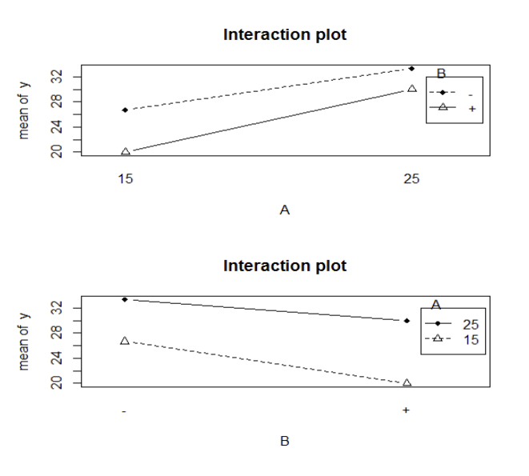

#### Comparsion

##### 1. Parallel Lines = No Interaction

The most important thing to notice is that the lines in both plots are **nearly parallel**.

- In the top plot (Effect of A at levels of B), both lines slope upward at roughly the same angle.
- In the bottom plot (Effect of B at levels of A), both lines slope downward at roughly the same angle.
- **Conclusion:** This confirms what we saw in the ANOVA table ($p = 0.183$); there is **no significant interaction**. The factors A and B act independently.

##### 2. Main Effect of A (Reactant Concentration)

- Looking at the first plot, as you move from 15% to 25% on the x-axis, the yield (y) **increases** for both catalyst levels.
- This shows that increasing Concentration has a **positive effect** on yield.

##### 3. Main Effect of B (Catalyst Amount)

- Looking at the second plot, as you move from the low level (-) to the high level (+) on the x-axis, the yield **decreases**.
- This shows that increasing the Catalyst amount has a **negative effect** on yield.

##### 4. Comparison of Slopes

- The lines have a **steep slope**, which visually represents why the Main Effects (A and B) were found to be "Highly Significant" in your ANOVA table. If there were no effect, the lines would be flat (horizontal).

---

### 2.6 Regression Model: Connecting Effects to Prediction

#### 🔹 Coded Variables (Recommended for Analysis)

-  a **coded variable** is a mathematical transformation used to simplify the analysis of a factorial design.

- Instead of using the actual physical units (like 15% concentration or 2 lbs of catalyst), we convert them into a standardized scale where the levels are represented by **$-1$** and **$+1$**.
- In a $2^k$ design, we typically use the following convention:
  - $-1$: Represents the Low level of a factor.
  - $+1$: Represents the High level of a factor.

Convert factor levels to $x = -1$ (low) or $x = +1$ (high):

| Factor           | Low Level | High Level | Coded Variable                       |
| ---------------- | --------- | ---------- | ------------------------------------ |
| A: Concentration | 15%       | 25%        | $x_1 = \frac{\text{Conc} - 20}{5}$   |
| B: Catalyst      | 1 lb      | 2 lb       | $x_2 = \frac{\text{Cat} - 1.5}{0.5}$ |

- 

#### 🔹 c (Coded Form):

$$
\hat{y} = \bar{y} + \frac{\text{Effect}_A}{2}x_1 + \frac{\text{Effect}_B}{2}x_2
$$

Where $\bar{y} = \frac{80+100+60+90}{4 \times 3} = 27.5$ (overall average)

$$
\hat{y} = 27.5 + \frac{8.33}{2}x_1 + \frac{-5.00}{2}x_2 = \boxed{27.5 + 4.167x_1 - 2.5x_2}
$$

- **For Concentration ($x_1$):**

  $$x_1 = \frac{\text{Concentration} - (25 + 15) / 2}{(25 - 15) / 2} = \frac{\text{Concentration} - 20}{5}$$

- **For Catalyst ($x_2$):**

  $$x_2 = \frac{\text{Catalyst} - (2 + 1) / 2}{(2 - 1) / 2} = \frac{\text{Catalyst} - 1.5}{0.5}$$


#### 🔹Fitted Regression Model(Original Units):

-  a **fitted regression model** is a mathematical equation that allows you to predict the response (Yield) based on the levels of your factors (Concentration and Catalyst).

Substitute back $x_1$ and $x_2$:
$$
\hat{y} = 27.5 + 4.167 \left( \frac{\text{Concentration} - 20}{5} \right) - 2.5 \left( \frac{\text{Catalyst} - 1.5}{0.5} \right)
$$

$$
\hat{y} = 18.33 + 0.833(\text{Concentration}) - 5.00(\text{Catalyst})
$$

✅ **Use this to predict yield** for any combination of concentration and catalyst!


#### R Codes to Obtain Regression Equation (used coded values ($-1, +1$)): 

```
# 1. Define the response variable (Yield)
y = c(28, 36, 18, 31, 25, 32, 19, 30, 27, 32, 23, 29)

# 2. Define the coded variables (-1 for low, 1 for high)
# x1 represents Reactant Concentration
x1 = rep(c(-1, 1, -1, 1), times = 3)

# x2 represents Amount of Catalyst
x2 = rep(c(-1, 1), each = 2, times = 3)

# 3. Create the linear regression model
model1 = lm(y ~ x1 + x2)

# 4. Display the results
model1

# output: 
Coefficients:
(Intercept) x1 x2
27.500 4.167 -2.500 
```


#### R Codes to Obtain Regression Equation (uses the **actual physical values** for Concentration ($15, 25$) and Catalyst ($1, 2$)): 

```
# 1. Define the response variable (Yield)
y = c(28, 36, 18, 31, 25, 32, 19, 30, 27, 32, 23, 29)

# 2. Define factors using their actual physical levels
# Concentration levels are 15 and 25
concentration = rep(c(15, 25, 15, 25), times = 3)

# Catalyst levels are 1 and 2
catalyst = rep(c(1, 2), each = 2, times = 3)

# 3. Create the linear regression model using natural units
model2 = lm(y ~ concentration + catalyst)

# 4. Display the coefficients
model2


Coefficients:
(Intercept) concentration catalyst
18.3333 0.8333 -5.0000 
```


---

### 2.7 R Code Walkthrough 

```r
# Step 1: Enter the data
y <- c(28, 36, 18, 31,    # Replicate 1 for (1), a, b, ab
       25, 32, 19, 30,    # Replicate 2
       27, 32, 23, 29)    # Replicate 3

# Step 2: Create factor variables
A <- factor(rep(c(15, 25, 15, 25), times = 3))  # Concentration
B <- factor(rep(c("Low", "Low", "High", "High"), each = 2, times = 3))  # Catalyst

# Step 3: Fit the model
model <- lm(y ~ A + B + A * B)  # * includes main effects + interaction

# Step 4: View ANOVA table
anova(model)

# Step 5: Check assumptions (residual plots)
par(mfrow = c(2, 2))  # 4 plots in one window
qqnorm(model$residuals); qqline(model$residuals)  # Normality check
plot(model$fitted.values, model$residuals)  # Constant variance check
abline(h = 0, col = "red")  # Reference line
```

> 💡 **Pro Tip**: Always check residual plots! If points don't follow the line in QQ-plot or show patterns in residual vs fitted plot, your model assumptions may be violated.

---

## 🔺 Part 3: The $2^3$ Factorial Design (3 Factors， each 2 level)

### 3.1 Three Ways to Label Treatments


| Run  | Geometric (±) | Letter Label | Binary (0/1) | A    | B    | C    |
| ---- | ------------- | ------------ | ------------ | ---- | ---- | ---- |
| 1    | − − −         | (1)          | 0 0 0        | Low  | Low  | Low  |
| 2    | + − −         | a            | 1 0 0        | High | Low  | Low  |
| 3    | − + −         | b            | 0 1 0        | Low  | High | Low  |
| 4    | + + −         | ab           | 1 1 0        | High | High | Low  |
| 5    | − − +         | c            | 0 0 1        | Low  | Low  | High |
| 6    | + − +         | ac           | 1 0 1        | High | Low  | High |
| 7    | − + +         | bc           | 0 1 1        | Low  | High | High |
| 8    | + + +         | abc          | 1 1 1        | High | High | High |

✅ **Key Insight**: The letter label tells you which factors are at HIGH level (e.g., "ac" = A high, C high, B low)

---

### 3.2 Example 2: Beverage Filling Experiment 🥤
**Factors**:
- A: Percent carbonation (10% vs 12%)
- B: Operating pressure (25 psi vs 30 psi)  
- C: Line speed (200 vs 250 bottles/min)
- Response: Fill height deviation (target = 0)

**Data Table** (2 replicates):

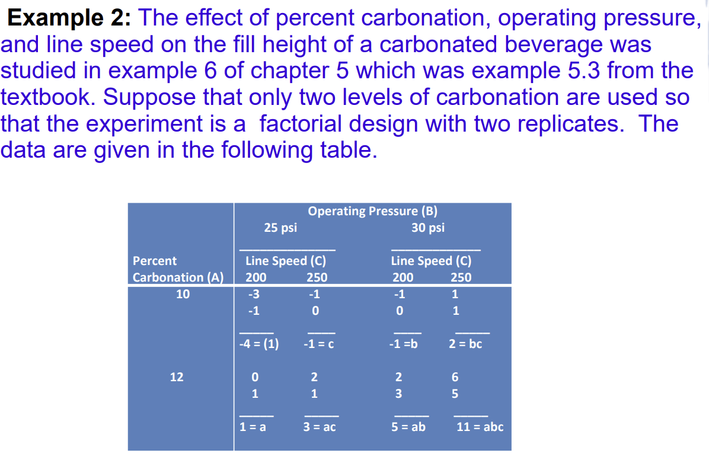

| Carbonation (A) | Pressure (B) | Speed (C) | Rep 1 | Rep 2 | Total  | Label |
| --------------- | ------------ | --------- | ----- | ----- | ------ | ----- |
| 10%             | 25 psi       | 200       | -3    | -1    | **-4** | (1)   |
| 12%             | 25 psi       | 200       | 0     | 1     | **1**  | a     |
| 10%             | 30 psi       | 200       | -1    | 0     | **-1** | b     |
| 12%             | 30 psi       | 200       | 2     | 3     | **5**  | ab    |
| 10%             | 25 psi       | 250       | -1    | 0     | **-1** | c     |
| 12%             | 25 psi       | 250       | 1     | 2     | **3**  | ac    |
| 10%             | 30 psi       | 250       | 2     | 0     | **2**  | bc    |
| 12%             | 30 psi       | 250       | 6     | 5     | **11** | abc   |

---

### 3.3 Calculating Effects Using the Sign Table

#### 🔹 The ± Sign Table for $2^3$ Design
*(This is your calculation cheat sheet!)*

| Treatment | I    | A    | B    | AB   | C    | AC   | BC   | ABC  |
| --------- | ---- | ---- | ---- | ---- | ---- | ---- | ---- | ---- |
| (1)       | +    | −    | −    | +    | −    | +    | +    | −    |
| a         | +    | +    | −    | −    | −    | −    | +    | +    |
| b         | +    | −    | +    | −    | −    | +    | −    | +    |
| ab        | +    | +    | +    | +    | −    | −    | −    | −    |
| c         | +    | −    | −    | +    | +    | −    | −    | +    |
| ac        | +    | +    | −    | −    | +    | +    | −    | −    |
| bc        | +    | −    | +    | −    | +    | −    | +    | −    |
| abc       | +    | +    | +    | +    | +    | +    | +    | +    |

- **Property A: Balance (Orthogonality)**

  Except for the identity column ($I$), every column has an **equal number of plus (+) and minus (–) signs**. This ensures that the high and low levels of each factor are balanced.

- **Property B: Orthogonality (Sum of Products)**

  The **sum of the products** of the signs in any two columns is **zero**. This is the mathematical definition of "orthogonality," meaning the estimate for Factor A is completely independent of the estimate for Factor B.

- **Property C: Identity Element ($I$)**

  Column $I$ acts as an **identity element**. Multiplying any column by $I$ leaves that column unchanged ($I \times A = A$).

- **Property D: The Closure Property (Generator)**

  The product of any two columns yields another column in the table. This is how interaction columns are created.

  - **Example 1:** $A \times B = AB$
  - **Example 2:** $AB \times B = AB^2$. Since any column squared becomes the identity column ($B^2 = I$), this simplifies to $A \times I$, which is just **$A$**.


#### 🔹 How to Use It:

1. Multiply each treatment total by the sign in the column for the effect you want
2. Sum these products → this is your **Contrast**
3. Effect = Contrast / ($2^{k-1} \cdot n$) = Contrast / (4 × 2) = Contrast / 8


**The Contrast for A ($C_A$)**

If you just need the **Contrast** (the numerator used for Sum of Squares), it is:
$$
C_A = a + ab + ac + abc - (1) - b - c - bc
$$

$$
C_A = (-4)(-1) + (1)(+1) + (-1)(-1) + (5)(+1) + (-1)(-1) + (3)(+1) + (2)(-1) + (11)(+1)
$$

$$
C_A = 4 + 1 + 1 + 5 + 1 + 3 - 2 + 11 = 24
$$

**Effect of A**
$$
A = \frac{a + ab + ac + abc}{4n} - \frac{(1) + b + c + bc}{4n} = \bar{y}_{A^+} - \bar{y}_{A^-}
$$

$$
\text{Effect}_A = \frac{24}{8} = \boxed{3.00}
$$

- **Numerator 1 (High A):** Includes all treatment combinations where **$a$** is present ($a, ab, ac, abc$).

  **Numerator 2 (Low A):** Includes all treatment combinations where **$a$** is absent ($(1), b, c, bc$).

  **$4n$:** This is the divisor because, in a $2^3$ design, there are 4 points at the "high" level and 4 points at the "low" level for each factor (multiplied by the number of replicates, $n$).


#### Main Effect diagram


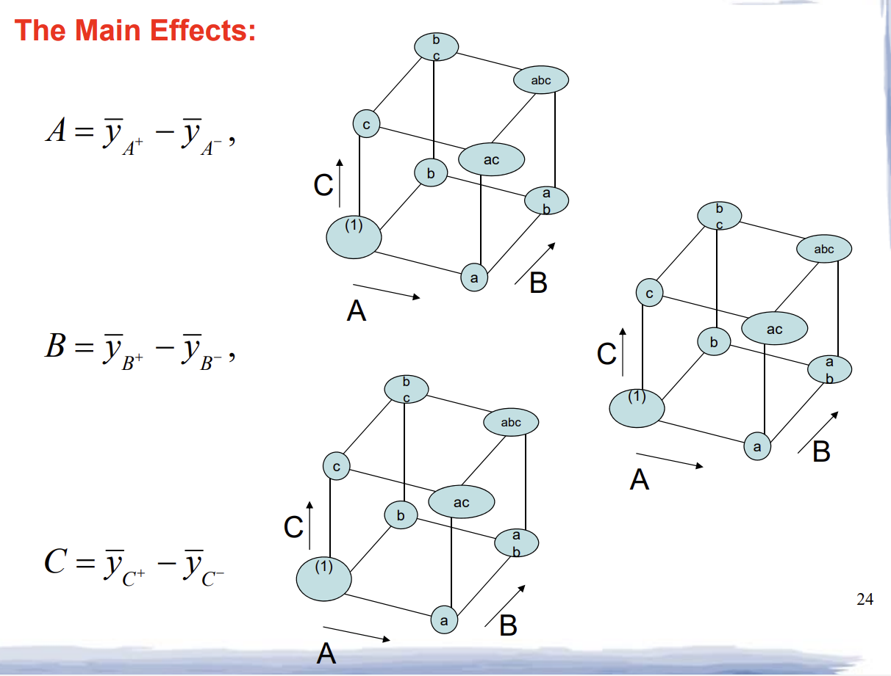

- The diagrams on the right use a cube to show where the "High" and "Low" levels of each factor live:
  - **Factor A:** Moves from left to right.
  - **Factor B:** Moves from front to back.
  - **Factor C:** Moves from bottom to top.

- The formulas on the left define the "Main Effect" of each factor as the difference between the average response at the **High level (+)** and the average response at the **Low level (-)**.

  - **$A = \bar{y}_{A^+} - \bar{y}_{A^-}$**: You compare the average of the 4 points on the **right** face of the cube ($a, ab, ac, abc$) against the 4 points on the **left** face ($(1), b, c, bc$).

    **$B = \bar{y}_{B^+} - \bar{y}_{B^-}$**: You compare the 4 points on the **back** face ($b, ab, bc, abc$) against the 4 points on the **front** face ($(1), a, c, ac$).

    **$C = \bar{y}_{C^+} - \bar{y}_{C^-}$**: You compare the 4 points on the **top** face ($c, ac, bc, abc$) against the 4 points on the **bottom** face ($(1), a, b, ab$).


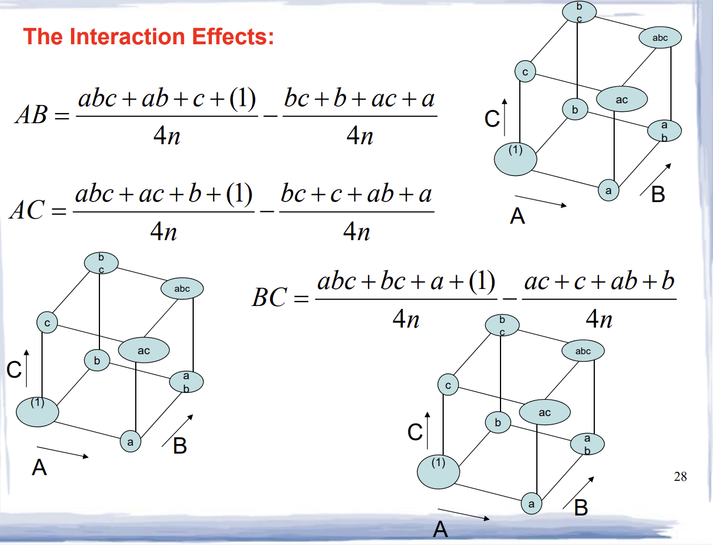


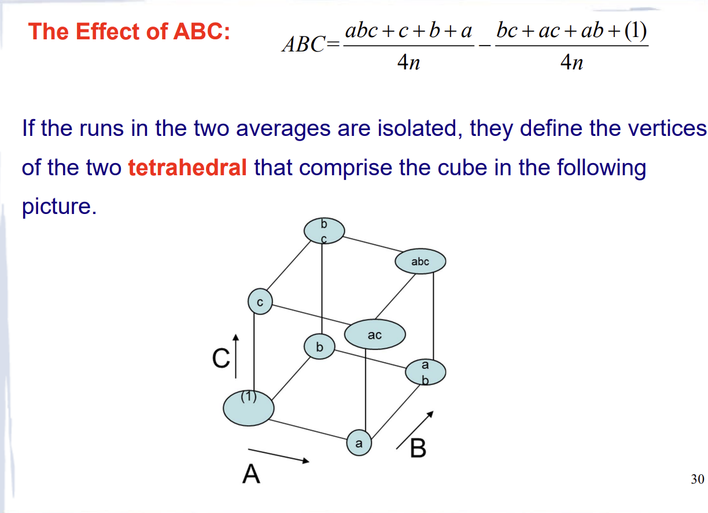

#### ✅ **All Effects Calculated**:


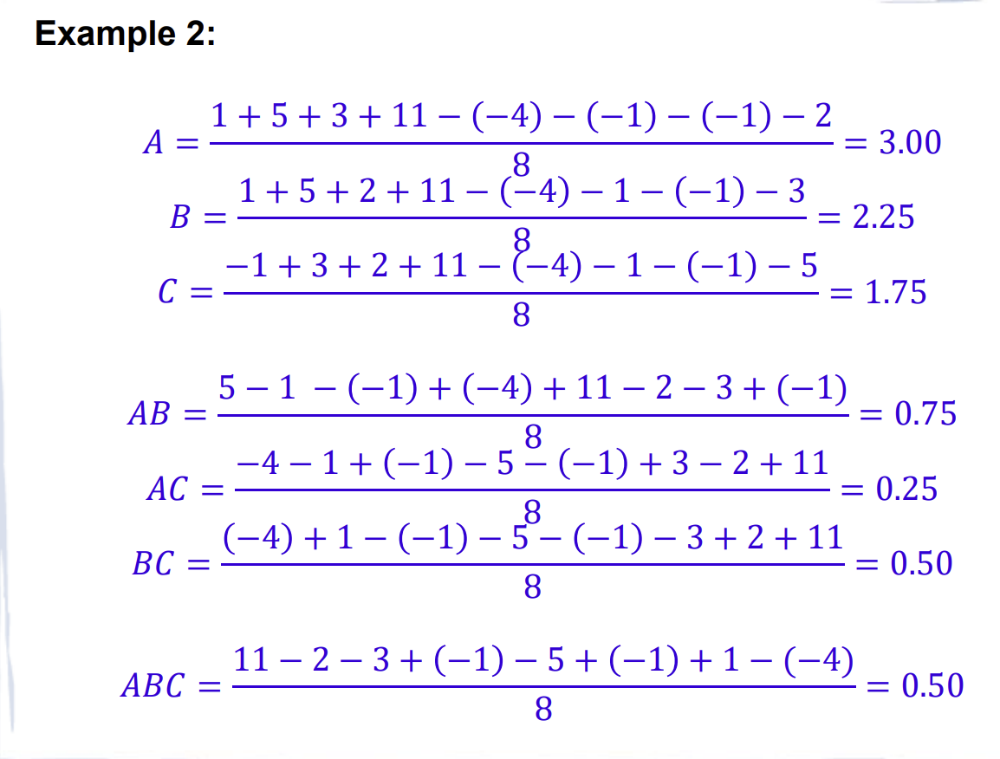

| Effect | Contrast | Effect Value |
| ------ | -------- | ------------ |
| A      | 24       | **3.00**     |
| B      | 18       | **2.25**     |
| C      | 14       | **1.75**     |
| AB     | 6        | 0.75         |
| AC     | 2        | 0.25         |
| BC     | 4        | 0.50         |
| ABC    | 4        | 0.50         |

---

### 3.4 Yates' Algorithm (Fast Calculation Method)

| Carbonation (A) | Pressure (B) | Speed (C) | Rep 1 | Rep 2 | Total  | Label |
| --------------- | ------------ | --------- | ----- | ----- | ------ | ----- |
| 10%             | 25 psi       | 200       | -3    | -1    | **-4** | (1)   |
| 12%             | 25 psi       | 200       | 0     | 1     | **1**  | a     |
| 10%             | 30 psi       | 200       | -1    | 0     | **-1** | b     |
| 12%             | 30 psi       | 200       | 2     | 3     | **5**  | ab    |
| 10%             | 25 psi       | 250       | -1    | 0     | **-1** | c     |
| 12%             | 25 psi       | 250       | 1     | 2     | **3**  | ac    |
| 10%             | 30 psi       | 250       | 2     | 0     | **2**  | bc    |
| 12%             | 30 psi       | 250       | 6     | 5     | **11** | abc   |

A systematic way to compute all effects at once:

| Treatment | Response | (1)  | (2)  | (3) Contrast | Effect | SS    |
| --------- | -------- | ---- | ---- | ------------ | ------ | ----- |
| (1)       | -4       | -3   | 1    | **16**       | I      | —     |
| a         | 1        | 4    | 15   | **24**       | A      | 36.00 |
| b         | -1       | 2    | 11   | **18**       | B      | 20.25 |
| ab        | 5        | 13   | 13   | **6**        | AB     | 2.25  |
| c         | -1       | 5    | 7    | **14**       | C      | 12.25 |
| ac        | 3        | 6    | 11   | **2**        | AC     | 0.25  |
| bc        | 2        | 4    | 1    | **4**        | BC     | 1.00  |
| abc       | 11       | 9    | 5    | **4**        | ABC    | 1.00  |

The number of calculation columns equals the number of factors ($k$). Since this is a $2^3$ design, there are 3 columns. To get the values in Column (1) from the Response column:

- **Top Half (Addition):** Add the responses in pairs.
  - $-4 + 1 = \mathbf{-3}$
  - $-1 + 5 = \mathbf{4}$
  - $-1 + 3 = \mathbf{2}$
  - $2 + 11 = \mathbf{13}$ 
- **Bottom Half (Subtraction):** Subtract the first from the second in each pair.
  - $1 - (-4) = \mathbf{5}$
  - $5 - (-1) = \mathbf{6}$
  - $3 - (-1) = \mathbf{4}$
  - $11 - 2 = \mathbf{9}$


**How it works**:

- Column (1): Pair adjacent responses, compute (sum, difference)
- Column (2): Repeat on column (1) results
- Column (3): Repeat again → final column gives contrasts
- Effect = (Column 3 value) / ($2^{k-1}n$) = value / 8
  - n = 2 (2 repliacate)

- $SS = \frac{(\text{Contrast})^2}{2^k n} = \frac{(\text{Col 3})^2}{16}$

---

### 3.5 ANOVA and Model Simplification

#### **Full Model ANOVA**:

R code to find Anova  for CRFD

```
> y <- c(-3,-1,0,1, -1,0,2,1, -1,0,2,3, 1,1,6,5)
> carbon <- as.factor(rep(c(10,12),each=2, times=4))
> press <- as.factor(rep(c(25,30), each=8))
> speed <- as.factor(rep(c(200,250), each=4, times=2))
> data <- data.frame(y, carbon, press, speed)
> attach(data)


> model <- lm(y ~ (carbon + press + speed )^3)
> anova(model)
```


| Source | df   | SS    | MS    | F    | p-value     |
| ------ | ---- | ----- | ----- | ---- | ----------- |
| A      | 1    | 36.00 | 36.00 | 57.6 | 0.00006 *** |
| B      | 1    | 20.25 | 20.25 | 32.4 | 0.00046 *** |
| C      | 1    | 12.25 | 12.25 | 19.6 | 0.0022 **   |
| AB     | 1    | 2.25  | 2.25  | 3.6  | 0.094       |
| AC     | 1    | 0.25  | 0.25  | 0.4  | 0.545       |
| BC     | 1    | 1.00  | 1.00  | 1.6  | 0.242       |
| ABC    | 1    | 1.00  | 1.00  | 1.6  | 0.242       |
| Error  | 8    | 5.00  | 0.625 | —    | —           |

✅ **Decision**: Only A, B, C are significant (p < 0.05). Drop all interactions!

Main Effects (The "Winners")

- All three primary factors are **highly statistically significant** ($P < 0.05$):

  - **Carbon ($P = 6.36 \times 10^{-6}$):** This is the most significant factor with the largest Sum of Squares (36.00). It has the strongest influence on the yield.

  - **Press ($P = 0.00045$):** Also highly significant.

  - **Speed ($P = 0.00228$):** Significant, though it has the smallest impact among the three main factors

Interactions (The "Losers")

- None of the interaction terms are significant (all $P > 0.05$):

  - **2-Way Interactions:** `carbon:press` ($P = 0.084$), `carbon:speed` ($P = 0.544$), and `press:speed` ($P = 0.241$) all fail to reach significance.

  - **3-Way Interaction:** `carbon:press:speed` ($P = 0.241$) is also not significant.

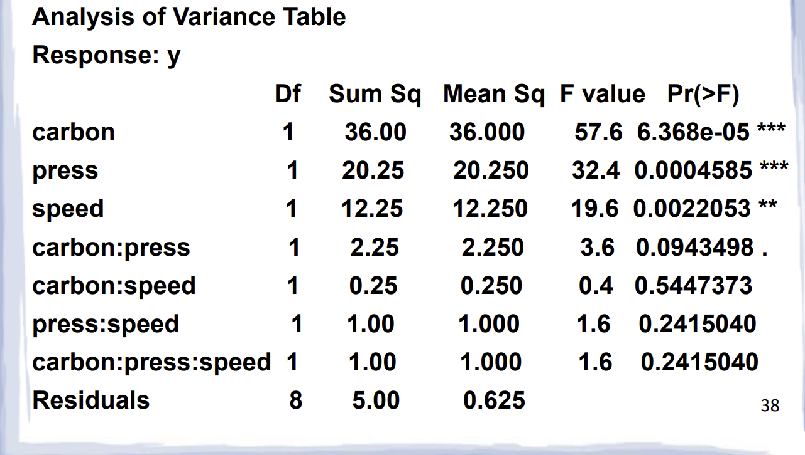


#### **Reduced Model ANOVA** (A + B + C only):

R Codes to Find ANOVA 

```
> model1 <- lm(y ~ carbon + press + speed )
> anova(model1)
```

| Source | df   | SS    | MS    | F     | p-value     |
| ------ | ---- | ----- | ----- | ----- | ----------- |
| A      | 1    | 36.00 | 36.00 | 45.47 | 0.00002 *** |
| B      | 1    | 20.25 | 20.25 | 25.58 | 0.00028 *** |
| C      | 1    | 12.25 | 12.25 | 15.47 | 0.00199 **  |
| Error  | 12   | 9.50  | 0.792 | —     | —           |

✅ **Better model**: Simpler, more degrees of freedom for error, same conclusions.


#### R Codes to Compare Two Models

```
model <- lm(y ~ (carbon + press + speed )^3)
model1 = lm(y~carbon+press+speed)
anova(model1, model)
```

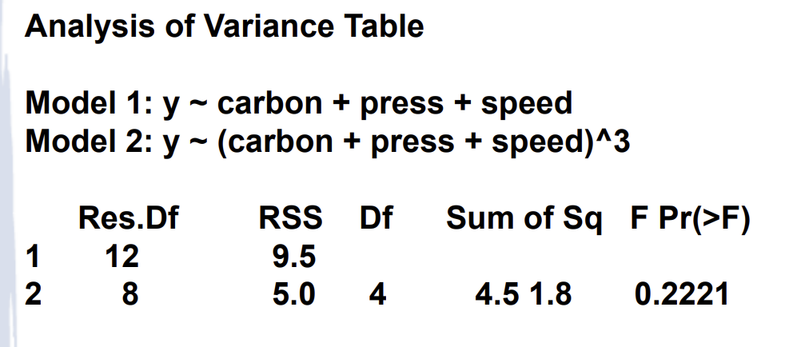


------


### R Codes to Find Interaction Plot:

```
# 1. Set up a 2x2 grid for the plots
par(mfrow=c(2,2))

# 2. Generate a Design Plot (shows the main effects of all factors)
plot.design(data)

# 3. Generate Interaction Plots for each pair of factors
# Carbon vs. Pressure
interaction.plot(carbon, press, y)

# Carbon vs. Speed
interaction.plot(carbon, speed, y)

# Pressure vs. Speed
interaction.plot(press, speed, y)
```

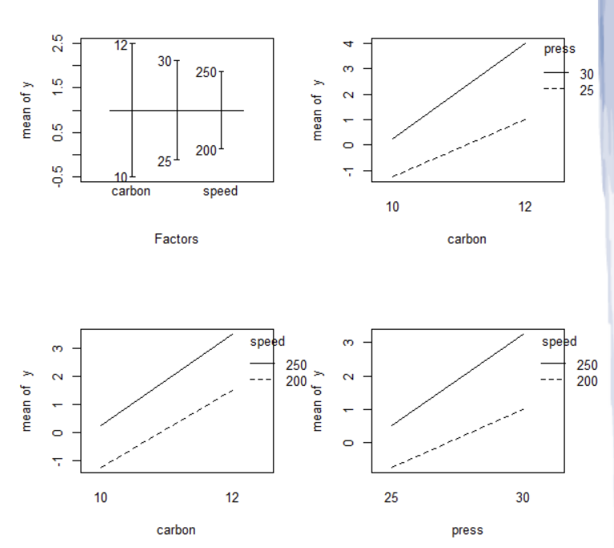

**1. The Design Plot (Top Left)**

- This plot shows the "Main Effects." The horizontal line is the grand mean.
- The vertical lines represent the change in yield for each factor. **Carbon** has the longest vertical line, indicating it has the **strongest effect** on the response, followed by Pressure and then Speed.

**2. The Interaction Plots (The other three windows)**

- **Parallelism:** In all three interaction plots, the lines are nearly **parallel**.
- **Conclusion:** Because the lines do not cross and are not significantly slanted toward each other, there are **no strong interactions** between Carbon, Pressure, and Speed.
- This confirms that the factors act independently; for example, the effect of increasing Carbon is the same regardless of whether the Speed is high or low.

**3. Slopes and Directions**

- In the "Carbon vs. Speed" plot (bottom right), the lines have a distinct **positive slope**. This visually confirms that as Carbon increases, the mean of $y$ increases.

------


### R Codes to Obtain Effects

```
# 1. Fit the full model with all 3-way interactions
model = lm(y ~ (carbon + press + speed)^3)

# 2. Extract effects 2 through 8 (skipping the intercept)
model.effects = model$effects[2:8]

# 3. View the estimated effects
model.effects

```

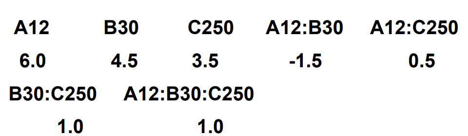


| **Variable**     | **Coefficient** | **Meaning**                                                  |
| ---------------- | --------------- | ------------------------------------------------------------ |
| **A (Carbon)**   | **6.0**         | **Strongest Effect.** Increasing carbon significantly raises the response. |
| **B (Press)**    | **4.5**         | **Strong Effect.** Increasing pressure raises the response.  |
| **C (Speed)**    | **3.5**         | **Moderate Effect.** Increasing speed raises the response.   |
| **Interactions** | **-1.5 to 1.0** | **Weak Effects.** The low values for `A:B`, `A:C`, `B:C`, and `A:B:C` indicate that the factors act independently. |

---

### 3.6 Half-Normal Plot: Visual Effect Screening
When you have many effects, use this plot to identify significant ones:

1. Take absolute values of all effect estimates
2. Plot them against theoretical normal quantiles
3. **Significant effects** will deviate from the straight line

```r
# R code for half-normal plot
model.effects <- model$effects[2:8]  # Exclude intercept
abs.effects <- abs(model.effects)
qq <- qqnorm(abs.effects, type = "n")  # Create empty plot
text(qq$x, qq$y, labels = names(abs.effects))  # Add labels
abline(0, 1, col = "red")  # Reference line
```


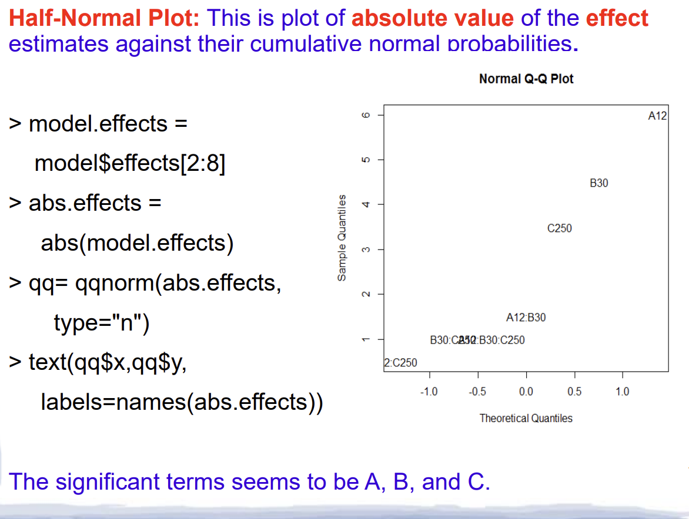

✅ **Interpretation**: Points A, B, C fall far from the line → they're significant. Others cluster near the line → likely noise.

Looking at the plot on this page, we can draw the following conclusions:

- **The Straight Line:** Most of the interaction terms (like $AC$, $BC$, $ABC$, etc.) cluster along the straight line near the bottom left. These are "noise."
- **Significant Factors:** The points labeled **A (Carbon)**, **B (Press)**, and **C (Speed)** are clearly separated from the straight line.
- **Final Conclusion:** The plot confirms that **A, B, and C** are the only significant effects in this experiment. This matches the ANOVA results we saw on Page 38.

------


### The Regression Model

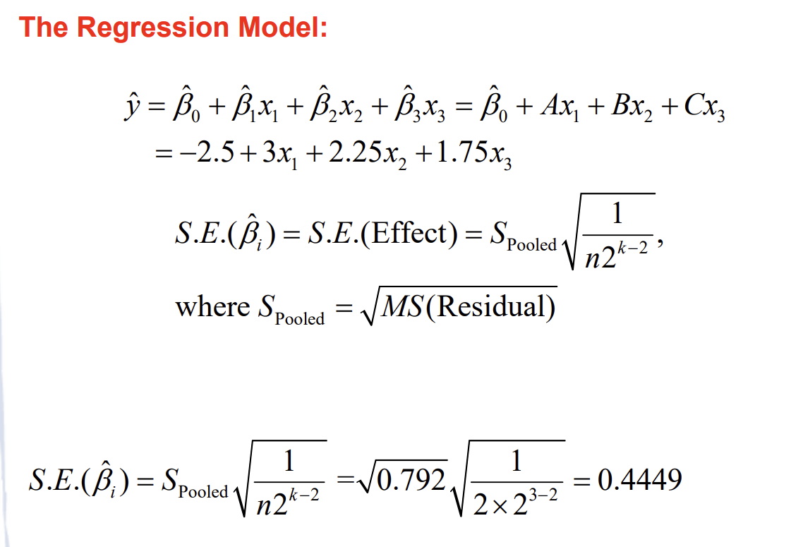

```
model1 <- lm(y ~ carbon + press + speed )
summary(model1)
```

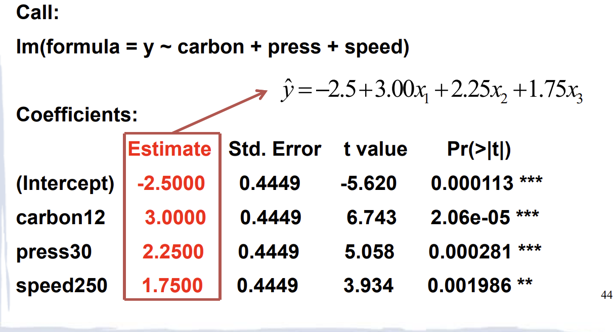

1. **The Regression Equation:**

   The red arrow on the slide points to the derived predictive formula:

   $$\hat{y} = -2.5 + 3.00x_1 + 2.25x_2 + 1.75x_3$$

   *(Where $x_1, x_2, x_3$ are the coded levels for Carbon, Pressure, and Speed).*

2. **Significance (P-values):**

   All three factors have $P$-values much smaller than $0.05$. This statistically confirms that **Carbon, Pressure, and Speed** all significantly impact the response variable.

3. **Coefficient Interpretation:**

   - **carbon12 (3.00):** This is the strongest positive coefficient. It means changing from low to high carbon increases the response the most.
   - **Intercept (-2.50):** This is the estimated response when all coded factors are at their "average" or reference level.

4. **Standard Error:**

   Notice that the **Std. Error** is identical ($0.4449$) for all factors. This is a hallmark of an **orthogonal (balanced & Independent) design**; because the experiment is perfectly balanced, the precision of our estimate for each factor is exactly the same.


---


## ⚠️ Part 4: Unreplicated $2^k$ Designs (No Replicates!)

### 4.1 The Problem
When $n = 1$ (no replicates):
- Total runs = $2^k$
- Total df = $2^k - 1$
- All df used by effects → **NO df left for error!**
- Cannot compute F-tests or p-values traditionally

### 4.2 The Solution: Effect Sparsity Principle
> "In most systems, only a few effects are truly important; most are negligible."

**Strategy**:
1. Calculate all effects
2. Assume small effects = noise
3. Pool small effects to estimate error
4. Test large effects against this pooled error

---

### 4.3 Example: Filtration Rate Experiment (4 Factors)
**Factors**: A=Temperature, B=Pressure, C=Concentration, D=Stirring Rate  
**Response**: Filtration rate (gal/h)  
**Design**: $2^4 = 16$ runs, **no replicates**

| Run  | Label | Filtration Rate |
| ---- | ----- | --------------- |
| 1    | (1)   | 45              |
| 2    | a     | 71              |
| 3    | b     | 48              |
| 4    | ab    | 65              |
| 5    | c     | 68              |
| 6    | ac    | 60              |
| 7    | bc    | 80              |
| 8    | abc   | 65              |
| 9    | d     | 43              |
| 10   | ad    | 100             |
| 11   | bd    | 45              |
| 12   | abd   | 104             |
| 13   | cd    | 75              |
| 14   | acd   | 86              |
| 15   | bcd   | 70              |
| 16   | abcd  | 96              |

#### 🔹 Step 1: Fit Full Model (Warning Expected!)
```r
# 1. Define the response variable y (16 observations from the 2^4 design)
# Note: Replace these numbers with the actual values from your data table
y <- c(45, 71, 48, 65, 68, 60, 80, 65, 43, 100, 45, 104, 75, 86, 70, 96)

# 2. Define the Factors in Standard Order
# A: Alternates every 1 run
A <- rep(c(-1, 1), times = 8)

# B: Alternates every 2 runs
B <- rep(c(-1, 1), each = 2, times = 4)

# C: Alternates every 4 runs
C <- rep(c(-1, 1), each = 4, times = 2)

# D: Alternates every 8 runs
D <- rep(c(-1, 1), each = 8)

g <- lm(y ~ (A + B + C + D)^4)  # All main effects + all interactions (Full model)
anova(g)  # Will warn: "perfect fit, no error df"
```

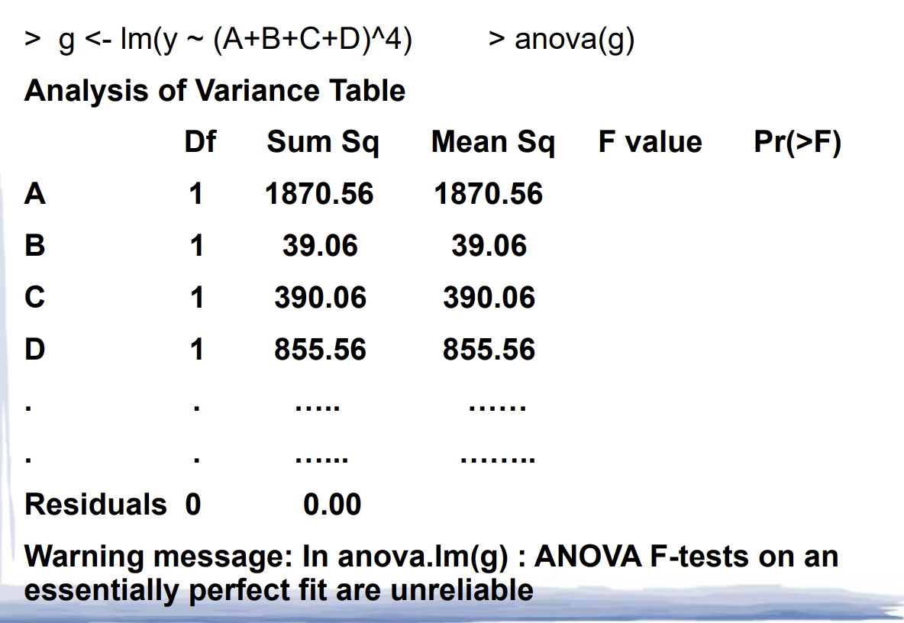


#### 🔹 Step 2: Identify & Remove Weak Effects

From effect calculations (or half-normal plot):
- Factor B has tiny effect → drop B and all terms containing B

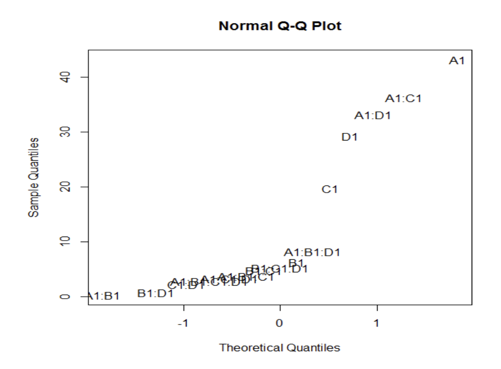

- How to Read the Plot
  - **The "Noise" (The Line):** The effects that cluster along the invisible straight diagonal line are considered **insignificant**. They represent random experimental error (noise). In this plot, this includes factor **B** and almost all complex interactions (like $AB$, $ABC$, etc.).
  - **The "Signals" (The Outliers):** Points that fall far away from the straight line are **statistically significant**. These represent real physical changes in the response, not just random variation.
- Looking at the labels on the plot, four specific effects stand out as **significant:**
  1. **A1 (Carbon):** The furthest outlier, representing the strongest positive effect.
  2. **D1 (Pressure):** A significant positive effect.
  3. **C1 (Speed):** A significant positive effect.
  4. **A1:D1 (Carbon-Pressure Interaction):** This is the only **interaction** that is significant.


#### 🔹 Step 3: Fit Reduced Model
```r
h <- lm(y ~ (A + C + D)^3)  # Model without B
anova(h)
```

**Resulting ANOVA**:

| Source    | df    | SS         | MS        | F     | p-value      |
| --------- | ----- | ---------- | --------- | ----- | ------------ |
| A         | 1     | 1870.56    | 1870.56   | 83.37 | 0.000017 *** |
| C         | 1     | 390.06     | 390.06    | 17.38 | 0.0031 **    |
| D         | 1     | 855.56     | 855.56    | 38.13 | 0.00027 ***  |
| A:C       | 1     | 1314.06    | 1314.06   | 58.57 | 0.00006 ***  |
| A:D       | 1     | 1105.56    | 1105.56   | 49.27 | 0.00011 ***  |
| C:D       | 1     | 5.06       | 5.06      | 0.23  | 0.647        |
| A:C:D     | 1     | 10.56      | 10.56     | 0.47  | 0.512        |
| **Error** | **8** | **179.50** | **22.44** | —     | —            |

✅ **Final Model**: Keep A, C, D, A:C, A:D (all p < 0.01)


### Interaction plot

```
# 1. Define the data (Standard Order for 2^4 design)
y <- c(45, 71, 48, 65, 68, 60, 80, 65, 43, 100, 45, 104, 75, 86, 70, 96)
A <- factor(rep(c(-1, 1), times = 8))
C <- factor(rep(c(-1, 1), each = 4, times = 2))
D <- factor(rep(c(-1, 1), each = 8))

# 2. Set up a 2x2 plotting grid
par(mfrow=c(2,2))

# 3. Plot 1: Interaction between A and C
interaction.plot(A, C, y, main="Interaction A:C", xlab="Factor A", ylab="mean of y", trace.label="C")

# 4. Plot 2: Interaction between A and D (The significant one)
interaction.plot(A, D, y, main="Interaction A:D", xlab="Factor A", ylab="mean of y", trace.label="D")

# 5. Plot 3: Interaction between C and D
interaction.plot(C, D, y, main="Interaction C:D", xlab="Factor C", ylab="mean of y", trace.label="D")
```

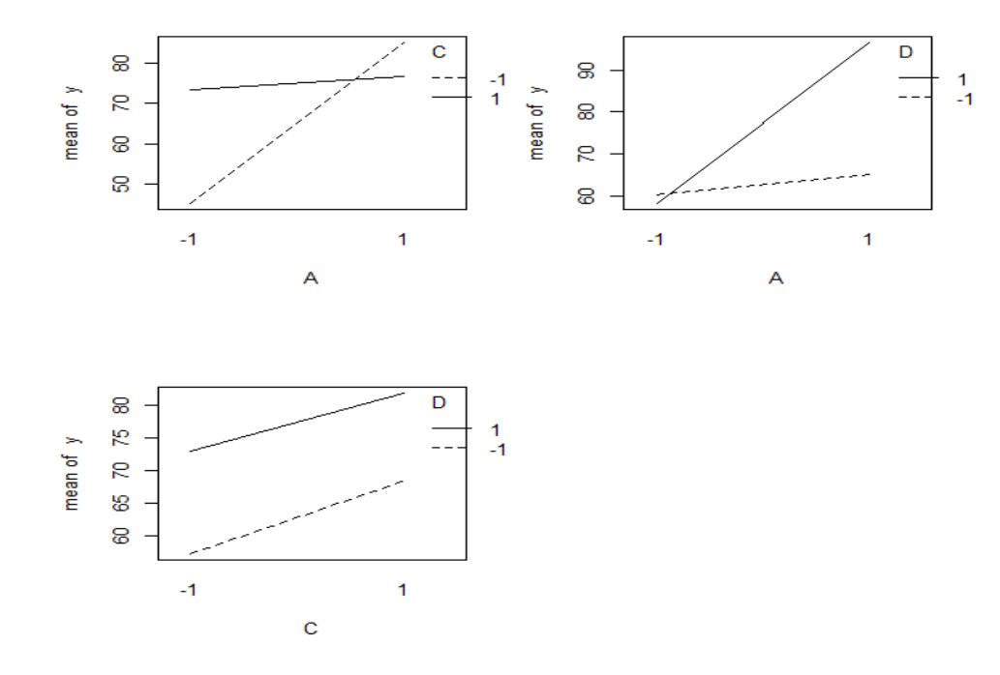

The interaction plots are used to see if the effect of one factor depends on the level of another.

1. Interaction A:D (Top-Right) — Significant

- **Observation:** The two lines are **not parallel**; they have distinctly different slopes.
- **Analysis:** This confirms a **statistically significant interaction**. The effect of Factor A (Carbon) is much stronger when Factor D (Pressure) is at its high level (+1) compared to its low level (-1). You cannot optimize one without considering the other.

2. Interaction A:C (Top-Left) — Insignificant

- **Observation:** The lines are almost perfectly **parallel**.
- **Analysis:** There is no interaction between Carbon (A) and Speed (C). The change in yield when increasing Carbon is consistent regardless of whether the Speed is high or low.

3. Interaction C:D (Bottom-Left) — Insignificant

- **Observation:** The lines are **parallel**.
- **Analysis:** There is no interaction between Speed (C) and Pressure (D). These two factors act independently of one another.


###  **Residual Plots**

```
# 1. Fit the "Reduced" model as defined on Page 48
# This drops factor B but keeps all interactions of A, C, and D
h <- lm(y ~ (A + C + D)^3)

# 2. Set up a 2x2 grid for the plots
par(mfrow = c(2, 2))

# 3. Generate Residuals vs. Factor plots
# Each plot shows the error spread for the low (1.0) and high (2.0) levels
plot(A, residuals(h), xlab = "c(A)", ylab = "resids", main = "Residuals vs A")
abline(h = 0, col = "red")

plot(B, residuals(h), xlab = "c(B)", ylab = "resids", main = "Residuals vs B")
abline(h = 0, col = "red")

plot(C, residuals(h), xlab = "c(C)", ylab = "resids", main = "Residuals vs C")
abline(h = 0, col = "red")

plot(D, residuals(h), xlab = "c(D)", ylab = "resids", main = "Residuals vs D")
abline(h = 0, col = "red")
```

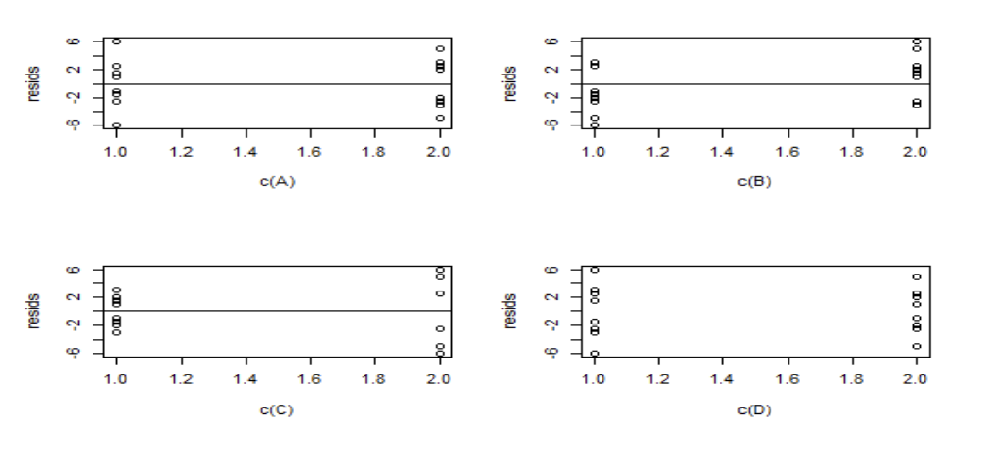

**Constant Variance:** In the plots for **A, C, and D**, the vertical spread of the points is roughly the same at both level 1.0 and 2.0. This means the model's prediction error is consistent.

**Linearity:** The points are scattered randomly around the red center line ($0$) with no "U" or "S" shapes, indicating the linear model is appropriate.

**The "B" Check:** Even though **Factor B** was left out of the math for `model_red`, we plot its residuals anyway. Since the points for B look just as random as the others, it confirms that B has no hidden influence on the error—validating that it was right to exclude it.

**Outliers:** There are no points flying far away from the rest (e.g., beyond $\pm6$), meaning no single "bad" data point is ruining your results.

---

## 🧮 Part 5: Essential Formulas Cheat Sheet

### 5.1 Effect Calculation (General $2^k$)
$$
\text{Effect} = \frac{\text{Contrast}}{2^{k-1} \cdot n}
$$

### 5.2 Contrast from Sign Table
$$
C_{\text{Effect}} = \sum (\text{sign}_{ij} \times \text{Total}_{ij})
$$
Where $\text{sign}_{ij} = +1$ or $-1$ from the ± table

### 5.3 Sum of Squares
$$
SS_{\text{Effect}} = \frac{C_{\text{Effect}}^2}{2^k \cdot n}
$$

### 5.4 Regression Model (Coded Variables)
$$
\hat{y} = \beta_0 + \beta_1 x_1 + \beta_2 x_2 + \beta_{12} x_1 x_2 + \cdots
$$
Where $\beta_i = \frac{\text{Effect}_i}{2}$

### 5.5 Converting Coded to Natural Variables
For factor with low = $L$, high = $H$:
$$
x_{\text{coded}} = \frac{\text{value} - \frac{L+H}{2}}{\frac{H-L}{2}}
$$

---

## 🛠️ Part 6: Practical Implementation Guide

### 6.1 Before You Start
✅ Randomize run order (prevents time trends from biasing results)  
✅ Use blocking if you can't run all experiments under identical conditions  
✅ Include center points to check for curvature (not covered here but important!)

### 6.2 Analysis Workflow


### 6.3 Common Mistakes to Avoid
❌ **Not randomizing runs** → confounding with time/laboratory effects  
❌ **Ignoring residual plots** → invalid conclusions if assumptions violated  
❌ **Keeping non-significant interactions** → overfitting, poor predictions  
❌ **Using uncoded variables in model comparison** → hard to compare effect sizes  

### 6.4 When to Use $2^k$ Designs
✅ Early-stage factor screening (many factors, limited resources)  
✅ When factors are naturally binary or can be set to two levels  
✅ When you suspect interactions might exist  
❌ When you need to model curvature (use response surface methods instead)  
❌ When factors have more than 2 important levels (consider $3^k$ or mixed designs)

---

## 🎓 Summary: What You Should Remember

1. **$2^k$ designs** test all combinations of $k$ factors at 2 levels each
2. **Main effect** = average change in response when factor goes from low to high
3. **Interaction** = when one factor's effect depends on another factor's level
4. **Contrasts** are the computational engine for effect estimation
5. **ANOVA** tells you which effects are statistically significant
6. **Coded variables** ($-1$/$+1$) make effects comparable and models interpretable
7. **Unreplicated designs** use effect sparsity + pooling to estimate error
8. **Always check assumptions** with residual plots!

> 💡 **Final Tip**: Start simple ($2^2$), master the calculations, then scale up. The patterns repeat—once you understand $2^2$, $2^3$ and $2^4$ follow the same logic!

---

*Need clarification on any step? Want me to walk through a specific calculation again? Just ask!* 😊