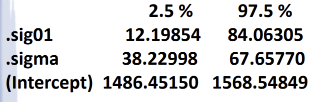

# 📚 Chapter 13: Experiment with Random Factors
## Complete Beginner-Friendly Lecture Notes
> **Target Audience**: Students with limited statistics background  
	**Goal**: Understand random effects models, variance components, and how to analyze them using R
>
---

## 🎯 Part 1: Fixed Factors vs. Random Factors — The Foundation
### 🔹 What is a "Factor"?
A **factor** is an independent variable in an experiment (e.g., laboratory, batch, operator, treatment).

### 🔹 Fixed Factors vs. Random Factors
| **Fixed Factor** | **Random Factor** |
| --- | --- |
| Levels are **specifically chosen** by the researcher | Levels are **randomly sampled** from a larger population |
| Conclusions apply **only to the levels studied** | Conclusions apply to the **entire population** of levels |
| Example: Testing 3 specific drug doses (10mg, 20mg, 30mg) | Example: Testing 3 randomly chosen labs out of 100 possible labs |
| Question: "Which dose works best?" | Question: "How much do labs vary in general?" |


In a standard ANOVA (Fixed Effects), we look at the **p-value** because we want to know if specific groups are different (e.g., "Is Fertilizer A better than Fertilizer B?").

In this chapter, we focus on **Estimating Variances** ($\sigma_{\tau}^2$and$\sigma^2$) because our goal has shifted from "Which one is best?" to **"Where is the inconsistency coming from?"**


### 💡 Why Does This Distinction Matter?
```plain
Fixed Effects: We care about COMPARING specific levels
Random Effects: We care about ESTIMATING VARIABILITY in the population
```

> 🎯 **Key Insight**: With random factors, we estimate **variance components** — how much of the total variation comes from different sources.
>

---

## 📐 Part 2: One-Way Random Effects Model
### 🔹 Statistical Model
For observation$j$from level$i$:

$\boxed{y_{ij} = \mu + \tau_i + \varepsilon_{ij}}$

| Symbol | Meaning | Type |
| --- | --- | --- |
|$y_{ij}$| Response variable (the measurement) | Observed |
|$\mu$| Overall mean (grand average) | Fixed parameter |
|$\tau_i$| Effect of level$i$| **Random variable** |
|$\varepsilon_{ij}$| Random error within level | Random variable |


### 🔹 Distributional Assumptions
$\tau_i \sim N(0, \sigma_\tau^2), \quad \varepsilon_{ij} \sim N(0, \sigma^2)$

And$\tau_i$and$\varepsilon_{ij}$are **independent**.

### 🔹 Variance Decomposition (Very Important!)
$\text{Var}(y_{ij}) = \sigma_y^2 = \underbrace{\sigma_\tau^2}_{\text{Between levels}} + \underbrace{\sigma^2}_{\text{Within levels}}$

+$\sigma_\tau^2$= variance **between** randomly selected levels (e.g., between labs)
+$\sigma^2$= variance **within** levels (e.g., measurement error within a lab)
+ These are called **variance components**

### 🔹 Hypothesis Testing
We test whether the random factor contributes meaningful variation:

$H_0: \sigma_\tau^2 = 0 \quad \text{vs.} \quad H_A: \sigma_\tau^2 > 0$

+ If$H_0$is true → no variation between levels → all variation is just random error
+ If$H_A$is true → levels differ significantly → factor matters

### 🔹 Point Estimates
$\hat{\mu} = \bar{y}_{..} \quad \text{(grand mean)}$

$\hat{\tau}_i = \bar{y}_{i.} - \bar{y}_{..} \quad \text{(deviation of level i from grand mean)}$

---

## 📊 Part 3: ANOVA for Random Effects
### 🔹 Sum of Squares Formulas
$SS_{Total} = \sum_{i=1}^{k}\sum_{j=1}^{n_i}(y_{ij} - \bar{y}_{..})^2$

$SS_{Treatments} = \sum_{i=1}^{k}\sum_{j=1}^{n_i}(\bar{y}_{i.} - \bar{y}_{..})^2$

+ Measures variation **between** the different groups or factor levels.

$SS_{Error} = \sum_{i=1}^{k}\sum_{j=1}^{n_i}(y_{ij} - \bar{y}_{i.})^2$

+ Measures variation **within** the groups (experimental noise).

And:$SS_{Total} = SS_{Treatments} + SS_{Error}$✓

### 🔹 Expected Mean Squares — The Critical Difference!
For random effects model$$y_{ij} = \mu + \tau_i + \epsilon_{ij}$$, we have

+$E(MS_{Error}) = \sigma^2$: This estimate only contains the error variance.
+$E(MS_{Treatments}) = \sigma^2 + n\sigma_{\tau}^2$: Unlike fixed effects, this includes the error variance plus a component representing the variance of the random factor ($\sigma_{\tau}^2$).

| Source | **Random Effects Model** | Fixed Effects Model |
| --- | --- | --- |
| Treatments |$E(MS_{Tr}) = \sigma^2 + n\sigma_\tau^2$|$E(MS_{Tr}) = \sigma^2 + \frac{n}{k-1}\sum\tau_i^2$|
| Error |$E(MS_E) = \sigma^2$|$E(MS_E) = \sigma^2$|


> ⚠️ **Key Point**: The F-test formula looks the same, but the **interpretation** of mean squares is different!
>

### 🔹 ANOVA Table Structure
$k$** (Number of Levels/Groups):** This represents the number of different groups, treatments, or factor levels being compared

$n$** (Sample Size per Group):** This is the number of observations or replicates within each of those$k$groups.

| Source | df | SS | MS | F |
| --- | --- | --- | --- | --- |
| Treatments |$k-1$|$SS_{Tr}$|$MS_{Tr} = \frac{SS_{Tr}}{k-1}$|$F = \frac{MS_{Tr}}{MS_E}$|
| Error |$nk-k$|$SS_E$|$MS_E = \frac{SS_E}{nk-k}$| — |
| Total |$nk-1$|$SS_{Total}$| — | — |


---

## 🔢 Part 4: Estimating Variance Components
### 🔹 Method of Moments (Simplest Approach)
In a fixed-effects model, we care about the means of specific groups. In a random-effects model, we care about **how much variation** is coming from the factor itself ($\sigma_{\tau}^2$) versus the random noise ($\sigma^2$).


#### Estimating Variance Components
 since we know the "Expected Mean Squares" from the previous slide, we can work backward to find the variance.

From expected mean squares:

+$E(MS_{Tr}) = \sigma^2 + n\sigma_\tau^2$
+$E(MS_E) = \sigma^2$


**Solving for variance components:**

+ **For Error (**$\sigma^2$**):** The best estimate is simply the Mean Square Error ($MS_{Error}$) from your ANOVA table.

$\boxed{\hat{\sigma}^2 = MS_E}$

+ **For the Random Factor (**$\sigma_{\tau}^2$**):** Since$E(MS_{Treatments}) = \sigma^2 + n\sigma_{\tau}^2$, the formula to isolate the variance is:

$\boxed{\hat{\sigma}_\tau^2 = \frac{MS_{Tr} - MS_E}{n}}$

	If our estimate for$\sigma_{\tau}^2$is 0, it means there is no real difference between groups; any differences you saw were just random luck.

### ⚠️ Problem with Method of Moments
$\text{If } MS_{Tr} < MS_E, \text{ then } \hat{\sigma}_\tau^2 < 0$

But variance **cannot be negative**! This is a limitation.

Mathematically, if your$MS_{Error}$is larger than your$MS_{Treatments}$, the subtraction in the numerator results in a negative number. Since variance (spread) physically cannot be less than zero, this usually suggests that the true variance is actually zero, or that the Method of Moments isn't the best fit for that specific dataset.


### ✅ Better Methods: ML and REML
| Method | Full Name | Advantage |
| --- | --- | --- |
| **ML** | Maximum Likelihood | Always produces non-negative estimates |
| **REML** | Restricted Maximum Likelihood | Less biased, preferred for small samples |


> 🎯 When data is balanced and$MS_{Tr} > MS_E$, REML = Method of Moments
>


### 2. Unequal Sample Sizes Adjustment
In a perfect experiment, every group has the same number of observations ($n$). However, if your groups have different sizes (e.g., Lab A has 7 samples, but Lab B has 8), you can't just use a simple$n$.

+ The slide introduces$n_0$, which is a "weighted average" of the sample sizes.
+ You calculate$n_0$using the complex formula in the middle of the page so that your variance estimate remains accurate even when the data is unbalanced.

When$n_1, n_2, ..., n_k$are not equal, replace$n$with:

$n_0 = \frac{1}{k-1}\left(\sum_{i=1}^{k} n_i - \frac{\sum_{i=1}^{k} n_i^2}{\sum_{i=1}^{k} n_i}\right)$

+$k$: The number of **groups** or factor levels (e.g., the number of different labs you are testing).
+$n$: The number of **observations** within each group (e.g., how many times you tested the product at each lab).

---

## 🧪 Example 1: Apo A-I Laboratory Study (Balanced-ish Design)
### 🔹 Research Question
Do different laboratories produce different measurements of apo A-I concentration?

### 🔹 Data Table (4 Labs, Unequal Sample Sizes)
| Lab A (n=7) | Lab B (n=8) | Lab C (n=7) | Lab D (n=8) |
| --- | --- | --- | --- |
| 1.195 | 1.155 | 1.021 | 1.163 |
| 1.144 | 1.173 | 1.037 | 1.171 |
| 1.167 | 1.171 | 1.022 | 1.182 |
| 1.249 | 1.175 | 1.064 | 1.184 |
| 1.177 | 1.153 | 1.094 | 1.175 |
| 1.217 | 1.139 | 0.992 | 1.134 |
| 1.187 | 1.185 | 1.072 | 1.169 |
| — | 1.144 | — | 1.136 |


### 🔹 R Code for Analysis
```r
# Enter data
Concen = c(1.195,1.144,1.167,1.249,1.177,1.217,1.187,
           1.155,1.173,1.171,1.175,1.153,1.139,1.185,1.144,
           1.021,1.037,1.022,1.064,1.094,0.992,1.072,
           1.163,1.171,1.182,1.184,1.175,1.134,1.169,1.136)
Lab = as.factor(rep(1:4, c(7,8,7,8)))

# Fit model and get ANOVA
model = lm(Concen ~ Lab)
anova(model)

ms = as.vector(model_anova[[3]])
names(ms)=c("MS Lab", "MS Error")

cat("Mean Square for Lab = ", ms[1], "\n",
"Mean Square for Error = ", ms[2], "\n")

Mean Square for Error = 0.0007301573 
Mean Square for Lab = 0.03074443
```

### 🔹 ANOVA Output
```plain
Analysis of Variance Table
Response: Concen
          Df   Sum Sq   Mean Sq  F value   Pr(>F)    
Lab        3  0.092233  0.0307444   42.107  4.009e-10 ***
Residuals 26  0.018984  0.0007302                     
```

### 🔹 Variance Component Estimates (Method of Moments)
```plain
# 1. Define the sample sizes (n) and number of groups (k)
# From page 9: Lab A=7, Lab B=8, Lab C=7, Lab D=8
n = c(7, 8, 7, 8)
k = 4

# 2. Calculate n0 (the weighted average for unbalanced designs)
# Formula: (Sum(n) - (Sum(n^2) / Sum(n))) / (k - 1)
n0 = (sum(n) - (sum(n^2) / sum(n))) / (k - 1)

# 3. Estimate the Variance Components
# Note: ms[1] is MS_Lab (0.03074443) and ms[2] is MS_Error (0.0007301573)
# These values were pulled from the ANOVA table on page 10
ms = c(0.03074443, 0.0007301573)

sigma2t = (ms[1] - ms[2]) / n0  # Variance of Lab (sigma_tau^2)
sigma2 = ms[2]                 # Variance of Error (sigma^2)

# 4. Print the results
cat("Method of Moments Variance Component Estimates", "\n",
    "Variance of Lab = ", sigma2t, "\n",
    "Variance of Error = ", sigma2, "\n")
    
Method of Moments Variance Component Estimates
Variance of Lab = 0.00400784
Variance of Error = 0.0007301573 
```

**Step 1**: Calculate adjusted$n_0$for unequal sample sizes:

$n_0 = \frac{1}{k-1}\left(\sum n_i - \frac{\sum n_i^2}{\sum n_i}\right) = \frac{1}{3}\left(30 - \frac{226}{30}\right) = 7.489$

**Step 2**: Estimate variance components:

$\hat{\sigma}^2 = MS_E = 0.0007302$

$\hat{\sigma}_\tau^2 = \frac{MS_{Tr} - MS_E}{n_0} = \frac{0.0307444 - 0.0007302}{7.489} = 0.004008$

#### 🔹 Interpretation Table
| Component | Estimate | Meaning |
| --- | --- | --- |
|$\hat{\sigma}_\tau^2$(Between Labs) | 0.004008 | Variation due to lab differences |
|$\hat{\sigma}^2$(Within Labs) | 0.000730 | Variation due to measurement error |
| **Total Variance** | 0.004738 |$\sigma_\tau^2 + \sigma^2$|


+ As noted at the bottom of your slide, since the Lab variance is significantly higher than the Error variance, it indicates that the **differences between labs** are a much larger source of inconsistency than the measurement errors within the labs themselves.


### how to interpret the variance components
#### 1. Partitioning Variability
The first section adds the two sources of variance together to get the **Total Variance** ($\sigma_y^2$):

$\sigma_y^2 = \sigma_{\tau}^2 + \sigma^2 = 0.00400784 + 0.0007301573 = 0.004737997$

**Intra-class Correlation Coefficient (ICC)**:

$ICC = \frac{\sigma_\tau^2}{\sigma_\tau^2 + \sigma^2} = \frac{0.004008}{0.004738} = 0.85$

+ the ratio of the "between-group" variance to the total variance
+ It measures how similar observations are within the same group.
    - **High ICC (like 0.85):** Means the "Lab" factor is very dominant. If you know which lab a sample came from, you can predict its value quite well because the "within-lab" error is small.

> ✅By dividing the Lab variance by this total,  **85% of the total variability** in concentration measurements is due to differences **between laboratories**, not measurement error! while only 15% is due to random error within the labs.
>

### 🔹 Confidence Interval for ICC
For balanced data with$n_1 = n_2 = ... = n_k = n$:

$L = \frac{1}{n}\left(\frac{MS_{Tr}}{MS_E} \cdot \frac{1}{F_{\alpha/2, k-1, N-k}} - 1\right)$

$U = \frac{1}{n}\left(\frac{MS_{Tr}}{MS_E} \cdot \frac{1}{F_{1-\alpha/2, k-1, N-k}} - 1\right)$

$95\% \text{ CI for ICC}: \left(\frac{L}{1+L}, \frac{U}{1+U}\right)$

+ This is used to determine the range in which the true population ICC likely falls, specifically for cases where the number of observations in each group is equal ($n_1 = n_2 = ... = n$).


### **Maximum Likelihood (ML)** and **Restricted Maximum Likelihood (REML)**
#### 1. Why do we need these new methods?
 the previous **Method of Moments (ANOVA Method)** has a major flaw: 

+ Uses the Mean Squares ($MS$) from an ANOVA table. it can produce a **negative variance estimate** ($\sigma_{\tau}^2 < 0$). Since variance represents a physical "spread" of data, a negative value is mathematically impossible in the real world.

**ML** and **REML** are preferred because:

+ They are "constrained" to ensure variance estimates stay at or above zero.
+ They handle **unbalanced data** (groups with different numbers of observations) much more effectively.


#### 2. What is REML?
**Restricted Maximum Likelihood (REML)** is the industry standard for Random Effects models.

+ **The Benefit:** It produces the same results as the Method of Moments when your data is perfectly balanced (equal$n$in every group) and the treatment variation is larger than the error.
+ **The Difference:** Unlike standard ML, it accounts for the "Degrees of Freedom" lost when estimating the mean, making it less biased for small sample sizes.

#### 3. How to do this in R
The page points you toward the `lme4` package, which is the most common tool for these models in R.

+ **Function:** `lmer()` (Linear Mixed-Effects Regression).
+ **Syntax:** You would typically write it as:`model = lmer(Response ~ (1 | RandomFactor), data = your_data)`
+ The `(1 | Group)` part tells R that the "Group" (like Lab or Batch) is a **Random Effect**, meaning we want to estimate its variance component ($\sigma_{\tau}^2$) rather than a specific fixed mean for each group.

---

## 🧪 Example 2: Soup Mix Package Weights (Negative Variance!)
### 🔹 Research Question
Is variability in intermix weight due to batch-to-batch differences or within-batch mixing process?

### 🔹 Data Table
| Batch | Weight Measurements |
| --- | --- |
| 1 | 0.52, 2.94, 2.03 |
| 2 | 4.59, 1.26, 2.78 |
| 3 | 2.87, 1.77, 2.68 |
| 4 | 1.38, 1.57, 4.10 |


### 🔹 R Code
```r
Weight = c(0.52, 2.94, 2.03, 4.59, 1.26, 2.78, 2.87, 1.77, 2.68, 1.38, 1.57, 4.10)
Batch = factor(rep(c(1:4), each=3))
model = lm(Weight ~ Batch)
anova(model)
```

### 🔹 ANOVA Output
```plain
          Df  Sum Sq Mean Sq F value Pr(>F)
Batch      3  1.6606  0.55354  0.3197  0.8111
Residuals  8 13.8499  1.73123
```

+ **Fixed Approach (p-value):** Tells you if _those specific 3 labs_ are different. This is useless if the company has 500 other labs they didn't test.
+ **Random Approach (Variance):** Tells you how much labs vary _in general_ across the whole company. We don't care about Lab A or Lab B; we care about the **spread** of the entire population.


### 🔹 Method of Moments Estimates
```plain
# 1. Access the ANOVA results from the previous step
# (Assumes 'model' was created using lm(Weight ~ Batch) on page 16)
model_anova = anova(model)

# 2. Extract the Mean Squares (MS) into a vector
# model_anova[[3]] contains the Mean Sq column
ms = as.vector(model_anova[[3]])

# 3. Define the design constants
n = 3  # Number of samples per batch
k = 4  # Number of batches

# 4. Calculate the Variance Components
# Formula: (MS_Batch - MS_Error) / n
sigma2t = (ms[1] - ms[2]) / n

# 5. Print the results to the console
cat("Method of Moments Variance Component Estimates", "\n",
    "Variance of Batch = ", sigma2t, "\n",
    "Variance of Error = ", ms[2], "\n")
    
Method of Moments Variance Component Estimates
Variance of Batch = -0.3925639
Variance of Error = 1.731233 
```

$\hat{\sigma}^2 = MS_E = 1.73123$

$\hat{\sigma}_\tau^2 = \frac{MS_{Tr} - MS_E}{n} = \frac{0.55354 - 1.73123}{3} = \boxed{-0.3926}$

### ⚠️ Problem: Negative Variance!
This is impossible! Method of moments failed.

### ✅ Solution: Use REML
R Codes to Obtain REML Estimate: 

```r
library(lme4)
model2 = lmer(Weight ~ 1 + (1|Batch))  # Random intercept model
summary(model2)
```

### 🔹 REML Output (Interpretation)
1. The Variance Components (The "Random effects" section)

This is the heart of the analysis. It breaks down the noise into two parts:

+ **Batch Variance (**`0.00`**):** In the previous step (Method of Moments), this was a negative number. REML has "corrected" it to zero. This tells you that **Batch-to-Batch variation is non-existent** or too small to measure.
+ **Residual Variance (**`1.41`**):** This is your$\sigma^2$(within-batch error). Since the Batch variance is 0, **100% of the variability** in your soup weights is coming from the mixing/packaging process, not the batches themselves.
2. The Fixed Effect (The "Intercept")
+ **Estimate (**`2.3742`**):** This is the estimated **Grand Mean** ($\mu$) of the intermix weight across all possible batches.
+ The$t$-value of$6.926$simply confirms that the average weight is significantly different from zero (which we already knew).

> ✅ REML correctly estimates$\hat{\sigma}_\tau^2 = 0$(no batch-to-batch variation)
>

### 🔹 Practical Conclusion
Since batch-to-batch variation is negligible, focus improvement efforts on the **mixing process**, not batch production.

---

## 🧪 Example 3: Dyestuff Color Yield
### 🔹 Research Question
Is variation in color yield due to intermediate acid batch differences or preparation process?

### 🔹 Data Table (6 Samples × 5 Preparations)
| Sample 1 | Sample 2 | Sample 3 | Sample 4 | Sample 5 | Sample 6 |
| --- | --- | --- | --- | --- | --- |
| 1440 | 1490 | 1510 | 1440 | 1515 | 1445 |
| 1440 | 1495 | 1550 | 1445 | 1595 | 1450 |
| 1520 | 1540 | 1560 | 1465 | 1625 | 1455 |
| 1545 | 1555 | 1595 | 1545 | 1630 | 1480 |
| 1580 | 1560 | 1605 | 1595 | 1635 | 1520 |


### 🔹 R Code
```r
Yield = c(1440,1440,1520,1545,1580, 1490,1495,1540,1555,1560,
          1510,1550,1560,1595,1605, 1440,1445,1465,1545,1595,
          1515,1595,1625,1630,1635, 1445,1450,1455,1480,1520)
Sample = factor(rep(c(1:6), each=5))
model = lm(Yield ~ Sample)
anova(model)
```

### 🔹 ANOVA Output
```plain
          Df  Sum Sq Mean Sq F value  Pr(>F)  
Sample     5  56358  11271.5   4.598  0.0044 **
Residuals 24  58830   2451.3                  
```

### 🔹 Variance Component Estimates
```plain
model_anova = anova(model)
ms = as.vector(model_anova[[3]])
names(ms)=c("MS Sample", "MS Error")
cat("Mean Square for Lab = ", ms[1], "\n",

"Mean Square for Error = ", ms[2], "\n")
Mean Square for Lab = 11271.5
Mean Square for Error = 2451.25 
```

$\hat{\sigma}^2 = MS_E = 2451.3$

$\hat{\sigma}_\tau^2 = \frac{MS_{Tr} - MS_E}{n} = \frac{11271.5 - 2451.3}{5} = 1764.04$

### 🔹 Interpretation Table
| Component | Estimate | % of Total |
| --- | --- | --- |
| Between Samples ($\sigma_\tau^2$) | 1764.04 | 41.8% |
| Within Samples ($\sigma^2$) | 2451.30 | 58.2% |
| **Total** | 4215.34 | 100% |


> ✅ About **42% of variation** is due to acid batch differences → improvements should focus on **both** acid production AND dyestuff preparation.
>

### 🔹 Confidence Intervals
The interval is based on the **Chi-Square (**$\chi^2$**) distribution**.

#### **For **$\sigma^2$** (95% CI)**: (Manual version)
$\left( \frac{SS_{Error}}{\chi^2_{\alpha/2, N-k}} , \frac{SS_{Error}}{\chi^2_{1-\alpha/2, N-k}} \right) = \left(\frac{SS_E}{\chi^2_{0.975,24}}, \frac{SS_E}{\chi^2_{0.025,24}}\right) = \left(\frac{58830}{39.364}, \frac{58830}{12.401}\right) = (1494.51, 4743.97)$

To find the interval for the standard deviation, you simply take the **square root** of the variance boundaries:

$\left( \sqrt{\frac{SS_{Error}}{\chi^2_{\alpha/2, N-k}}} , \sqrt{\frac{SS_{Error}}{\chi^2_{1-\alpha/2, N-k}}} \right)$

A 0.95 % confidence interval for sigma is: 

$\Rightarrow \sigma \in (38.66, 68.88)$

##### R  code to find CI for Sigma
```plain
# 1. Extract Degrees of Freedom (df) and Sum of Squares (ss)
# Assuming 'model_anova' is the result of anova(lm(Weight ~ Batch))
df = as.vector(model_anova[[1]])
ss = as.vector(model_anova[[2]])

# 2. Set the confidence level (95%)
alpha = 0.05

# 3. Calculate the Confidence Interval for Sigma (Standard Deviation)
# Using the Chi-Square distribution: sqrt(SS_Error / qchisq)
lower_bound = sqrt(ss[2] / qchisq(1 - alpha/2, df[2]))
upper_bound = sqrt(ss[2] / qchisq(alpha / 2, df[2]))

# 4. Print the formatted result
cat("\n", "A", 1 - alpha, "%", "confidence interval for sigma is:", "\n",
    "(", lower_bound, " , ", upper_bound, ")", "\n")
    
A 0.95 % confidence interval for sigma is:
( 38.65889 , 68.87608 )
```


#### **For **$\sigma_{\tau}^2$** (90% CI)**: (Manual version)
$100(1-\alpha)\%$** Confidence Interval** for the variance of the random effect ($\sigma_{\tau}^2$)

##### The Formula for Variance ($\sigma_{\tau}^2$)
The interval is defined as:

$\left( \frac{SS_{Treatments} \left( 1 - \frac{F_{\alpha/2, k-1, N-k}}{F_0} \right)}{n \chi^2_{\alpha/2, k-1}} , \frac{SS_{Treatments} \left( 1 - \frac{F_{1-\alpha/2, k-1, N-k}}{F_0} \right)}{n \chi^2_{1-\alpha/2, k-1}} \right)$

**Where:**

+$F_0$: The observed F-statistic from your ANOVA table ($\frac{MS_{Treatments}}{MS_{Error}}$).
+$SS_{Treatments}$: Sum of Squares for the factor (Treatments).
+$n$: Number of replicates per group.
+$F$** values**: Critical values from the F-distribution.
+$\chi^2$** values**: Critical values from the Chi-Square distribution.
+$k-1$: Degrees of freedom for the factor.
+$N-k$: Degrees of freedom for the error.


**R  code to find CI  for **$\sigma_{\tau}^2$

```plain
# 1. Extract the F-value from the ANOVA table
# Assuming 'model_anova' was created from anova(lm(Weight ~ Batch))
# [[4]][1] pulls the first value from the 'F value' column
F_val = model_anova[[4]][1]

# 2. Define constants
alpha = 0.10  # For a 90% confidence interval
n = 5         # Number of replicates per group

# 3. Calculate the Confidence Interval for sigma_tau
# Note: ss[1] is SS_Treatments, df[1] is df_Treatments, df[2] is df_Error
lower_bound = sqrt(ss[1] * (1 - qf(1 - alpha/2, df[1], df[2]) / F_val) / 
                   (n * qchisq(1 - alpha/2, df[1])))

upper_bound = sqrt(ss[1] * (1 - qf(alpha / 2, df[1], df[2]) / F_val) / 
                   (n * qchisq(alpha / 2, df[1])))

# 4. Print the result
cat("\n", "A", 1 - alpha, "%", "confidence interval for sigma of tau is:", "\n",
    "(", lower_bound, " , ", upper_bound, ")", "\n")

A 0.9 % confidence interval for sigma of tau is:
( 16.605 , 114.4141 ) 
```


#### CI for Ratio of Variances ($\sigma_{\tau}^2 / \sigma^2$)
 ($\sigma_{\tau}^2 / \sigma^2$)

+ This tells you how many times larger the treatment (between-group) variance is compared to the error (within-group) variance.
+ This tells you how many times larger the treatment (between-group) variance is compared to the error (within-group) variance.

```plain
# 1. Define constants from the example
alpha = 0.05
n = 5
k = 6
# F refers to the F-statistic (F0) from your ANOVA table
# df[1] is Treatment DF, df[2] is Error DF

# 2. Calculate the Confidence Interval for the Variance Ratio (sigma2_tau / sigma2)
# Formula for Lower (L) and Upper (U) bounds
L = (1/n) * (F / qf(1 - alpha/2, df[1], df[2]) - 1)
U = (1/n) * (F / qf(alpha / 2, df[1], df[2]) - 1)

# Print the Variance Ratio Interval
cat("\n", "A ", 1 - alpha, "%", " confidence interval for sigma2_tau/sigma2 is:", "\n",
    "(", L, " , ", U, ")", "\n")
A 0.95 % confidence interval for sigma2_tau/sigma2 is:
( 0.09150769 , 5.57362)


```


#### R code to  find CI for  ICC ($\frac{\sigma_{\tau}^2}{\sigma_{\tau}^2 + \sigma^2}$)
method1

```plain
# 1. Define constants from the example
alpha = 0.05
n = 5
k = 6
# F refers to the F-statistic (F0) from your ANOVA table
# df[1] is Treatment DF, df[2] is Error DF

# 2. Calculate the Confidence Interval for the Variance Ratio (sigma2_tau / sigma2)
# Formula for Lower (L) and Upper (U) bounds
L = (1/n) * (F / qf(1 - alpha/2, df[1], df[2]) - 1)
U = (1/n) * (F / qf(alpha / 2, df[1], df[2]) - 1)

# 3. Calculate the Confidence Interval for the ICC (sigma2_tau / (sigma2_tau + sigma2))
# The ICC interval uses the L and U values calculated above
cat("\n", "A ", 1 - alpha, "%", " confidence interval ICC is:", "\n",
    "(", L / (1 + L), " , ", U / (1 + U), ")", "\n")
A 0.95 % confidence interval ICC is:
( 0.08383605 , 0.8478768)
```


method2

```plain
# 1. Install and load the necessary package
install.packages("ICC")
library(ICC)

# 2. Run the ICC estimation
# 'Sample' is your grouping factor (k=5 groups)
# 'Yield' is your response variable (n=6 per group)
icc_results = ICCest(Sample, Yield, data = your_data_frame)

# 3. View the output
# This will print$ICC,$LowerCI,$UpperCI,$N,$k,$varw (sigma^2), and$vara (sigma_tau^2)
print(icc_results)

```

##### Manual calculation
##### Estimating Error Variance ($\hat{\sigma}^2$)
The estimate for the "Within-Group" or Error variance is simply the Mean Square Error:

+$\hat{\sigma}^2 = MS_{Error} = 2451.3$

##### Estimating Treatment Variance ($\hat{\sigma}_{\tau}^2$)
The estimate for the "Between-Group" variance (labeled as `vara` in the R output) uses the difference between the two Mean Squares, divided by the sample size per group:

$\hat{\sigma}_{\tau}^2 = \frac{MS_{Treatments} - MS_{Error}}{n}$

Plugging in the numbers from the slide:

$\hat{\sigma}_{\tau}^2 = \frac{11271.5 - 2451.3}{5}$

+$\hat{\sigma}_{\tau}^2 = 1764.04$


### R Codes to Obtain REML Estimate:
```plain
# 1. Load the library (must be installed first via install.packages("lme4"))
library(lme4)

# 2. Fit the Random Effects Model
# Formula: Yield ~ 1 + (1 | Sample)
# '1' represents the fixed intercept (grand mean)
# '(1 | Sample)' identifies 'Sample' as the random effect
model2 = lmer(Yield ~ 1 + (1 | Sample), data = your_data)

# 3. View the full statistical summary
summary(model2)
```

#### 1. Random Effects (The "Noise" Sources)
This table tells you where the variability in your Yield is coming from:

+ **Sample (Intercept):** The variance is **1764**. This is$\sigma_{\tau}^2$(the variation between different samples).
+ **Residual:** The variance is **2451**. This is$\sigma^2$(the random error or variation within the same sample).
+ **Interpretation:** These match the "Method of Moments" calculations from Page 29 exactly because the data is balanced.

#### 2. Fixed Effects (The "Average")
+ **Estimate (1527.50):** This is the **Grand Mean** ($\mu$). It represents the average Yield across all possible samples in the population.
+ **Std. Error (19.38):** This measures the precision of your mean estimate.
+ **t value (78.8):** A very high value indicating that the average Yield is significantly different from zero.

#### 3. Groups and Obs
+ **Number of obs: 30, groups: Sample, 6**: Confirms the study used 30 total measurements taken across 6 different sample groups.


### R Codes to Obtain ML Estimate:
```plain
# 1. Load the library
library(lme4)

# 2. Fit the model using ML instead of REML
# Yield ~ 1 (Fixed Intercept) + (1 | Sample) (Random Effect)
model2 = lmer(Yield ~ 1 + (1 | Sample), data = your_data, REML = FALSE)

# 3. View the summary
summary(model2)
```

#### 1. The Strategy Shift
+ The top of the output confirms: `Linear mixed model fit by maximum likelihood`. Unlike REML, standard ML estimates tend to **underestimate** variance components in small samples because they don't account for degrees of freedom lost by the fixed effects.

#### 2.Random Effects (The Variances)
+ **Sample (Intercept):** The variance is **1388**.
    - _Note:_ This is **smaller** than the REML estimate (1764) from the previous page. This is the "bias" mentioned above.
+ **Residual:** The variance is **2451**. (This remains the same as the REML estimate).

#### 3. Model Fit Statistics
+ **AIC / BIC:** These are "Information Criteria." They are used to compare this model to others; lower values generally suggest a better balance between model fit and simplicity.
+ **logLik (-163.7):** The Log-Likelihood value that the computer maximized to find these estimates.

#### 4. Fixed Effects
+ **Estimate (1527.50):** The grand mean (average yield) remains exactly the same.
+ **Std. Error (17.69):** Notice this error is smaller than the REML version (19.38), making the ML results look more "certain" than they actually are.


### R code  to approximate CI for variance components
Unlike the manual formulas from previous pages, this method uses a "profile likelihood" approach, which is more accurate when using REML models.

```plain
# 1. Load the package (install first if needed: install.packages("daewr"))
library(daewr)

# 2. Create a profile of the REML model 
# (Assumes 'model2' was created using lmer() as shown on page 30)
pr = profile(model2)

# 3. Calculate the 95% Confidence Intervals
confint(pr)
```

<!-- 这是一张图片，ocr 内容为： -->


| **Parameter** | **2.5% (Lower)** | **97.5% (Upper)** | **What it represents** |
| --- | --- | --- | --- |
| **.sig01** | **12.19** | **84.06** | The CI for$\sigma_{\tau}$(**Between-Sample** spread) |
| **.sigma** | **38.22** | **67.65** | The CI for$\sigma$(**Random Error/Within-Sample** spread) |
| **(Intercept)** | **1486.45** | **1568.54** | The CI for the **Grand Mean** ($\mu$) |


---

## 🔀 Part 5: Two-Factor Random Effects Model
### 🔹 Statistical Model
$y_{ijk} = \mu + \tau_i + \beta_j + (\tau\beta)_{ij} + \varepsilon_{ijk}$

Where:

+$\tau_i \sim N(0, \sigma_\tau^2)$: Random effect of Factor A
+$\beta_j \sim N(0, \sigma_\beta^2)$: Random effect of Factor B  
+$(\tau\beta)_{ij} \sim N(0, \sigma_{\tau\beta}^2)$: Random interaction
+$\varepsilon_{ijk} \sim N(0, \sigma^2)$: Random error

### 🔹 Variance Decomposition
$\text{Var}(y_{ijk}) = \sigma_y^2 = \sigma_\tau^2 + \sigma_\beta^2 + \sigma_{\tau\beta}^2 + \sigma^2$

+ are called variance components and the model is called a random effects model

### 🔹 Expected Mean Squares
| Source | Expected Mean Square |
| --- | --- |
| Factor A |$E(MS_A) = \sigma^2 + n\sigma_{\tau\beta}^2 + bn\sigma_\tau^2$|
| Factor B |$E(MS_B) = \sigma^2 + n\sigma_{\tau\beta}^2 + an\sigma_\beta^2$|
| Interaction AB |$E(MS_{AB}) = \sigma^2 + n\sigma_{\tau\beta}^2$|
| Error |$E(MS_E) = \sigma^2$|


### 🔹 Hypothesis Tests (Different Denominators!)
| Hypothesis | Test Statistic | Denominator | Why? |
| --- | --- | --- | --- |
|$H_0: \sigma_{\tau\beta}^2 = 0$|$F = \frac{MS_{AB}}{MS_E}$| Error | Only$\sigma^2$in denominator |
|$H_0: \sigma_\tau^2 = 0$|$F = \frac{MS_A}{MS_{AB}}$| **Interaction** | Cancels$\sigma^2 + n\sigma_{\tau\beta}^2$|
|$H_0: \sigma_\beta^2 = 0$|$F = \frac{MS_B}{MS_{AB}}$| **Interaction** | Cancels$\sigma^2 + n\sigma_{\tau\beta}^2$|


> ⚠️ **Critical**: Main effects are tested against the **interaction MS**, not error MS!
>

### 🔹 Variance Component Estimators (Balanced Data)
$\hat{\sigma}^2 = MS_E$

$\hat{\sigma}_{\tau\beta}^2 = \frac{MS_{AB} - MS_E}{n}$

$\hat{\sigma}_\tau^2 = \frac{MS_A - MS_{AB}}{bn}$

$\hat{\sigma}_\beta^2 = \frac{MS_B - MS_{AB}}{an}$

---

## 🧪 Example 4: Gage R&R Study (Measurement System Analysis)
### 🔹 Research Question
A manufacturer wants to measure features on manufactured parts (like diameter, length, weight). But measurements aren't perfect! 

**Question**: When we measure a part, how much of the variation in measurements is due to:

1. **Actual differences between parts**? (Good - this is what we want to detect)
2. **Measurement error**? (Bad - this hides real differences)

#### 🔹 Key Concepts: Gage Repeatability & Reproducibility
| Term | Definition | Simple Explanation |
| --- | --- | --- |
| **Gage Repeatability** | Same operator, same part, same gage, multiple measurements | "Can I get the same answer if I measure the same thing twice?" |
| **Gage Reproducibility** | Different operators, same part, same gage | "Do different people get the same answer measuring the same thing?" |
| **Measurement Error** | Repeatability + Reproducibility | "How much 'noise' is in my measurement system?" |


#### 🔹 The 10% Rule (Industry Standard)
> ⚠️ **Important**: If measurement error is **more than 10% of the tolerance range**, the measurement system may not be good enough for quality control!
>

### 🔹 Part 2. Data Structure
#### 🔹 What Did They Do?
| Factor | Type | Levels | Why Random? |
| --- | --- | --- | --- |
| **Parts** | Random | 10 parts | Sampled from all parts produced in normal manufacturing |
| **Operators** | Random | 3 operators | Sampled from all possible operators who might do this job |
| **Replicates** | - | 2 measurements per operator×part | To estimate pure measurement error |


**Total observations**: 10 parts × 3 operators × 2 replicates = **60 measurements**

### 🔹 The Data Table (Complete)
```plain
Part | Operator 1 (2 reps) | Operator 2 (2 reps) | Operator 3 (2 reps)
-----|-------------------|-------------------|-------------------
  1  | 0.71, 0.69        | 0.56, 0.57        | 0.52, 0.54
  2  | 0.98, 1.00        | 1.03, 0.96        | 1.04, 1.01
  3  | 0.77, 0.77        | 0.76, 0.76        | 0.81, 0.81
  4  | 0.86, 0.94        | 0.82, 0.78        | 0.82, 0.82
  5  | 0.51, 0.51        | 0.42, 0.42        | 0.46, 0.49
  6  | 0.71, 0.59        | 1.00, 1.04        | 1.04, 1.00
  7  | 0.96, 0.96        | 0.94, 0.91        | 0.97, 0.95
  8  | 0.86, 0.86        | 0.72, 0.74        | 0.78, 0.78
  9  | 0.96, 0.96        | 0.97, 0.94        | 0.84, 0.81
 10  | 0.64, 0.72        | 0.56, 0.52        | 1.01, 1.01
```

#### 🔹 Visualizing the Data Structure
```plain
                    ┌─ Replicate 1
        ┌─ Operator 1 ─┤
        │              └─ Replicate 2
        │
        │              ┌─ Replicate 1
Part 1 ─┼─ Operator 2 ─┤
        │              └─ Replicate 2
        │
        │              ┌─ Replicate 1
        └─ Operator 3 ─┤
                       └─ Replicate 2
```


### 📐 Part 3: The Statistical Model (Step-by-Step)
#### 🔹 The Model Equation
$\boxed{y_{ijk} = \mu + \tau_i + \beta_j + (\tau\beta)_{ij} + \varepsilon_{ijk}}$

Let me break down each piece:

| Symbol | Name | What It Means | Type |
| --- | --- | --- | --- |
|$y_{ijk}$| Response | The k-th measurement by operator j on part i | Observed data |
|$\mu$| Overall mean | The grand average of all measurements | Fixed parameter |
|$\tau_i$| Part effect | How much part i differs from the average | **Random**:$\tau_i \sim N(0, \sigma_\tau^2)$|
|$\beta_j$| Operator effect | How much operator j differs from average | **Random**:$\beta_j \sim N(0, \sigma_\beta^2)$|
|$(\tau\beta)_{ij}$| Interaction | How operator j's bias changes for part i | **Random**:$(\tau\beta)_{ij} \sim N(0, \sigma_{\tau\beta}^2)$|
|$\varepsilon_{ijk}$| Error | Pure measurement noise (repeatability) | **Random**:$\varepsilon_{ijk} \sim N(0, \sigma^2)$|


#### 🔹 Why Are These "Random"?
+ **Parts**: We didn't pick these 10 specific parts because they're special. We randomly sampled them from all parts produced. We want to learn about **all parts**, not just these 10.
+ **Operators**: Same logic - we want to generalize to all operators who might do this job.
+ **Interaction**: The way an operator's technique affects measurements might vary by part - also random.

#### 🔹 Variance Decomposition (The Heart of Random Effects!)
$\text{Var}(y_{ijk}) = \sigma_y^2 = \underbrace{\sigma_\tau^2}_{\text{Part-to-part}} + \underbrace{\sigma_\beta^2}_{\text{Operator}} + \underbrace{\sigma_{\tau\beta}^2}_{\text{Interaction}} + \underbrace{\sigma^2}_{\text{Repeatability}}$

> 🎯 **Key Goal**: Estimate each of these four variance components!
>

#### 🔹 What Each Variance Component Means in Practice
| Variance Component | Symbol | Practical Meaning |
| --- | --- | --- |
| Part-to-part variation |$\sigma_\tau^2$| **Good variation**: Real differences between manufactured parts |
| Operator variation |$\sigma_\beta^2$| **Bad variation**: Different operators get systematically different results |
| Interaction variation |$\sigma_{\tau\beta}^2$| **Bad variation**: Operator bias depends on which part they're measuring |
| Repeatability (error) |$\sigma^2$| **Bad variation**: Same operator, same part, different results |


**Gage Reproducibility** =$\sigma_\beta^2 + \sigma_{\tau\beta}^2$(variation due to different operators)

**Total Measurement Error** =$\sigma_\beta^2 + \sigma_{\tau\beta}^2 + \sigma^2$


With equal number of replicates per subclass, we can use either method of moments or REML estimators of the variance components. 

---

### Part 4: The ANOVA Table (How We Analyze the Data)
#### 🔹 R Code to Fit the Model
```r
# Enter the 60 measurements
y = c(0.71,0.69,0.98,1.00,0.77,0.77,0.86,0.94,0.51,0.51,
      0.71,0.59,0.96,0.96,0.86,0.86,0.96,0.96,0.64,0.72,
      0.56,0.57,1.03,0.96,0.76,0.76,0.82,0.78,0.42,0.42,
      1.00,1.04,0.94,0.91,0.72,0.74,0.97,0.94,0.56,0.52,
      0.52,0.54,1.04,1.01,0.81,0.81,0.82,0.82,0.46,0.49,
      1.04,1.00,0.97,0.95,0.78,0.78,0.84,0.81,1.01,1.01)

# Create factor variables
Part = factor(rep(c(1:10), each=2, times=3))        # 10 parts, 2 reps, 3 operators
Operator = factor(rep(c(1:3), each=20))              # 3 operators, 20 measurements each

# Fit the model (using lm for ANOVA)
model = lm(y ~ Part + Operator + Part*Operator)
anova(model)
```

#### 🔹 The ANOVA Output (Explained Line by Line)
```plain
Analysis of Variance Table
Response: y
              Df   Sum Sq   Mean Sq  F value     Pr(>F)    
Part           9  1.44892  0.160991   5.988  0.00064 ***
Operator       2  0.02970  0.014852   0.552  0.60204    
Part:Operator 18  0.48393  0.026885  35.767  < 2e-16 ***
Residuals     30  0.02255  0.000752                      
```

| Column | What It Is | How to Read It |
| --- | --- | --- |
| **Df** | Degrees of freedom | Part: 10-1=9; Operator: 3-1=2; Interaction: 9×2=18; Error: 60-10×3=30 |
| **Sum Sq** | Sum of Squares | Total variation attributed to each source |
| **Mean Sq** | Mean Square = Sum Sq / Df | Average variation per degree of freedom |
| **F value** | Test statistic | Ratio of Mean Squares (explained below) |
| **Pr(>F)** | p-value | Probability of seeing this F if the effect were zero |


#### 🔹 Expected Mean Squares (The Critical Concept!)
For a **two-factor random effects model**, the expected values of Mean Squares are:

| Source | Expected Mean Square | What's in It |
| --- | --- | --- |
| Part (A) |$E(MS_A) = \sigma^2 + n\sigma_{\tau\beta}^2 + bn\sigma_\tau^2$| Error + Interaction + Part |
| Operator (B) |$E(MS_B) = \sigma^2 + n\sigma_{\tau\beta}^2 + an\sigma_\beta^2$| Error + Interaction + Operator |
| Interaction (AB) |$E(MS_{AB}) = \sigma^2 + n\sigma_{\tau\beta}^2$| Error + Interaction |
| Error |$E(MS_E) = \sigma^2$| Just error |


Where:

+$a = 10$(number of parts)
+$b = 3$(number of operators)  
+$n = 2$(replicates per cell)

#### 🔹 Why the F-Tests Use Different Denominators
| Hypothesis | What We're Testing | F-statistic | Why This Denominator? |
| --- | --- | --- | --- |
|$H_0: \sigma_{\tau\beta}^2 = 0$| Is there interaction? |$F = \frac{MS_{AB}}{MS_E} = \frac{0.026885}{0.000752} = 35.767$| Only$\sigma^2$in denominator, so F tests if$\sigma_{\tau\beta}^2 > 0$|
|$H_0: \sigma_\tau^2 = 0$| Do parts differ? |$F = \frac{MS_A}{MS_{AB}} = \frac{0.160991}{0.026885} = 5.988$| Cancels$\sigma^2 + n\sigma_{\tau\beta}^2$, tests if$\sigma_\tau^2 > 0$|
|$H_0: \sigma_\beta^2 = 0$| Do operators differ? |$F = \frac{MS_B}{MS_{AB}} = \frac{0.014852}{0.026885} = 0.552$| Same logic as above |


> ⚠️ **Critical**: Main effects (Part, Operator) are tested against **Interaction MS**, NOT Error MS! This is different from fixed-effects ANOVA.
>

#### 🔹 Interpreting the p-values
| Test | F-statistic | p-value | Conclusion |
| --- | --- | --- | --- |
| Interaction ($\sigma_{\tau\beta}^2$) | 35.767 | < 0.0001 | ✅ **Significant**: Operator bias depends on which part they measure |
| Part effect ($\sigma_\tau^2$) | 5.988 | 0.00064 | ✅ **Significant**: Parts truly differ from each other (good!) |
| Operator effect ($\sigma_\beta^2$) | 0.552 | 0.602 | ❌ **Not significant**: No evidence operators have systematic biases |


---

### 🔢 Part 5: Estimating Variance Components (Method of Moments)
#### 🔹 The Formulas (Derivation)
From the expected mean squares:

$E(MS_E) = \sigma^2 \quad \Rightarrow \quad \boxed{\hat{\sigma}^2 = MS_E}$

$E(MS_{AB}) = \sigma^2 + n\sigma_{\tau\beta}^2 \quad \Rightarrow \quad \boxed{\hat{\sigma}_{\tau\beta}^2 = \frac{MS_{AB} - MS_E}{n}}$

$E(MS_A) = \sigma^2 + n\sigma_{\tau\beta}^2 + bn\sigma_\tau^2 \quad \Rightarrow \quad \boxed{\hat{\sigma}_\tau^2 = \frac{MS_A - MS_{AB}}{bn}}$

$E(MS_B) = \sigma^2 + n\sigma_{\tau\beta}^2 + an\sigma_\beta^2 \quad \Rightarrow \quad \boxed{\hat{\sigma}_\beta^2 = \frac{MS_B - MS_{AB}}{an}}$

```typescript
model_anova = anova(model)
ms = as.vector(model_anova[[3]])
n=2; a=10; b=3
cat("Method of Moments Variance Component Estimate","\n",
"Variance of Error = ", ms[4],"\n",
"Variance of Interaction = ", (ms[3]-ms[4])/n, "\n",
"Variance of Part = ", (ms[1]-ms[3])/(b*n), "\n",
"Variance of Operator = ", (ms[2]-ms[3])/(a*n), "\n")


Method of Moments Variance Component Estimate
Variance of Error = 0.0007516667
Variance of Interaction = 0.01306667
Variance of Part = 0.02235093
Variance of Operator = -0.00060
```

#### 🔹 Plugging in the Numbers
| Component | Formula | Calculation | Result |
| --- | --- | --- | --- |
|$\hat{\sigma}^2$(Error) |$MS_E$| 0.000752 | **0.000752** |
|$\hat{\sigma}_{\tau\beta}^2$(Interaction) |$\frac{MS_{AB} - MS_E}{n}$|$\frac{0.026885 - 0.000752}{2}$| **0.013066** |
|$\hat{\sigma}_\tau^2$(Part) |$\frac{MS_A - MS_{AB}}{bn}$|$\frac{0.160991 - 0.026885}{3 \times 2}$| **0.022351** |
|$\hat{\sigma}_\beta^2$(Operator) |$\frac{MS_B - MS_{AB}}{an}$|$\frac{0.014852 - 0.026885}{10 \times 2}$| **-0.000602** ⚠️ |


#### ⚠️ The Problem: Negative Variance!
$\hat{\sigma}_\beta^2 = -0.000602$

**Why is this bad?** Variance measures spread - it **cannot be negative**! This happens when$MS_B < MS_{AB}$, which means the observed operator variation is smaller than what we'd expect from interaction + error alone.

**What does it mean?** There's no evidence of operator-to-operator variation beyond what's explained by interaction and random error.


---

### ✅ Part 6: The Solution - REML Estimation
#### 🔹 What is REML?
**REML** = Restricted Maximum Likelihood

+ A more sophisticated estimation method that:
    - Always produces **non-negative** variance estimates
    - Handles **unbalanced data** (unequal sample sizes)
    - Is less biased for small samples

#### 🔹 R Code for REML
```r
library(lme4)

# Fit random effects model using lmer
# Formula: y ~ 1 + (1|Part) + (1|Operator) + (1|Part:Operator)
# "1" = overall mean (fixed)
# "(1|Part)" = random intercept for each Part
# "(1|Operator)" = random intercept for each Operator  
# "(1|Part:Operator)" = random interaction

model2 = lmer(y ~ 1 + (1|Part) + (1|Operator) + (1|Part:Operator))
summary(model2)
```

#### 🔹 REML Output (Interpreted)
```plain
Random effects:
 Groups          Name        Variance  Std.Dev.
 Part:Operator   (Intercept) 0.012465  0.11165   ← σ²(τβ)
 Part            (Intercept) 0.022551  0.15017   ← σ²τ
 Operator        (Intercept) 0.000000  0.00000   ← σ²β (set to 0!)
 Residual                    0.000752  0.02742   ← σ²
```

| Component | Method of Moments | REML | Interpretation |
| --- | --- | --- | --- |
|$\sigma^2$(Repeatability) | 0.000752 | 0.000752 | Same (always estimated from error MS) |
|$\sigma_{\tau\beta}^2$(Interaction) | 0.013066 | 0.012465 | Very similar |
|$\sigma_\tau^2$(Part) | 0.022351 | 0.022551 | Very similar |
|$\sigma_\beta^2$(Operator) | -0.000602 | **0.000000** | REML sets negative estimates to 0 |


> ✅ **Key Point**: REML agrees with method of moments when estimates are positive, but fixes the negative variance problem!
>

---

### 📊 Part 7: Confidence Intervals for Variance Components
#### 🔹 Why We Need Confidence Intervals
Point estimates (like$\hat{\sigma}_\tau^2 = 0.022351$) are just our best guess. We want to know: **How uncertain is this estimate?**

### 🔹 Method 1: Exact CI for$\sigma^2$(Error Variance)
<!-- 这是一张图片，ocr 内容为： -->


Since$SS_E/\sigma^2 \sim \chi^2_{df_E}$:

$\text{95% CI for } \sigma^2: \left(\frac{SS_E}{\chi^2_{0.975,30}}, \frac{SS_E}{\chi^2_{0.025,30}}\right) = \left(\frac{0.02255}{46.979}, \frac{0.02255}{16.791}\right) = (0.00048, 0.0134)$

$\Rightarrow \text{95% CI for } \sigma: (\sqrt{0.00048}, \sqrt{0.0134}) = (0.022, 0.037)$

**R Code**:

```r
model_anova = anova(model)
df = as.vector(model_anova[[1]])
ss = as.vector(model_anova[[2]])

# 2. Set the confidence level (alpha = 0.05 for a 95% interval)
alpha = 0.05

# CI for sigma (error standard deviation)
cat("95% CI for sigma (error): (", 
    sqrt(ss[4]/qchisq(1-alpha/2, df[4])), ",",
    sqrt(ss[4]/qchisq(alpha/2, df[4])), ")\n")
# Output: (0.0219, 0.0366)
```

+ The Result: For this data$SS_{Error} = 0.02255 $and$df = 30$, the confidence interval is (0.0219, 0.0366).
+ **What it means:** We are 95% confident that the "true" random error (the standard deviation of the noise within measurements) is between **0.0219** and **0.0366**.  


#### 🔹 Method 2: Approximate CI Using `vci()` Function
For variance components that are linear combinations of mean squares, use the `daewr` package:

```r
library(daewr)

# CI for σ²τ (Part variance)
vci(confl=0.95, c1=1/(b*n), ms1=ms[1], nu1=df[1], 
              c2=1/(b*n), ms2=ms[3], nu2=df[3])
# Output: delta=0.02235, 95% CI: (0.0092, 0.0682)

# CI for σ²(τβ) (Interaction variance)  
vci(confl=0.95, c1=1/n, ms1=ms[3], nu1=df[3],
              c2=1/n, ms2=ms[4], nu2=df[4])
# Output: delta=0.01307, 95% CI: (0.0080, 0.0254)
```


#### 🔹 Method 3: Profile Likelihood CI from REML (Most Reliable)
```r
library(daewr)
pr = profile(model2)  # Compute likelihood profile
confint(pr)           # Get confidence intervals
```

**Output**:

```plain
                2.5%    97.5%
.sig01 (σ(τβ))  0.083    Inf     ← Interaction std dev
.sig02 (στ)     0.080   0.251    ← Part std dev  
.sig03 (σβ)     0.000   0.093    ← Operator std dev
.sigma (σ)      0.022   0.036    ← Error std dev
```

> 📝 **Note**: These are confidence intervals for **standard deviations** (square roots of variances), which are easier to interpret!
>

---

### 🎯 Part 8: Practical Interpretation - What Do These Numbers Mean?
#### 🔹 Step 1: Calculate Total Variance ( REML estimate )
$\hat{\sigma}_y^2 = \hat{\sigma}_\tau^2 + \hat{\sigma}_\beta^2 + \hat{\sigma}_{\tau\beta}^2 + \hat{\sigma}^2 = 0.022551 + 0 + 0.012465 + 0.000752 = 0.035768$

#### 🔹 Step 2: Calculate Percentages of Total Variation
| Source | Variance | % of Total | Interpretation |
| --- | --- | --- | --- |
| **Part-to-Part** ($\sigma_\tau^2$) | 0.022551 | **63.0%** | ✅ Good: Most variation is real differences between parts |
| **Interaction** ($\sigma_{\tau\beta}^2$) | 0.012465 | **34.9%** | ⚠️ Concern: Operator technique depends on which part they measure |
| **Operator** ($\sigma_\beta^2$) | 0.000000 | **0.0%** | ✅ Good: No systematic operator bias |
| **Repeatability** ($\sigma^2$) | 0.000752 | **2.1%** | ✅ Excellent: Very little pure measurement noise<br/> This is the "Gage" error.   |


#### 🔹 Step 3: Calculate Measurement System Metrics
**Gage Reproducibility** (variation due to different operators):

$\sigma_\beta^2 + \sigma_{\tau\beta}^2 = 0 + 0.012465 = 0.012465$

+  This is the "Operator" error (including how operators interact with parts)  
+  If Operator A always gets a larger measurement than Operator B for the same part, your measurement system has a "human" problem.  

****

**Total Measurement Error** (all "bad" variation):

$\sigma_\beta^2 + \sigma_{\tau\beta}^2 + \sigma^2 = 0.012465 + 0.000752 = 0.013217$

****

**Proportion of Measurement Error Due to Reproducibility**:

$\frac{\sigma_\beta^2 + \sigma_{\tau\beta}^2}{\sigma_\beta^2 + \sigma_{\tau\beta}^2 + \sigma^2} = \frac{0.012465}{0.013217} = 0.943 = \boxed{94.3\%}$

> 🎯 94.3% of measurement error is due to reproducibility (operator differences and interactions) → Focus on operator training, not better equipment!
>

#### 🔹 Step 4: Calculate Signal-to-Noise Ratio
**Part-to-Part Variation** (signal) vs. **Measurement Error** (noise):

$\text{Signal-to-Noise} = \frac{\sigma_\tau}{\sqrt{\sigma_\beta^2 + \sigma_{\tau\beta}^2 + \sigma^2}} = \frac{\sqrt{0.022551}}{\sqrt{0.013217}} = \frac{0.150}{0.115} = 1.30$

> A ratio > 3 is ideal for quality control. Here, 1.30 suggests the measurement system has room for improvement.
>

---

### 💡 Part 9: What Should the Manufacturer Do? (Practical Recommendations)
#### 🔹 Based on the Analysis:
| Issue | Evidence | Recommendation |
| --- | --- | --- |
| ✅ Parts truly differ |$\hat{\sigma}_\tau^2$is large and significant | Continue monitoring part quality - measurements can detect real differences |
| ⚠️ Operator-part interaction |$\hat{\sigma}_{\tau\beta}^2$is large (34.9% of total) | **Train operators** on consistent measurement techniques across all part types |
| ✅ No operator bias |$\hat{\sigma}_\beta^2 = 0$| No need to replace operators or change staffing |
| ✅ Excellent repeatability |$\hat{\sigma}^2$is only 2.1% of total | **Don't invest in new gages** - the equipment is precise enough |


#### 🔹 The Bottom Line:
> 🎯 **Focus improvement efforts on operator training**, not on buying better equipment. The interaction effect suggests operators measure different parts differently - standardizing their technique will reduce measurement error the most.
>

#### 🔹 Check the 10% Rule:
If the tolerance range for this measurement is, say, 1.0 unit:

+ Total measurement error std dev =$\sqrt{0.013217} = 0.115$
+ % of tolerance =$0.115 / 1.0 \times 100\% = 11.5\%$

> ⚠️ **Slightly above 10%**: The measurement system is borderline acceptable. Reducing the interaction effect through training could bring it below the 10% threshold.
>

---

## 🔀 Part 6: Mixed Models (One Fixed, One Random)
### 🔹 When to Use Mixed Models?
+ Factor A: **Fixed** (specific levels of interest, e.g., 3 specific operators)
+ Factor B: **Random** (sample from population, e.g., 10 random parts)

### 🔹 Statistical Model
$y_{ijk} = \mu + \tau_i + \beta_j + (\tau\beta)_{ij} + \varepsilon_{ijk}$

Where:

+$\tau_i$: **Fixed effect** (with$\sum \tau_i = 0$)
+$\beta_j \sim N(0, \sigma_\beta^2)$: Random effect
+$(\tau\beta)_{ij} \sim N(0, \frac{a-1}{a}\sigma_{\tau\beta}^2)$: Random interaction
+$\varepsilon_{ijk} \sim N(0, \sigma^2)$: Error

### 🔹 Expected Mean Squares (Mixed Model)
| Source | Expected Mean Square |
| --- | --- |
| Factor A (Fixed) |$E(MS_A) = \sigma^2 + n\sigma_{\tau\beta}^2 + \frac{bn\sum\tau_i^2}{a-1}$|
| Factor B (Random) |$E(MS_B) = \sigma^2 + an\sigma_\beta^2$|
| Interaction AB |$E(MS_{AB}) = \sigma^2 + n\sigma_{\tau\beta}^2$|
| Error |$E(MS_E) = \sigma^2$|


### 🔹 Hypothesis Tests for Mixed Model
| Hypothesis | Test Statistic | Denominator |
| --- | --- | --- |
|$H_0: \sigma_{\tau\beta}^2 = 0$|$F = \frac{MS_{AB}}{MS_E}$| Error |
|$H_0: \tau_i = 0$(all i) |$F = \frac{MS_A}{MS_{AB}}$| **Interaction** |
|$H_0: \sigma_\beta^2 = 0$|$F = \frac{MS_B}{MS_E}$| Error |


### 🔹 Variance Component Estimators
$\hat{\sigma}^2 = MS_E$

$\hat{\sigma}_{\tau\beta}^2 = \frac{MS_{AB} - MS_E}{n}$

$\hat{\sigma}_\beta^2 = \frac{MS_B - MS_E}{an}$

### 🔹 Confidence Interval for Fixed Effects
For comparing two fixed effect levels$i$and$i'$:

$\bar{y}_{i..} - \bar{y}_{i'..} \pm t_{\alpha/2, df_{AB}} \cdot \sqrt{\frac{2}{nb} MS_{AB}}$

> Note: Use$MS_{AB}$(not$MS_E$) for the standard error!
>

---

## 🧪 Example 5: Unbalanced Data - Calcium Assay Study
### 📋 Part 1: What is This Study About? (The Big Picture)
#### 🔹 The Real-World Problem
A medical laboratory wants to measure calcium levels in blood serum. But different laboratories might get different results!

**Research Question**: 

> "When we measure calcium concentration, how much of the variation comes from:
>
> 1. Differences **between laboratories**? (Lab effect)
> 2. Differences **between standard solutions**? (Solution effect)  
> 3. **Interaction** between lab and solution? (Does Lab A handle Solution 1 differently than Solution 2?)
> 4. Pure **measurement error**? (Random noise)"
>

#### 🔹 Why This Matters
If most variation is due to **laboratories**, then:

+ Need to standardize lab procedures
+ Train lab technicians uniformly
+ Consider using reference labs

If most variation is due to **solutions**, then:

+ Focus on solution preparation quality
+ Improve solution stability

#### 🔹 Key Term: "Unbalanced Data"
| Term | Meaning | Example |
| --- | --- | --- |
| **Balanced Data** | Same number of measurements in every group | Every lab tests every solution exactly 3 times |
| **Unbalanced Data** ⚠️ | Different number of measurements per group | Lab A tests Solution 1 twice, but Solution 2 three times |


> ⚠️ **Example 5 has unbalanced data** - this makes calculations more complex!
>

---

### 📊 Part 2: The Data Structure
#### 🔹 The Experimental Design
| Factor | Type | Levels | Why Random? |
| --- | --- | --- | --- |
| **Laboratory** | Random | 3 labs (A, B, C) | Sampled from all possible labs; want to generalize |
| **Standard Solution** | Random | 4 solutions (1, 2, 3, 4) | Sampled from all possible solutions; want to generalize |
| **Replicates** | - | Varies (1-3 per cell) | Multiple measurements to estimate error |


#### 🔹 The Complete Data Table
<!-- 这是一张图片，ocr 内容为： -->


####  R Codes to Enter Data and Obtain ANOVA Table:  
```r
y= c(87, 92, 179, 177,    # Lab A: Sol 1 (2), Sol 2 (2)
     84,  83, 173,         # Lab A: Sol 3 (2), Sol 4 (1)  
     80,  76, 166,         # Lab A: Sol 1 (2 more), Sol 2 (1 more)
     80, 69, 138, 151,     # Lab A: Sol 1 (2), Sol 3 (1), Sol 4 (2)
     70,  46, 138,         # Lab A: Sol 1 (2), Sol 2 (1)
     132,                  # Lab A: Sol 3 (1)
     70, 67, 173, 176,     # Lab B: Sol 1 (2), Sol 2 (2)
     60,  63, 166,         # Lab B: Sol 3 (2), Sol 4 (1)
     44,  48 )             # Lab B: Sol 1 (2)
Lab= factor(rep(c("A","B","C"), c(10,8,9)))
Solution= factor(c(1:4,2:4,2:4,1:4,2:4,4,1:4,2:4,2:3))
```


---

### 📐 Part 3: The Statistical Model
#### 🔹 Two-Factor Random Effects Model
$\boxed{y_{ijk} = \mu + \tau_i + \beta_j + (\tau\beta)_{ij} + \varepsilon_{ijk}}$

| Symbol | Name | Type | Meaning |
| --- | --- | --- | --- |
|$y_{ijk}$| Response | Observed | Calcium measurement k from Lab i, Solution j |
|$\mu$| Overall mean | Fixed | Grand average calcium level |
|$\tau_i$| Lab effect | **Random** | How Lab i differs from average;$\tau_i \sim N(0, \sigma_\tau^2)$|
|$\beta_j$| Solution effect | **Random** | How Solution j differs from average;$\beta_j \sim N(0, \sigma_\beta^2)$|
|$(\tau\beta)_{ij}$| Interaction | **Random** | Lab i's bias with Solution j;$(\tau\beta)_{ij} \sim N(0, \sigma_{\tau\beta}^2)$|
|$\varepsilon_{ijk}$| Error | Random | Pure measurement noise;$\varepsilon_{ijk} \sim N(0, \sigma^2)$|


#### 🔹 Variance Decomposition
$\text{Var}(y_{ijk}) = \sigma_y^2 = \underbrace{\sigma_\tau^2}_{\text{Lab}} + \underbrace{\sigma_\beta^2}_{\text{Solution}} + \underbrace{\sigma_{\tau\beta}^2}_{\text{Interaction}} + \underbrace{\sigma^2}_{\text{Error}}$

> 🎯 **Goal**: Estimate each of these four variance components!
>

#### 🔹 Hypotheses to Test
| Hypothesis | Null ($H_0$) | Alternative ($H_A$) | Practical Meaning |
| --- | --- | --- | --- |
| Lab effect |$\sigma_\tau^2 = 0$|$\sigma_\tau^2 > 0$| Do labs differ in their measurements? |
| Solution effect |$\sigma_\beta^2 = 0$|$\sigma_\beta^2 > 0$| Do solutions have different true values? |
| Interaction |$\sigma_{\tau\beta}^2 = 0$|$\sigma_{\tau\beta}^2 > 0$| Do labs handle different solutions differently? |


---

### 📈 Part 4: The ANOVA Table (What R Gives Us)
#### 🔹 R Code to Fit the Model
```r
# Enter the 27 measurements
y= c(87, 92, 179, 177,    
     84,  83, 173,        
     80,  76, 166,        
     80, 69, 138, 151,     
     70,  46, 138,        
     132,                  
     70, 67, 173, 176,    
     60,  63, 166,         
     44,  48 ) 

# Create factor variables
Lab = factor(rep(c("A","B","C"), c(10,8,9)))
Solution = factor(c(1:4,2:4,2:4,1:4,2:4,4,1:4,2:4,2:3))

# Fit linear model for ANOVA
model2 = lm(y ~ Lab + Solution + Lab*Solution)
anova(model2)
```

#### 🔹 ANOVA Output (From Slide 60)
<!-- 这是一张图片，ocr 内容为： -->


#### 🔹 Key Point: Unbalanced Data Complication
With **balanced data**, Mean Squares follow nice chi-square distributions, making confidence intervals easy.

With **unbalanced data** ⚠️:

+ Mean Squares are **not** distributed as multiples of chi-square
+ Standard confidence interval formulas **don't apply**
+ Method of moments estimates become **non-unique**

---

### 🔢 Part 5: Method of Moments Estimation (And Why It Fails)
#### 🔹 The Formulas (For Balanced Data)
$\hat{\sigma}^2 = MS_E$

$\hat{\sigma}_{\tau\beta}^2 = \frac{MS_{AB} - MS_E}{n}$

$\hat{\sigma}_\tau^2 = \frac{MS_A - MS_{AB}}{bn}$

$\hat{\sigma}_\beta^2 = \frac{MS_B - MS_{AB}}{an}$

#### 🔹 Problem: What is "n" for Unbalanced Data?
With unequal replicates, we use an **adjusted sample size**:

$n^* = \frac{ab}{\sum \frac{1}{n_{ij}}} = \frac{3 \times 4}{\frac{1}{1} + \frac{1}{3} + \frac{1}{3} + \frac{1}{3} + \frac{1}{1} + \frac{1}{2} + \frac{1}{2} + \frac{1}{3} + \frac{1}{1} + \frac{1}{3} + \frac{1}{3} + \frac{1}{2}} = 1.846$

#### 🔹 Method of Moments Estimates (From Slide 65)
```plain
y1 =tapply(y, list(Lab,Solution), mean)
y1=c(y1)

Lab1 = factor(rep(c("A","B","C"), time=4))
Solution1 = factor(rep(c(1:4), each=3))
model3 = lm(y1 ~ Lab1+Solution1+Lab1*Solution1)
anova(model3)

```

<!-- 这是一张图片，ocr 内容为： -->


| Component | Formula | Calculation | Result |
| --- | --- | --- | --- |
|$\hat{\sigma}^2$(Error) |$MS_E$| From original ANOVA | **1388.5** |
|$\hat{\sigma}_{\tau\beta}^2$(Interaction) |$\frac{MS_{AB} - MS_E}{n^*}$|$\frac{104.1 - 1388.5}{1.846}$| **-695.8** ⚠️ |
|$\hat{\sigma}_\tau^2$(Lab) |$\frac{MS_A - MS_{AB}}{bn^*}$|$\frac{412.8 - 104.1}{4 \times 1.846}$| **41.8** |
|$\hat{\sigma}_\beta^2$(Solution) |$\frac{MS_B - MS_{AB}}{an^*}$|$\frac{5011.8 - 104.1}{3 \times 1.846}$| **886.2** |


```plain
# 1. Get Mean Squares from two different ANOVA models
model_anova2 = anova(model2)
model_anova3 = anova(model3)

# 2. Extract Mean Square (MS) values into a vector
ms = as.vector(model_anova3[[3]]) # Pulls MS from model3
ms[4] = model_anova2[[3]][4]      # Replaces the 4th MS with one from model2

# 3. Define the study design constants
a = 3   # Number of Operators
b = 4   # Number of Parts
# n represents the number of replicates for each combination
n = c(1,3,3,3,1,2,2,3,1,3,3,2) 

# 4. Calculate nstar (the weighted average sample size for unbalanced data)
nstar = a * b / sum(1/n)

# 5. Calculate and print Variance Component Estimates
cat("Method of Moments Variance Component Estimate", "\n\n",
    "Variance of Error = ", ms[4], "\n",
    "Variance of Interaction = ", (ms[3] - ms[4]) / nstar, "\n",
    "Variance of Part = ", (ms[1] - ms[3]) / (b * nstar), "\n",
    "Variance of Operator = ", (ms[2] - ms[3]) / (a * nstar))

# Print
Method of Moments Variance Component Estimate
Variance of Error = 1388.478 
Variance of Interaction = -695.7099
Variance of Part = 41.79861
Variance of Operator = 886.107
```

#### ⚠️ The Problem: Negative Variance!
$\hat{\sigma}_{\tau\beta}^2 = -695.8$

**Why is this bad?** Variance measures spread - it **cannot be negative**!

**Why does this happen?** 

+ Unbalanced data makes the method of moments unstable
+ When$MS_{AB} < MS_E$, the formula gives negative estimates
+ This is a known limitation of method of moments

---

### ✅ Part 6: The Solution - REML Estimation
#### 🔹 What is REML?
**REML** = Restricted Maximum Likelihood

| Feature | Method of Moments | REML |
| --- | --- | --- |
| Handles unbalanced data | ❌ Poorly | ✅ Yes |
| Guarantees non-negative estimates | ❌ No | ✅ Yes |
| Computation | Simple formulas | Numerical optimization |
| Bias for small samples | Can be high | Lower |


#### 🔹 R Code for REML
```r
library(lme4)

# Fit random effects model
# (1|Lab) = random intercept for each Lab
# (1|Solution) = random intercept for each Solution
# (1|Lab:Solution) = random interaction

model = lmer(y ~ 1 + (1|Lab) + (1|Solution) + (1|Lab:Solution))
summary(model)
```

#### 🔹 REML Output (From Slide 58/61)
<!-- 这是一张图片，ocr 内容为： -->


#### 🔹 REML Estimates Summary
| Component | Method of Moments | REML | Interpretation |
| --- | --- | --- | --- |
|$\sigma^2$(Error) | 1388.5 | 1388.5 | Same (always from residual MS) |
|$\sigma_{\tau\beta}^2$(Interaction) | -695.8 | **0.00** | REML sets negative to boundary (0) |
|$\sigma_\tau^2$(Lab) | 41.8 | 28.03 | Moderate lab-to-lab variation |
|$\sigma_\beta^2$(Solution) | 886.2 | 1493.72 | **Large** solution-to-solution variation |


> ✅ **Key Insight**: REML agrees with method of moments when estimates are positive, but fixes the negative variance problem by constraining estimates to be ≥ 0.
>

---

## 📊 Part 7: Confidence Intervals
### 🔹 Why We Need Confidence Intervals
Point estimates like$\hat{\sigma}_\beta^2 = 1493$are just our best guess. We want to know: **How uncertain is this estimate?**

### 🔹 Method 1: Profile Likelihood CI from REML (Most Reliable)
```r
library(daewr)
library(lme4)


model = lmer(y ~ 1 + (1|Lab) + (1|Solution) + (1|Lab:Solution))

pr = profile(model)  # Compute likelihood profile
confint(pr)          # Get confidence intervals
```

**Output** (From Slide 61):

```plain
                2.5%    97.5%
.sig01 (σ(τβ))  0.000   23.368   ← Interaction std dev
.sig02 (σβ)    15.518   85.780   ← Solution std dev  
.sig03 (στ)     0.000   37.993   ← Lab std dev
.sigma (σ)     24.673   44.911   ← Error std dev
```

### 🔹 Interpretation of Confidence Intervals
| Component | 95% CI for Std Dev | 95% CI for Variance | Interpretation |
| --- | --- | --- | --- |
| Interaction$\sigma_{\tau\beta}$| (0.00, 23.37) | (0, 546) | Could be zero; interaction may not exist |
| Solution$\sigma_\beta$| (15.52, 85.78) | (241, 7358) | **Definitely positive**; solutions differ substantially |
| Lab$\sigma_\tau$| (0.00, 37.99) | (0, 1443) | Could be zero; lab differences uncertain |
| Error$\sigma$| (24.67, 44.91) | (609, 2017) | Measurement error is substantial |


### 🔹 Method 2: Approximate CI Using `vci()` Function
For variance components expressible as$\delta = c_1 E(MS_1) - c_2 E(MS_2)$:

```r
# 1. Load the required library
library(daewr)

# 2. Prepare the Degrees of Freedom (df)
# Extract df from your ANOVA model
df = as.vector(model_anova3[[1]])

# Adjust the error degrees of freedom for the unbalanced design
# a = operators, b = parts, sum(n) = total observations
df[4] = sum(n) - a * b 

# 3. Calculate Confidence Interval for 'Part' Variance
vci(confl = 1 - alpha, 
    c1 = 1 / (b * nstar), ms1 = ms[1], nu1 = df[1],
    c2 = 1 / (b * nstar), ms2 = ms[3], nu2 = df[3])

# 4. Calculate Confidence Interval for 'Operator' Variance
vci(confl = 1 - alpha, 
    c1 = 1 / (a * nstar), ms1 = ms[2], nu1 = df[2],
    c2 = 1 / (a * nstar), ms2 = ms[3], nu2 = df[3])

# 5. Calculate Confidence Interval for 'Interaction' Variance
vci(confl = 1 - alpha, 
    c1 = 1 / nstar, ms1 = ms[3], nu1 = df[3],
    c2 = 1 / nstar, ms2 = ms[4], nu2 = df[4])
```

**Output** (From Slide 67):

```plain
# For Lab variance:
delta= 41.8  Lower Limit=-8.62  Upper Limit= 1075.6

# For Solution variance:  
delta= 886.1  Lower Limit= 331.5  Upper Limit= 7696.8

# For Interaction variance:
delta=-695.7  Lower Limit=-1497.3  Upper Limit=-359.4  ← Still negative!
```

> ⚠️ **Problem**: The approximate method still gives negative limits for interaction variance, making interpretation difficult.
>

### 🔹 Comparison: REML vs. Approximate CIs
| Component | REML 95% CI (Variance) | Approximate 95% CI (Variance) | Which to Trust? |
| --- | --- | --- | --- |
| Interaction | (0, 546) | (-1497, -359) → NA | ✅ REML |
| Solution | (241, 7358) | (331, 7697) | Both reasonable |
| Lab | (0, 1443) | (-8.6, 1076) → (0, 1076) | ✅ REML |
| Error | (609, 2017) | Use chi-square method | Chi-square exact |


---

### 🎯 Part 8: Practical Interpretation - What Do These Numbers Mean?
#### 🔹 Step 1: Calculate Total Variance (Using REML)
From the correct REML output (Page 58):

| Component | Variance |
| --- | --- |
| Lab ($\hat{\sigma}_\tau^2$) | 28.03 |
| Solution ($\hat{\sigma}_\beta^2$) | 1493.72 |
| Interaction ($\hat{\sigma}_{\tau\beta}^2$) | 0.00 |
| Error ($\hat{\sigma}^2$) | 1049.86 |


$\hat{\sigma}_y^2 = 28.03 + 1493.72 + 0.00 + 1049.86 = \boxed{2571.61}$

---

#### 🔹 Step 2: Calculate Percentages of Total Variation
| Source | Variance (REML) | % of Total | Interpretation |
| --- | --- | --- | --- |
| **Solution** ($\sigma_\beta^2$) | 1493.72 | **58.1%** | 🎯 **Dominant source**: Solutions have very different true calcium levels |
| **Error** ($\sigma^2$) | 1049.86 | **40.8%** | ⚠️ **Very large**: Measurement process has substantial noise |
| **Lab** ($\sigma_\tau^2$) | 28.03 | **1.1%** | ✅ **Very small**: Labs are very consistent with each other |
| **Interaction** ($\sigma_{\tau\beta}^2$) | 0.00 | **0.0%** | ✅ None detected: Labs don't handle different solutions differently |


---

#### 🔹 Step 3: Practical Recommendations
| Finding | Evidence | Recommendation |
| --- | --- | --- |
| ✅ **Solutions vary greatly** |$\hat{\sigma}_\beta^2$= 58.1% of total | Expected - solutions should have different concentrations |
| ✅ **Labs are very consistent** |$\hat{\sigma}_\tau^2$= 1.1% of total | **Excellent!** Lab-to-lab variation is minimal - no action needed |
| ⚠️ **Measurement error is VERY HIGH** |$\hat{\sigma}^2$= 40.8% of total | 🚨 **CRITICAL**: Focus improvement efforts HERE - review measurement protocols, equipment calibration, technician training |
| ✅ **No interaction** |$\hat{\sigma}_{\tau\beta}^2$= 0 | No need for lab-specific solution protocols |


### 🧮 Appendix: Key Formulas for Unbalanced Data
#### 🔹 Adjusted Sample Size
$n^* = \frac{ab}{\sum_{i=1}^a \sum_{j=1}^b \frac{1}{n_{ij}}}$

Where$n_{ij}$= number of observations in Lab i, Solution j cell.

#### 🔹 Method of Moments (with$n^*$)
$\hat{\sigma}^2 = MS_E$

$\hat{\sigma}_{\tau\beta}^2 = \frac{MS_{AB} - MS_E}{n^*}$

$\hat{\sigma}_\tau^2 = \frac{MS_A - MS_{AB}}{b \cdot n^*}$

$\hat{\sigma}_\beta^2 = \frac{MS_B - MS_{AB}}{a \cdot n^*}$

#### 🔹 When to Use Which Method
| Situation | Recommended Approach |
| --- | --- |
| Balanced data, all MS positive | Method of Moments (simple) |
| Unbalanced data | **REML** (via `lmer()`) |
| Negative variance estimates | **REML** (automatically constrains to ≥ 0) |
| Need confidence intervals | Profile likelihood from REML |


---

## 🧪 Example 6: Mixed Model Application (Gage R&R Revisited)
### 🔹 Scenario Change
In Example 4, operators were random. Now suppose the manufacturer employs **only 3 specific operators** → Operator effect is **fixed**.

### 🔹 Model Change
+ Part: Random effect
+ Operator: Fixed effect
+ Part×Operator: Random interaction

### 🔹 R Code (Same data, different model specification)
```r
# Operator is now fixed (no random effect notation)
model = lm(y ~ Operator + Part + Operator*Part)
anova(model)
```

### 🔹 Corrected Hypothesis Tests
| Test | Correct F-statistic | Denominator |
| --- | --- | --- |
| Interaction |$F = \frac{MS_{AB}}{MS_E} = 35.767$| Error |
| Part (random) |$F = \frac{MS_{Part}}{MS_{AB}} = 5.988$| Interaction |
| **Operator (fixed)** |$F = \frac{MS_{Operator}}{MS_{AB}} = 0.552$| **Interaction** ← Changed! |


### 🔹 Variance Component Estimates (Mixed Model)
$\hat{\sigma}^2 = MS_E = 0.000752$

$\hat{\sigma}_{\tau\beta}^2 = \frac{MS_{AB} - MS_E}{n} = 0.013066$

$\hat{\sigma}_\tau^2 = \frac{MS_{Part} - MS_E}{bn} = \frac{0.160991 - 0.000752}{3 \times 2} = 0.026707$

> Note: No estimate for$\sigma_\beta^2$because operator is fixed!
>

---

## 📋 Summary Table: Model Types Comparison
| Model Type | Factor A | Factor B | Test A | Test B | Test AB | Variance Components |
| --- | --- | --- | --- | --- | --- | --- |
| **Fixed** | Fixed | Fixed |$MS_A/MS_E$|$MS_B/MS_E$|$MS_{AB}/MS_E$| None estimated |
| **Random** | Random | Random |$MS_A/MS_{AB}$|$MS_B/MS_{AB}$|$MS_{AB}/MS_E$|$\sigma_\tau^2, \sigma_\beta^2, \sigma_{\tau\beta}^2, \sigma^2$|
| **Mixed** | Fixed | Random |$MS_A/MS_{AB}$|$MS_B/MS_E$|$MS_{AB}/MS_E$|$\sigma_\beta^2, \sigma_{\tau\beta}^2, \sigma^2$|


---

## 🎯 Part 7: Practical Guidelines
### ✅ When to Use Random Effects Models
1. Levels are **randomly sampled** from a larger population
2. You want to **generalize conclusions** beyond studied levels
3. You're interested in **variance components**, not specific level comparisons

### 🔧 Estimation Method Selection
| Situation | Recommended Method |
| --- | --- |
| Balanced data,$MS_{Tr} > MS_E$| Method of Moments (simple) |
| Any data, especially unbalanced | **REML** (preferred) |
| Large samples | ML or REML |
| Small samples | **REML** (less biased) |


### ⚠️ Common Pitfalls
1. **Negative variance estimates**: Use REML instead of method of moments
2. **Wrong F-test denominator**: Check if factors are fixed/random/mixed
3. **Ignoring interaction**: Always test interaction first in two-factor models
4. **Small df for variance components**: Confidence intervals will be wide

### 📊 Reporting Results
Always report:

1. Variance component estimates ($\hat{\sigma}^2$,$\hat{\sigma}_\tau^2$, etc.)
2. **Standard deviations** (square roots) for interpretability
3. **Confidence intervals** (REML profile likelihood preferred)
4. **ICC** or proportion of variance explained
5. Estimation method used (REML recommended)

---

## 🧮 Appendix: Key Formulas Cheat Sheet
### One-Way Random Effects
$\hat{\sigma}^2 = MS_E, \quad \hat{\sigma}_\tau^2 = \frac{MS_{Tr} - MS_E}{n}$

### Two-Way Random Effects
$\hat{\sigma}^2 = MS_E, \quad \hat{\sigma}_{\tau\beta}^2 = \frac{MS_{AB} - MS_E}{n}$

$\hat{\sigma}_\tau^2 = \frac{MS_A - MS_{AB}}{bn}, \quad \hat{\sigma}_\beta^2 = \frac{MS_B - MS_{AB}}{an}$

### Intra-class Correlation (ICC)
$ICC = \frac{\sigma_\tau^2}{\sigma_\tau^2 + \sigma^2} \quad \text{(one-way)}$

### Unequal Sample Sizes Adjustment
$n_0 = \frac{1}{k-1}\left(\sum n_i - \frac{\sum n_i^2}{\sum n_i}\right)$

### Confidence Interval for$\sigma^2$
$\left(\frac{SS_E}{\chi^2_{\alpha/2, df_E}}, \frac{SS_E}{\chi^2_{1-\alpha/2, df_E}}\right)$

### Approximate CI for Variance Component$\delta = c_1 E(MS_1) - c_2 E(MS_2)$
Use `vci()` function from `daewr` package:

```r
vci(confl=1-alpha, c1=c1, ms1=MS1, nu1=df1, c2=c2, ms2=MS2, nu2=df2)
```

---

## 💡 Final Tips for Beginners
1. **Start with ANOVA table**: Always look at MS values first
2. **Check for negative variances**: If you get one, switch to REML
3. **Interpret variance components as percentages**: More intuitive than raw values
4. **Use ICC**: Tells you "how much" of variation is due to the factor
5. **Plot your data**: Boxplots by group help visualize between/within variation
6. **Remember the goal**: Random effects → estimate variability, not compare levels

> 🎓 **Key Takeaway**: Random effects models answer "**How variable is the population?**" while fixed effects models answer "**Which specific level is best?**"
>

---

## 📚 Quick Reference: R Functions Summary
| Task | Function/Package | Example |
| --- | --- | --- |
| Fit fixed effects model | `lm()` | `lm(y ~ factor)` |
| Fit random effects model | `lmer()` from `lme4` | `lmer(y ~ 1 + (1|factor))` |
| Get ANOVA table | `anova()` | `anova(model)` |
| Get REML estimates | `summary(lmer(...))` | `summary(model2)` |
| Profile likelihood CI | `profile()` + `confint()` | `confint(profile(model2))` |
| Approximate CI for variance components | `vci()` from `daewr` | `vci(confl=0.95, c1=..., ms1=..., ...)` |
| ICC estimation | `ICCest()` from `ICC` | `ICCest(group, response)` |


---

_These notes comprehensively cover all 81 slides from Chapter 13, with beginner-friendly explanations, complete data tables, step-by-step calculations, R code with comments, and practical interpretations. Practice with the provided datasets to build intuition!_ 🚀

